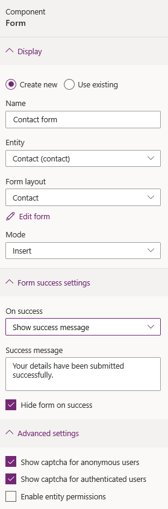

# Add form

Form is a data-driven configuration that collects data in the portal without the need for a developer to surface the form in the portal. 

Forms are [created in Microsoft Dataverse](../model-driven-apps/form-designer-overview.md). You can use them in webpages in the portal or in conjunction with lists to build out complete web applications.  

To add a form component:

1.  [Edit the portal](manage-existing-portals.md#edit) to open it in Power Apps portals Studio.  

2.  Select the page on which you want to add the component.

3.  Select an editable element on the canvas.

4.  Select **Components**  from the left side of the screen.  

5.  Under **Portal components**, select **Form**.

6.  In the properties pane on the right side of the screen, select one of the following options:

    - **Create new**: Create a new form.
    - **Use existing**: Use an existing form.

7. Enter information or make selection:

    - **Name**: Name of the form.

    - **Table**: The name of the table from which the form is loaded.

    - **Form layout**: The name of the form on the target table in Dataverse that is to be rendered.

    - **Mode**: Select one of the following options:

        - **Insert**: Indicates the form should insert a new record upon submission.

        - **Edit**: Indicates the form should edit an existing record.

        - **Read only**: Indicates the form should display an existing record's non-editable form.

        > [!NOTE]
        > The default option for **Edit** and **ReadOnly** modes is set as Query String Parameter Name passed as ID in URL. To change these values, you need to open Portal Management app and update the form properties.

    - **On success**: Select one of the following options:

        - **Show success message**: Requires a message to be displayed to the user on successful submission of the form. You can also select **Hide form on success** to hide the form upon successful submission.

        - **Redirect to webpage**: Redirects the user to the selected webpage in the portal. This field is required.

        - **Redirect to URL**: Redirects the user to the specified URL. This field is required.

    - **Show captcha for anonymous users**: Displays captcha to anonymous users.
    
    > [!NOTE]
    > Captcha control is currently limited to only English language for audio, and Latin characters for image.

    - **Show captcha for authenticated users**: Displays captcha to authenticated users.

    - **Enable table permissions**: Table permissions to be considered for the form. By default, it isn't selected. If selected, explicit permissions are required for any user to access the form. More information: [Table permission](configure/assign-entity-permissions.md)

        > [!div class=mx-imgBorder]
        > 

### See also

- [Power Apps portals Studio](portal-designer-anatomy.md)
- [Create and manage webpages](create-manage-webpages.md)
- [WYSIWYG editor](compose-page.md)

[!INCLUDE[footer-include](../../includes/footer-banner.md)]