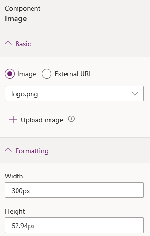
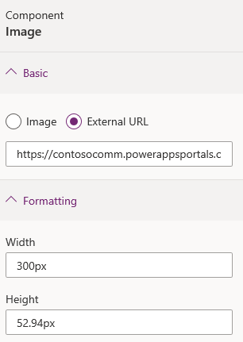

# Add image

Image component allows you to add images to your portal page.

To add image component:

1.  [Edit the portal](manage-existing-portals.md#edit) to open it in Power Apps portals Studio.  

2.  Select the page on which you want to add the component.

3.  Select an editable element on the canvas.

4.  Select **Components**  from the left side of the screen.  

5.  Under **Portal components**, select **Image**. The image placeholder is added to the canvas.

6.  In the properties pane on the right side of the screen, enter the following information:

    - **Image**: Select this option if you would like to select an existing image or upload a new one. If you want to select a previously uploaded image, choose an image from the **Select image** list. To upload a new image, select **Upload image**. All the uploaded images are included in the image library, which can be selected again through the **Select image** list.

        > [!div class=mx-imgBorder]
        >   

        > [!NOTE]
        > - You can upload only the images of type png, svg, jpg, and jpeg with the maximum size of 5 MB.
        > - You can't upload an image with the same name. You need to modify the name of the image to upload it again.

    - **External url**: Select this option if you would like to upload an image from an external URL. Enter the URL in the **External url** field. Only secured links are accepted—that is, https:// is mandatory. If you have images stored in your content delivery network, you can provide the link in this field.

        > [!div class=mx-imgBorder]
        >   

    -   **Formatting options**

        - **Width**: Enter width of the image.

        - **Height**: Enter height of the image.

    > [!NOTE]
    > You can also select the image on the canvas and drag the handles to resize it.

### See also

- [Power Apps portals Studio](portal-designer-anatomy.md)
- [Create and manage webpages](create-manage-webpages.md)
- [WYSIWYG editor](compose-page.md)

[!INCLUDE[footer-include](../../includes/footer-banner.md)]