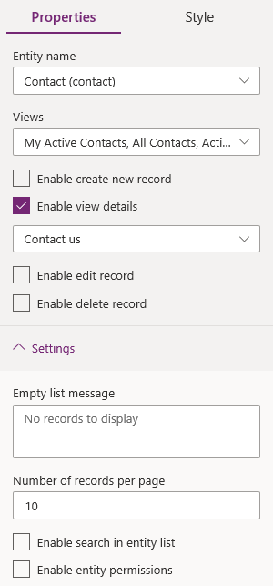

# Add list

List is a data-driven configuration to render a list of records without the need for a developer to surface the grid in the portal.

Lists use [Dataverse views](/powerapps/maker/model-driven-apps/create-and-edit-views) to display records on the portal.  

To add list component:

1.  [Edit the portal](manage-existing-portals.md#edit) to open it in Power Apps portals Studio.  

2.  Select the page on which you want to add the component.

3.  Select an editable element on the canvas.

4.  Select **Components**  from the left side of the screen.  

5.  Under **Portal components**, select **List**.

6.  In the properties pane on the right side of the screen, select one of the following options:

    - **Create new**: Create a new list.
    - **Use existing**: Use an existing list.

7.  Enter information or make selection:

    - **Name**: Name of the list.

    - **Table**: The name of the table from which the views are loaded.

    - **Views**: The list of views of the target table that is to be rendered. You can select multiple views to display records in the list. The view selected first is the default view.

    - **Create new record**: Allows a user to create a record. Select a webpage that contains a form to create a new record.

    - **View details**: Allows a user to view details. Select a webpage that contains a form to display details.

    - **Edit record**: Allows a user to edit a record. Select a webpage that contains a form to edit the record.

    - **Delete record**: Allows a user to delete a record.

    - **Number of records per page**: Enter the number of the records to display on a page.

    - **Enable search in list**: Allows a user to search records in the list.

    - **Permissions**: Table permissions to be considered for the form. [Configure table permissions](configure/entity-permissions-studio.md) to make the form available to anyone, or any specific roles.  

        > [!NOTE]
        > If one or more forms/lists have no permissions configured, you'll see this warning: "One or more lists or forms on your site have no set permissions. Permissions must be enabled for all data components by April 2022 or they will be set by the system."

    > [!div class=mx-imgBorder]
    > 

### See also

- [Power Apps portals Studio](portal-designer-anatomy.md)
- [Create and manage webpages](create-manage-webpages.md)
- [WYSIWYG editor](compose-page.md)

[!INCLUDE[footer-include](../../includes/footer-banner.md)]