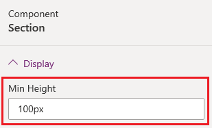
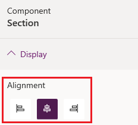
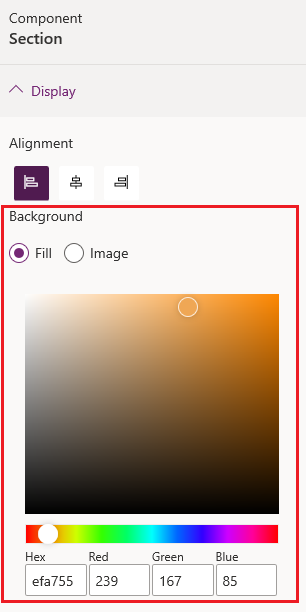
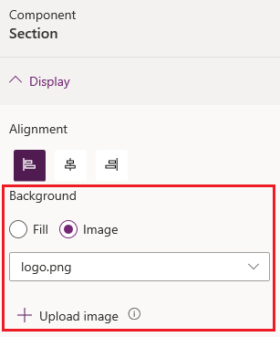

# Add sections

Sections allow you to define a structure for your page and arrange portal components. Once you add sections to your page, you can add portal components inside the sections as per the requirement.

To add sections:

1.    [Edit the portal](manage-existing-portals.md#edit) to open it in Power Apps portals Studio.

2.    Select the page on which you want to add a section.

3.    Select an editable element on the canvas.

4.    Select **Components**  from left side of the screen.

5.    Under **Section layout**, select the section type to be inserted.

6.    In the properties pane on the right side of the screen, enter or select the following information:

       - **Min Height**: Enter the minimum height of the section. If you add a component that occupies more space than the specified height, the section expands to accommodate the component. By default, the minimum height is 100 px. You can also enter the height in points (pt) and percentage (%).

        > [!div class=mx-imgBorder]
        >   

        - **Alignment**: Select whether the component in the section must be left, center, or right aligned.

        > [!div class=mx-imgBorder]
        >   

        - **Background**: Select if you'd like to have color or an image as the section background.

        - **Fill**: Select a color for the background.

            > [!div class=mx-imgBorder]
            >   

        - **Image**: Select an image from the list. If you would like to upload a new image, select **Upload image**.

            > [!div class=mx-imgBorder]
            >   

7.    Add the required portal component in the section.

## Next steps

[Add text](add-text.md)

### See also

- [Power Apps portals Studio](portal-designer-anatomy.md)
- [Create and manage webpages](create-manage-webpages.md)
- [WYSIWYG editor](compose-page.md)

[!INCLUDE[footer-include](../../includes/footer-banner.md)]