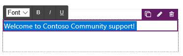
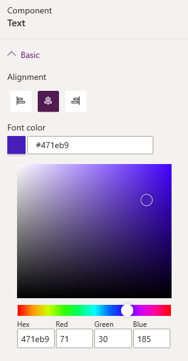

# Add text box

A text box component allows you to add text inside your portal page.

To add text box:

1.  [Edit the portal](manage-existing-portals.md#edit) to open it in Power Apps portals Studio.  

2.  Select the page on which you want to add the component.

3.  Select an editable element on the canvas.

4.  Select **Components**  from the left side of the screen.  

5.    Under **Portal components**, select **Text**.

6.  Enter the required text in the text box.

7.  To format the text, select the text to display the format options. Modify the font size and style as required.

    > [!div class=mx-imgBorder]
    >   

8. In the properties pane on the right side of the screen, select the following information:

    - **Alignment**: Select whether the text must be left, center, or right aligned.

    - **Font color**: Select a color for the text.

        > [!div class=mx-imgBorder]
        >   
 
### See also

- [Power Apps portals Studio](portal-designer-anatomy.md)
- [Create and manage webpages](create-manage-webpages.md)
- [WYSIWYG editor](compose-page.md)

[!INCLUDE[footer-include](../../includes/footer-banner.md)]
