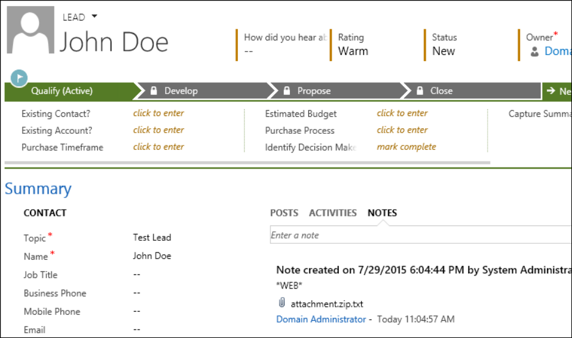
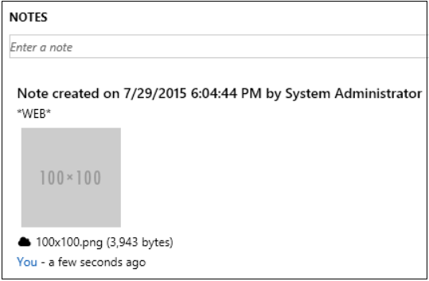
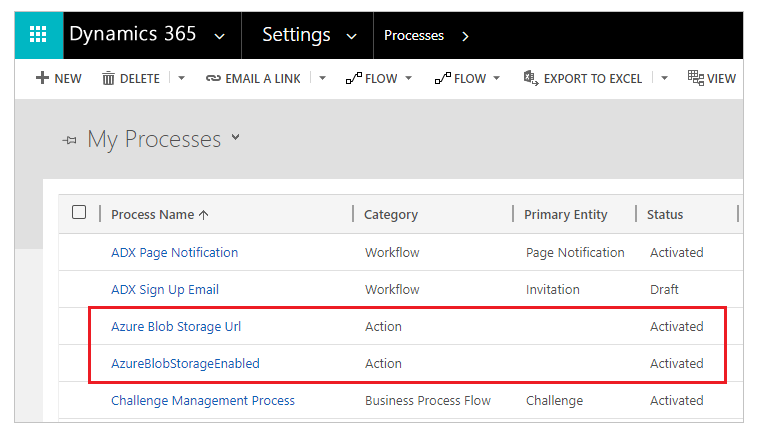

# Add the Azure Storage web resource to a form

Attachments uploaded to Azure Storage (instead of directly to Microsoft Dataverse) can be managed by using notes in Dataverse.

To enable attachments from a particular form to be uploaded into Azure Storage, you must add a web resource to that form, and [configure Azure Storage for your organization](enable-azure-storage.md).

> [!NOTE]
> In this example, the form is added to the Lead form for the Lead table. We recommend using caution when editing existing forms.

When a file (for example, attachments.zip) is uploaded to Azure Storage by using the portal, it's represented by a note on an table and a placeholder for the attachment.



The attachment file is now named attachment.zip.txt. By default, Dataverse  has no conception of an Azure file, so this placeholder .txt file is stored in Dataverse  instead. The Azure Storage context for the placeholder file shows details about the file.
```
{
 Name: attachment.zip,
 Type: application/x-zip-compressed,
 Size: 24890882,
 "Url": "https://accountname.blob.core.windows.net/storage/81a9a9491c36e51182760026833bcf82/attachment.zip"
}
```

## Steps to add the Azure Storage web resource to a form

To see and interact with the file stored in Azure, you must add the web resource adx.annotations.html to the form. As a pre-requisite, ensure that your users have read access to adx_setting. Otherwise, the web resource won't render properly.

1. In the form editor for the relevant form, select **Web Resource** on the **Insert** tab.

2. In the **Web resource** box, select **adx_annotations/adx.annotations.html**.

3. Enter a name and label for the resource.

4. In the **Custom Parameter (data)** box, enter **azureEnabled=true**. <br>You can also use the web resource without enabling Azure support in this way, in which case it will function almost entirely the same as the default control.</br>

5. On the **Formatting** tab, choose whatever formatting rules you prefer. We recommend that you clear the **Display border** check box.

6. Select **OK** to save the resource.

7. Optionally, you can remove the existing notes control. Or move it to a tab or a section marked to be not visible by default.

8. Save the form, and then publish the changes.

   

The new control will now be rendered on the page, giving you the ability to manage your attachments in Azure Storage.


The paper-clip icon has been replaced with a cloud icon to denote that this file is stored in Azure Storage. You can continue to store attachments in Dataverse; those files will be denoted with the paper-clip icon.

> [!NOTE]
> You must add cross-origin resource sharing (CORS) rule on your Azure Storage account as follows, otherwise you will see the regular attachment icon rather than the cloud icon.
> - **Allowed origins**: Specify your domain. For example, `https://contoso.crm.dynamics.com`  <br> Ensure the allowed origin doesn't have trailing `/`. For example, `https://contoso.crm.dynamics.com/` is incorrect.
> - **Allowed verbs**: GET, PUT, DELETE, HEAD, POST
> - **Allowed headers**: Specify the request headers that the origin domain may specify on the CORS request. For example, x-ms-meta-data\*, x-ms-meta-target\*. For this scenario, you must specify *, otherwise the web resource will not render properly.
> - **Exposed headers**: Specify the response headers that may be sent in the response to the CORS request and exposed by the browser to the request issuer. Examples - \* or x-ms-meta-\*. For this scenario, you must specify *, otherwise the web resource will not render properly.
> - **Maximum age (seconds)**: Specify the maximum amount time that a browser should cache the preflight OPTIONS request. For example, 200.
> 
> [!include[More information](../../includes/proc-more-information.md)] [CORS support for the Azure Storage Services](/rest/api/storageservices/cross-origin-resource-sharing--cors--support-for-the-azure-storage-services).

If the attached file is an image, the control will display the image as a thumbnail whether it's stored in Dataverse  or Azure Storage.

> [!NOTE]
> The thumbnail feature is limited to images under 1 MB in size.



## Processes for Azure Blob Storage

Several processes are required to upload attachments to Azure Storage that must be activated: **AzureBlobStorageEnabled**, **Azure Blob Storage Url** and **Generate Shared Access Signature**.



During migration, the processes may get deactivated. Migration may cause attachments to upload to Dataverse instead of Azure Storage after you follow steps to add web resource. Ensure these processes are activated to upload attachments to Azure Storage.

## CORS protocol support

To learn about CORS protocol support in portals, go to [Configure CORS protocol support](configure/cors-support.md).


[!INCLUDE[footer-include](../../includes/footer-banner.md)]