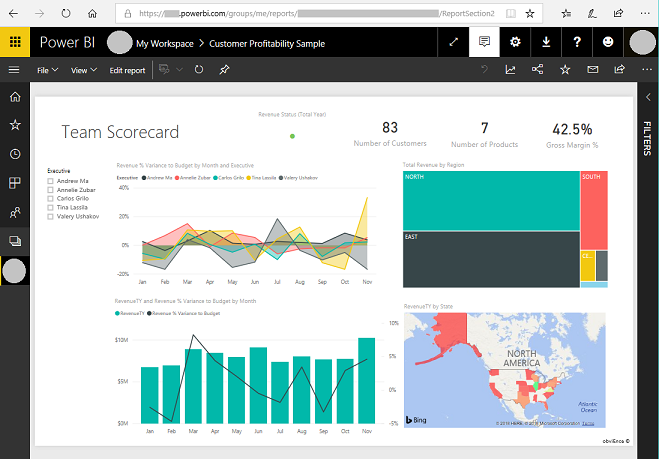
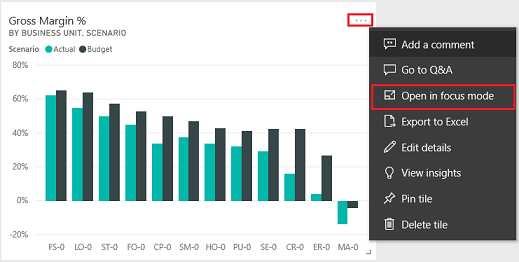
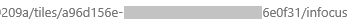

# Add a Power BI report or dashboard to a webpage in a portal

> [!TIP]
> This article explains how to add a Power BI report or dashboard using *powerbi* Liquid tag. To add **Power BI component** on a webpage in your portal using the portals Studio, go to [Add a Power BI component to a webpage using the portals Studio](../add-powerbi.md).

You can add a Power BI report or dashboard to a web page in portal by using the [powerbi](../liquid/portals-entity-tags.md#powerbi) Liquid tag. Use the `powerbi` tag in the **Copy** field on a web page or in the **Source** field on a web template.

If you're adding a Power BI report or dashboard created in the new workspace of Power BI, you must specify the authentication type as **powerbiembedded** in the *powerbi* Liquid tag.

> [!NOTE]
> - If you have specified AAD as the authentication type in powerbi Liquid tag, you must share it with the required users before adding the secure Power BI report or dashboard to a web page in portal. More information: [Share Power BI workspace](/power-bi/service-how-to-collaborate-distribute-dashboards-reports#collaborate-with-coworkers-in-an-app-workspace) and [Share Power BI dashboard and report](/power-bi/service-share-dashboards).
> - **powerbiembedded** supports Power BI dashboards and reports that connect to Azure Analysis Services. You can also use "customdata" property in liquid code to pass value for [CustomData](/dax/customdata-function-dax) property.

For example: 

```

```

To learn about how to get a dashboard path, and ID of the dashboard tile, refer to the sections later in this article.

## Using a dashboard or report connecting to Azure Analysis Services

You can add [powerbi Liquid tag](../liquid/portals-entity-tags.md#powerbi) with a dashboard, or report that connects to [Azure Analysis Services](/azure/analysis-services/analysis-services-connect-pbi).

To add a dashboard or report connecting to Azure Analysis Services, use [CustomData](/dax/customdata-function-dax) parameter in the connection string.

For example:

```

```

The optional **customdata** tag can be configured as a string, or generated dynamically based on an object's attribute, using a period ("."), or square brackets ("[]") to separate between the object and the attribute, in between two pairs of curly brackets.

Examples:
- `customdata: {{ object.attribute }}`
- `customdata: {{ object[attribute] }}`

As the **customdata** tag returns a string, it may be necessary to convert this string to an integer in the [DAX query](/dax/dax-queries).

> [!IMPORTANT]
> - Portals doesn't support Power BI dashboard or report connecting to Azure Analysis Services that uses a [data gateway to connect to an on-premises data source](/azure/analysis-services/analysis-services-gateway).
> - Your portal version must be [9.3.4.x](../versions/version-9.3.4.x.md) or later for this feature to work.

### Azure Analysis Services and Roles (RLS)

The **roles** tag is optional for Azure Analysis Services based reports and dashboards. When not used, role defaults to the role the app is assigned to in Azure Analysis Services.

However, this tag may become necessary to specify a certain role (or roles) among several available roles, and might still be required when using Row-Level security.

Roles are contained within the Azure Analysis Services database and not in the report itself, unlike other Power BI report types.

- Providing no roles in the Liquid code.

    If no role is supplied in the Liquid code, the Azure Analysis Services role will be determined by the role(s) that the App has access to, and will filter the results based on the given custom data against the DAX query in the role(s). That is, all available roles will combine their accesses, but will still filter if the provided custom data is relevant. This scenario will most often be the case with Azure Analysis Services reports or single-tile dashboards.

- Providing roles in the Liquid code.

    Azure Analysis Services roles can be provided in the Liquid code, similar to RLS roles. Using these roles may be required when multiple roles are available, but you want to use specific roles for the page. When using any roles in the connection string, specifying Azure Analysis Services role is a must. For example, multi-tile dashboards that use Azure Analysis Services tiles with RLS tiles.

    The following considerations apply when using Azure Analysis Services tiles in a dashboard:

    - If an Azure Analysis Services tile is used in a dashboard with other tiles that require roles, the Azure Analysis Services role must be added to the list of roles.
    - Multiple tiles from different Azure Analysis Services sources can be used with their own roles, but the custom data must be the same for each, and multiple custom data values cannot be used in the Liquid code.  The **customdata** tag and the **customdata** parameter for the EffectiveIdentity take only a string value.

## Get the path of a dashboard or report

1.	Sign in to [Power BI](https://powerbi.microsoft.com/).

2.	Open the dashboard or report you want to embed in your portal.

3.	Copy the URL from the address bar.

    > [!div class=mx-imgBorder]
    > 

## Get the ID of a dashboard tile

1.	Sign in to [Power BI](https://powerbi.microsoft.com/).

2.	Open the dashboard from which you want to embed a tile in your portal.

3.	Point to the tile, select **More options**, and then select **Open in focus mode**.

    > [!div class=mx-imgBorder]
    > 

4.	Copy the tile ID from the URL in the address bar. The tile ID is the value after /tiles/.

    > [!div class=mx-imgBorder]
    > 

## How to use powerbi-client JavaScript library in portals

You can use [powerbi-client JavaScript library](https://github.com/microsoft/PowerBI-JavaScript#powerbi-client) while embedding Power BI reports or dashboards in your portal. For more information about powerbi-client JavaScript library, see the [Power BI JavaScript wiki](https://github.com/Microsoft/PowerBI-JavaScript/wiki).

Below is a sample JavaScript to update the report settings or to handle events. This sample disables filter pane, disables page navigation, and enables *dataSelected* event.

> [!IMPORTANT]
> Use powerbi-client JavaScript library to disable or enable filter pane. However, if you want to restrict access to data or configure security, use [Row-level security (RLS) with Power BI](/power-bi/admin/service-admin-rls). Disabling filter pane doesn't restrict data access, and it can be re-enabled using JavaScript library code.

```javascript
$(document).ready(function () {
    var embedContainer = $(".powerbi")[0];
    if (embedContainer) {
        var report = powerbi.get(embedContainer);
        report.on("loaded", function () {
            report.updateSettings({
                panes: {
                    filters: {
                        visible: false
                    },
                    pageNavigation: {
                        visible: false
                    }
                }
            }).catch(function (errors) {
                console.log(errors);
            });
        })
    }
});
```

To add custom JavaScript to a webpage:

1. Open the [Portal Management](../configure/configure-portal.md) app.
1. Select **Web Pages** from the left pane.
1. Select the webpage that contains the Power BI report or dashboard.
1. Select **Advanced** tab.
1. Copy and paste the JavaScript inside the **Custom JavaScript** section.
1. Select **Save & Close**.

Now, let's understand the sample JavaScript operations and different options.

### Get a reference to the embedded report HTML

Get a reference to the embedded report HTML.

```javascript
var embedContainer = $(".powerbi")[0];
```

More information: [Get a reference to an existing Power BI component given the containing element](https://github.com/microsoft/PowerBI-JavaScript/wiki/Service-Details#get-a-reference-to-an-existing-power-bi-component-given-the-containing-element)

### Get a reference to the embedded report

```javascript
var report = powerbi.get(embedContainer);
```

### Work with Power BI panes

You can use the settings for panes to work with Power BI panes on a portals webpage. For example, you can use the filters setting to hide or show the pane, or work with the page navigation setting.

Below is a sample to remove filters pane:

```javascript
report.updateSettings({
            panes: {
                filters :{
                    visible: false
                }
            }
        }).catch(function (errors) {
            console.log(errors);
        });
```

Below is a sample to work with both page navigation and filters:

```javascript
report.updateSettings({
            panes: {
                filters :{
                    visible: false
                },
                pageNavigation:{
                    visible: false
                }
            }
        }).catch(function (errors) {
            console.log(errors);
        });
```

More information: [Update settings](https://github.com/Microsoft/PowerBI-JavaScript/wiki/Update-Settings) and [Embed configuration - Settings](https://github.com/Microsoft/PowerBI-JavaScript/wiki/Embed-Configuration-Details#settings)

### Handle events

The embedded component can emit events upon invoking a completion of an executed command. For example, below is a sample for `dataSelected` event.

```javascript
//Report.off removes a given event listener if it exists
    report.off("dataSelected");
//Report.on will add an event list
    report.on('dataSelected', function(event){
        console.log('Event - dataSelected:');
        console.log(event.detail);
    })
```

More information: [Handling events](https://github.com/Microsoft/PowerBI-JavaScript/wiki/Handling-Events)

### See also

- [Add a Power BI component to a webpage using the portals Studio](../add-powerbi.md)
- [Set up Power BI integration](set-up-power-bi-integration.md)
- [powerbi Liquid tag](../liquid/portals-entity-tags.md#powerbi)


[!INCLUDE[footer-include](../../../includes/footer-banner.md)]
