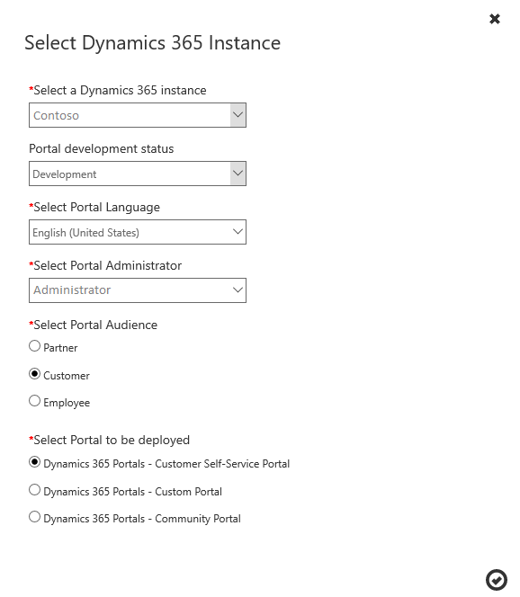

 
# Change the Dynamics 365 instance, audience, or type of portal

After your portal is created and provisioned, you can change the details of your Dynamics 365 instance and portal.

> [!IMPORTANT]
> When changing Dynamics 365 Instance for your portal, ensure the new instance is from the same [region](/power-platform/admin/regions-overview) as the current instance. Changing the Dynamics 365 Instance for Power Apps portals across regions isn't supported.

To learn about the roles required to perform this task, read [Admin roles required for portal administrative tasks](portal-admin-roles.md).

1. Go to the **Dynamics 365 Administration Center** page, and then select the **Applications** tab.

2. Select the name of the portal you want to edit, and then select **Manage**.

3. Select the **Manage Dynamics 365 Instance** tab. On this page, you can review the Dynamics 365 instance that is currently linked to your portal.

4. Select **Update Dynamics 365 Instance**. In the dialog box, use the provided fields to change your Dynamics 365 instance, portal development status, portal language, or your portal administrator. You can also keep the same Dynamics 365 instance, but change the portal audience or type of portal.

5. Select the  button to confirm your changes.  

   > [!div class="mx-imgBorder"]
   >   

[!INCLUDE[footer-include](../../../includes/footer-banner.md)]