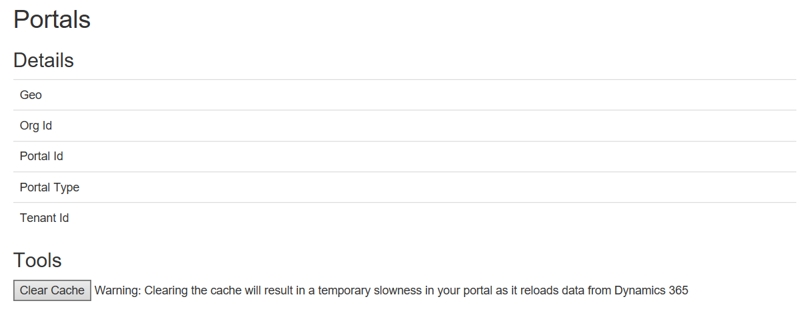

# Clear the server-side cache for a portal

[!include[cc-beta-prerelease-disclaimer](../../../includes/cc-beta-prerelease-disclaimer.md)]

As a portal administrator, you can clear the server-side cache for the entire portal so that updated data from Common Data Services is immediately reflected on the portal. Updates from Common Data Services are communicated to the portal in asynchronous mode, so there might be a lag between the time data is updated in Common Data Services and the time that updated data appears on the portal. To eliminate this delay&mdash;for example, when it interferes with portal configuration&mdash;you can force the portal to refresh its cache immediately.

> [!NOTE]
> The SLA for cache refresh (data transfer between Common Data Services and portal) is 15 minutes.

To clear the server-side cache

1.	Sign in to the portal as an administrator.

2.	Navigate to the URL as follows: `<portal_path>/_services/about`

3.	Select **Clear Cache**. 

The server-side cache is deleted, and data is reloaded from Common Data Services. Note that clearing the portal server-side cache will temporarily cause poor portal performance while data is being reloaded from Common Data Services.

> [!div class=mx-imgBorder]
> 
