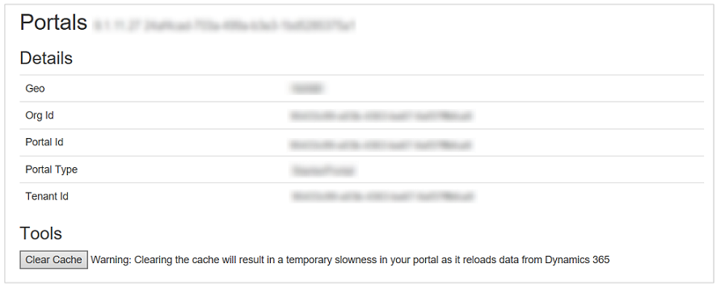
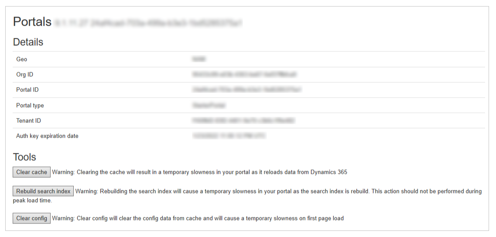

# Server-side cache in portals

As a portal administrator, you can clear the server-side cache for the entire portal so that updated data from Microsoft Dataverse is immediately reflected on the portal. Updates from Dataverse  are communicated to the portal in asynchronous mode, so there might be a lag between the time data is updated in Dataverse and the time that updated data appears on the portal. To eliminate this delay&mdash;for example, when it interferes with portal configuration&mdash;you can force the portal to refresh its cache immediately.

> [!IMPORTANT]
> - Clearing the [portal server-side cache](#steps-to-clear-portal-server-side-cache) or the [configuration tables cache](#configuration-entity-caching-portals-with-capacity-based-licenses) causes temporary performance degradation of the portal while data gets reloaded from Dataverse.
> - Changes to the [configuration tables](#list-of-configuration-tables-refreshed-when-you-clear-config), or [publish changes](../../data-platform/create-solution.md#publish-changes) actions should be performed during non-peak hours. Frequent or too many table changes may adversely affect portal performance.
> - The SLA for cache refresh (data transfer between Dataverse and portal) is 15 minutes.
> - Power Apps portals with version 9.2.6.x or later have improved caching. For more information, go to [Caching changes for portals with version 9.2.6.x or later](#caching-changes-for-portals-with-version-926x-or-later).

## Steps to clear portal server-side cache

To clear the server-side cache:

1. Sign in to the portal as an administrator.

1. Navigate to the URL as follows: `<portal_path>/_services/about`.

1. Select **Clear Cache**.

The server-side cache is deleted, and data is reloaded from Dataverse. 

## Configuration table caching in portals with capacity-based licenses

[Capacity based](/power-platform/admin/powerapps-flow-licensing-faq#portals) portals have more options on `<portal_path>/_services/about`:

To learn more about the differences between Power Apps portals and portal add-ons, read [Power Apps portals, Dynamics 365 portals and add-on portals](../overview.md#power-apps-portals-dynamics-365-portals-and-add-on-portals).

Portal metadata is stored in tables called *configuration tables*. If you change configuration tables using the *Unified Interface application*, you **must** select **Clear config** to clear the configuration cache for changes to reflect in your Portal.  

### List of configuration tables refreshed when you clear config

Clearing the server-side configuration cache for a portal includes refreshing the data from the following *configuration tables*:

:::row:::
:::column:::
	adx_contentaccesslevel
:::column-end:::
:::column:::
	adx_contentsnippet
:::column-end:::
:::column:::
	adx_entityform
:::row-end:::
:::row:::
:::column:::
	adx_entityformmetadata
:::column-end:::
:::column:::
	adx_entitylist
:::column-end:::
:::column:::
	adx_entitypermission
:::row-end:::
:::row:::
:::column:::
	adx_entitypermission_webrole
:::column-end:::
:::column:::
	adx_externalidentity
:::column-end:::
:::column:::
	adx_pagealert
:::row-end:::
:::row:::
:::column:::
	adx_pagenotification
:::column-end:::
:::column:::
	adx_pagetag
:::column-end:::
:::column:::
	adx_pagetag_webpage
:::row-end:::
:::row:::
:::column:::
	adx_pagetemplate
:::column-end:::
:::column:::
	adx_portallanguage
:::column-end:::
:::column:::
	adx_publishingstate
:::row-end:::
:::row:::
:::column:::
	adx_publishingstatetransitionrule
:::column-end:::
:::column:::
	adx_publishingstatetransitionrule_webrole
:::column-end:::
:::column:::
	adx_redirect
:::row-end:::
:::row:::
:::column:::
	adx_setting
:::column-end:::
:::column:::
	adx_shortcut
:::column-end:::
:::column:::
	adx_sitemarker
:::row-end:::
:::row:::
:::column:::
	adx_sitesetting
:::column-end:::
:::column:::
	adx_urlhistory
:::column-end:::
:::column:::
	adx_webfile
:::row-end:::
:::row:::
:::column:::
	adx_webfilelog
:::column-end:::
:::column:::
	adx_webform
:::column-end:::
:::column:::
	adx_webformmetadata
:::row-end:::
:::row:::
:::column:::
	adx_webformsession
:::column-end:::
:::column:::
	adx_webformstep
:::column-end:::
:::column:::
	adx_weblink
:::row-end:::
:::row:::
:::column:::
	adx_weblinkset
:::column-end:::
:::column:::
	adx_webnotificationentity
:::column-end:::
:::column:::
	adx_webnotificationurl
:::row-end:::
:::row:::
:::column:::
	adx_webpage
:::column-end:::
:::column:::
	adx_webpage_tag
:::column-end:::
:::column:::
	adx_webpageaccesscontrolrule
:::row-end:::
:::row:::
:::column:::
	adx_webpageaccesscontrolrule_webrole
:::column-end:::
:::column:::
	adx_webpagehistory
:::column-end:::
:::column:::
	adx_webpagelog
:::row-end:::
:::row:::
:::column:::
	adx_webrole_systemuser
:::column-end:::
:::column:::
	adx_website
:::column-end:::
:::column:::
	adx_website_list
:::row-end:::
:::row:::
:::column:::
	adx_website_sponsor
:::column-end:::
:::column:::
	adx_websiteaccess
:::column-end:::
:::column:::
	adx_websiteaccess_webrole
:::row-end:::
:::row:::
:::column:::
	adx_websitebinding
:::column-end:::
:::column:::
	adx_websitelanguage
:::column-end:::
:::column:::
	adx_webtemplate
:::row-end:::

## Caching changes for portals with version 9.2.6.x or later

Power Apps portals with version 9.2.6.x or later benefit from improved caching functionality to increase consistency and reliability as follows.

- [Capacity-based portals and add-on portals](../overview.md#power-apps-portals-dynamics-365-portals-and-add-on-portals) will use the same caching functionality.
- Add-on portals with high load will have improved performance and a reliable data cache refresh.

> [!IMPORTANT]
> - No change to SLA for cache refresh (data transfer between Dataverse and portal) mentioned earlier in this article.
> - Data changes done using portals will reflect immediately in Dataverse and portals.
> - No change to [clear server-side cache functionality](#steps-to-clear-portal-server-side-cache). You can continue to use this functionality to clear server cache immediately.
 
### FAQs
 
**1. Can I change the cache refresh duration from 15 minutes to a lesser duration?**  
No. SLA for cache refresh remains 15 minutes. Any changes from Dataverse will reflect on portals within 15 minutes.

**2. I'm using plugins or workflows to update data in other tables and need these data changes to reflect immediately on my portal.**  
This design approach isn't recommended. Except the primary record where the create or update action is triggered, data reflection from Dataverse to portals is never guaranteed to be immediate.

**3. Is there any difference in caching between capacity-based portals and add-on portals?**  
No.

**4. How long does it take for changes to reflect from portals to Dataverse?**  
Immediately, as long as the update changes a primary record and isn't based on indirect changes to data using plugins or workflows.

## Next steps

[Understand how portals connects to Microsoft Dataverse environment](connectivity.md)

## See also

[Build a portal using portals Studio](../portal-designer-anatomy.md)

[!INCLUDE[footer-include](../../../includes/footer-banner.md)]