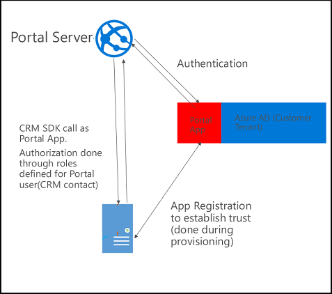

# Portals connectivity to a Microsoft Dataverse environment

A portal connects to a Dataverse environment using an Azure Active Directory application. The application is created in the same tenant where the portal is provisioned. The application is registered with the Dataverse environment during the portal provisioning process.

Each portal has a separate Azure Active Directory application associated with it, whether it's connected to the same Dataverse environment or not. The default Azure Active Directory authentication provider created for a portal uses the same Azure Active Directory application to authenticate the portal. Authorization is enforced by web roles assigned to the user accessing the portal.

You can see the associated portal application in Azure Active Directory. The name of this application will be Microsoft CRM Portals, and the portal ID is in the **App ID URI** field in the Azure Active Directory application. The person who provisions the portal owns this application. Don't delete or modify this application, or you might break the portal functionality. You must be the application owner to manage a portal from the Power Apps Portals admin center.

## Understanding authentication key in portals

For a portal to connect to Dataverse using an Azure Active Directory application, it requires an authentication key connected to the Azure Active Directory application. This key is generated when you provision a portal and the public part of this key is automatically uploaded to the Azure Active Directory application.

> [!IMPORTANT]
> The authentication key will expire in two years. It must be renewed every two years to ensure that your portal will continue to connect to the Dataverse environment. If you do not update the key, the portal will stop working.  

### See also

[Manage portals authentication key](manage-auth-key.md)

[!INCLUDE[footer-include](../../../includes/footer-banner.md)]