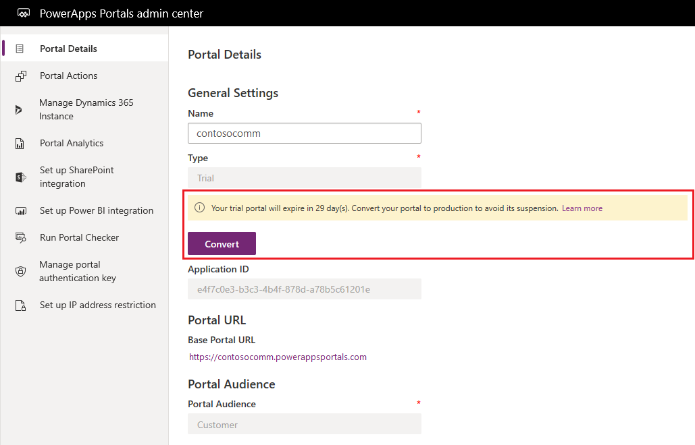
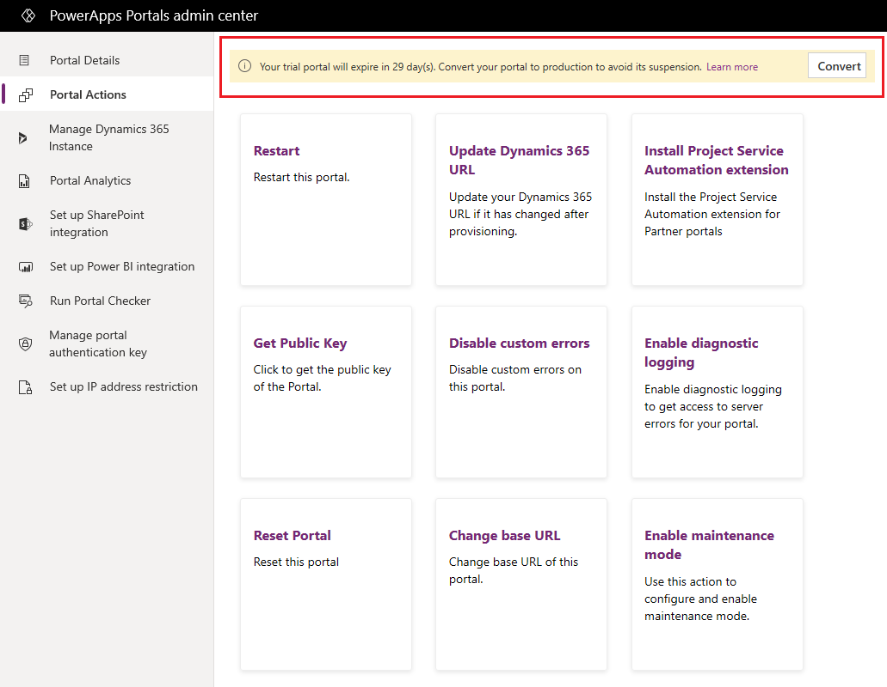
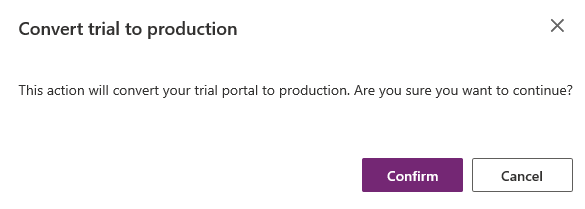
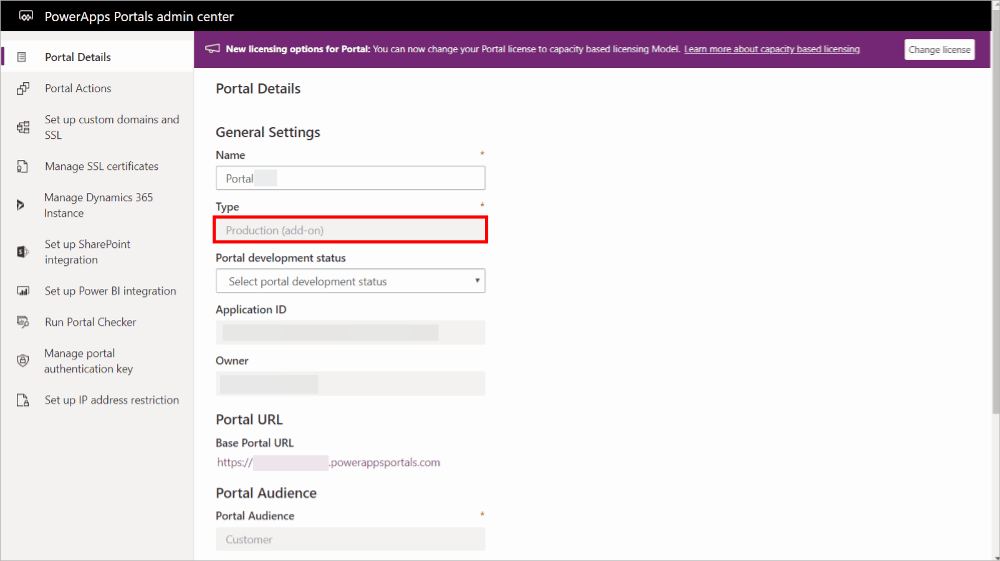

# Convert a portal

As explained in the [portal lifecycle](portal-lifecycle.md) article earlier, a Power Apps portals goes through different stages. You can convert a portal from one stage to another, depending on what conversion is allowed, and whether the environment has the required license, or capacity.

> [!IMPORTANT]
> The [table permission changes for forms and lists](../important-changes-deprecations.md#table-permission-changes-for-forms-and-lists-on-new-portals) introduced with the portals release version [9.3.7.x](/power-platform/released-versions/portals/portalupdate1) also take effect on a portal that's converted from trial to production.

## Convert a portal from trial to production

You can convert a trial portal to a production portal from the notifications displayed in the Power Apps Portals admin center.

> [!NOTE]
> You must be assigned one of the following roles to convert a portal from trial to production:
> - Global administrator
> - System administrator
>
> More information: [Admin roles required for portal administrative tasks](portal-admin-roles.md)

When you open the [Power Apps Portals admin center](admin-overview.md) and go to the **[Portal Details](portal-details.md)** tab, you'll see the notification about the trial expiration displayed below the **Type** field.

> [!div class=mx-imgBorder]
> 

On other pages in the admin center, the notification is displayed at the top of the page.

> [!div class=mx-imgBorder]
> 

To convert your portal from trial to production:

1.	In the notification, select **Convert**.

2.	Select **Confirm**.

    > [!div class=mx-imgBorder]
    > 

## Convert an existing portal to capacity-based model

You can convert your existing portal license to [capacity-based licensing model](/power-platform/admin/powerapps-flow-licensing-faq#can-you-share-more-details-regarding-the-new-power-apps-portals-licensing). To change your portal license to capacity-based model:

> [!TIP]
> To learn about the roles required to perform this task, read [Admin roles required for portal administrative tasks](portal-admin-roles.md).

1. Go to [Portal details](portal-details.md).
1. Select **Change License**.

    

Consider the following before changing your portal license:

- Your portal will restart and won't be available for a few minutes during license conversion. You might need to schedule this for a downtime period for business users.
- Your environment must have an appropriate [license](/power-platform/admin/powerapps-flow-licensing-faq#portals) available and assigned before you convert the license.
- You must have administrative privileges to convert the license.
- Only production environments can be converted from an existing license to a capacity-based license. If you have a [trial environment](/power-platform/admin/trial-environments), you must convert it to a production environment first.

## Considerations for conversion of add-on portals

The following sections describe the conditions that apply to portals that were [provisioned by using the portal add-on plan](../provision-portal-add-on.md).

### Trial add-on portal

A trial add-on portal expires after 30 days. An expired portal is suspended for seven days. The portal is deleted after the suspension period ends. A trial add-on portal can still be converted to a production portal during the period when it has either been configured to an environment or suspended.

### Production add-on portal

A production add-on portal expires at the end of the purchased license period. The suspension period for a production add-on portal can vary depending on the license plan you purchased. The portal is deleted after the suspension period ends. You can extend the license of a production add-on portal while the portal is in a configured or suspended state. If it has been suspended, the portal can be converted to a configured state after you extend the license period.

> [!IMPORTANT]
> To avoid functionality loss by having your portal suspended or deleted, ensure that you've extended the license period in a timely manner, well before expiry.

### Suspended add-on portal

Portal [provisioned using portal add-on plan](../provision-portal-add-on.md) purchased earlier is suspended at the end of expiration. This expiration period is 30 days for trial portals while it may vary for an add-on portal in production with a purchased license. Suspended trial portal is deleted after 7 days while suspension period may vary for production portal.

### Reset add-on portal

Follow the steps in [Reset a portal](reset-portal.md) to reset a portal that was provisioned by using a previously purchased, portal add-on plan.

### See also

- [Understand lifecycle of a portal](portal-lifecycle.md)  
- [Microsoft Learn: Portal application lifecycle management](/learn/modules/extend-power-app-portals/2-portal-application-lifecycle)
- [Power Apps portals FAQ](../faq.yml)

[!INCLUDE[footer-include](../../../includes/footer-banner.md)]