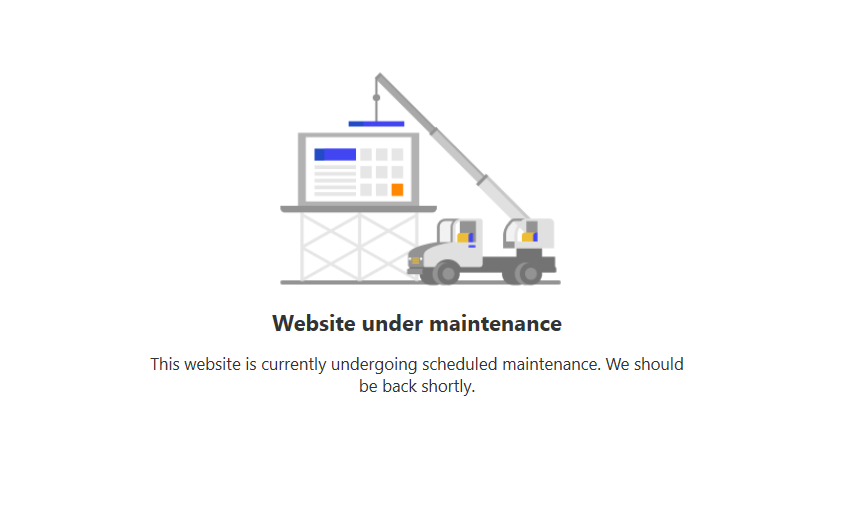
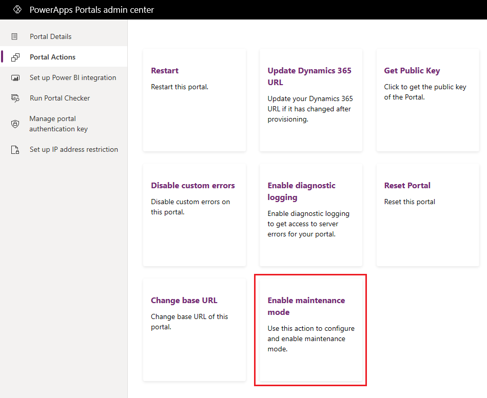
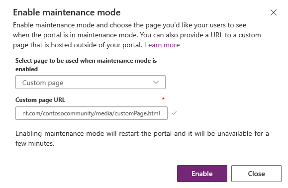
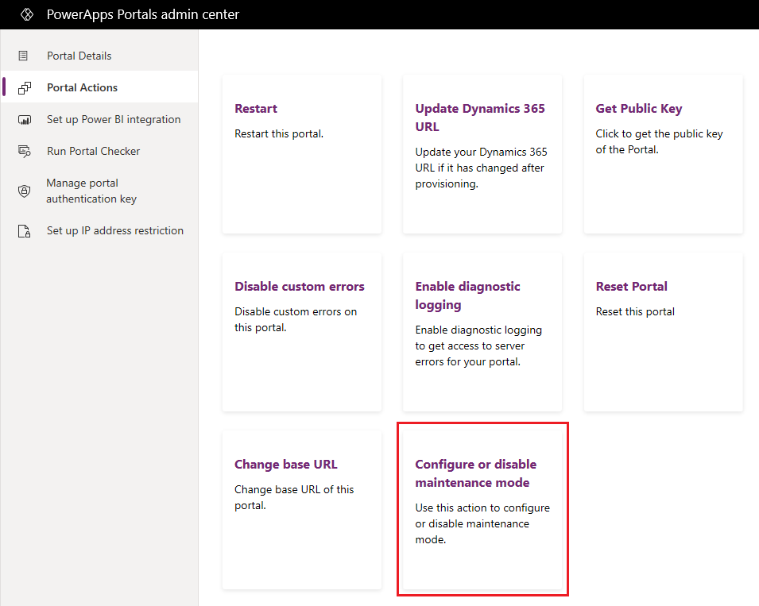
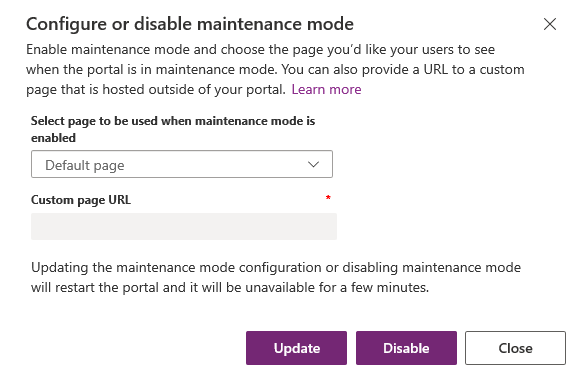

# Maintenance mode for a portal

There might be times when your website is under scheduled maintenance or is down because of temporary outage. When a customer accesses the website during maintenance, unpredictable behavior and intermittent unavailability might be experienced. 

As a portal administrator, you can configure your portal to display a proper message to customers whenever a maintenance activity is going on (for example, "Solution packages are being upgraded.") You can benefit from this capability by enabling the maintenance mode on your portal. When the maintenance mode is enabled, a message is displayed, and the customers are restricted from browsing any webpages except the `<portal URL>/_services/about` page.

> [!div class=mx-imgBorder]
> 

## Enable maintenance mode

You can enable maintenance mode on your portal to provide a consistent message, instead of dealing with unpredictable behavior when your website is under scheduled maintenance. This capability will provide a better experience for your portal users.

1. Open [Power Apps portals admin center](admin-overview.md).

3. Go to **Portal Actions** > **Enable maintenance mode**.

    > [!div class=mx-imgBorder]
    > 

4. In the **Enable maintenance mode** window, enter the following values:
    - **Select page to be used when maintenance mode is enabled**: Select one of the following values:

        - **Default page**: Select this value if you want the default page to be displayed when maintenance mode is enabled. By default, this option is selected.

        - **Custom page**: Select this value if you want a custom HTML page to be displayed when maintenance mode is enabled.

    - **Custom page URL**: This field is enabled only when you select the option to display a custom HTML page.

        > [!IMPORTANT]
        > Read the [custom maintenance page considerations](#considerations-for-custom-maintenance-page) before using custom maintenance page.
 
5. Select **Enable**. While maintenance mode is being enabled, the portal restarts and is unavailable for a few minutes. 

    > [!div class=mx-imgBorder]
    > 

### Considerations for custom maintenance page

- Ensure the page URL you provide is publicly accessible.
- The custom maintenance page uses IFrame to display the page. So, the page shouldn't contain the `x-frame-options:SAMEORIGIN` response header, else the page won't load.
- Don't host custom maintenance page on a Power Apps portal. If a portal is unavailable (for reasons such as data migration, solution upgrade, an outage, or any other maintenance activity), the custom maintenance page hosted on the same portal won't be accessible.
- If the custom maintenance page is inaccessible publicly, or if you host the page on a Power Apps portal where custom maintenance mode is enabled, the default maintenance page is used instead. The page also shows the following note for the administrators:

    `Note for administrators: The custom page for maintenance mode could not be displayed due to configuration errors.`

## Configure or disable maintenance mode

After enabling maintenance mode for your portal, you can update the maintenance mode settings and choose a different page.

You can also choose to disable maintenance mode on your portal when the scheduled maintenance of your website is complete. Your portal users can now browse and access all web pages as usual.

1. Open [Power Apps portals admin center](admin-overview.md).

2. Go to **Portal Actions** > **Configure or disable maintenance mode**.

    > [!div class=mx-imgBorder]
    > 

3. Modify the settings as required, and select **Update**. For example, you might choose to display the default page if you've selected to display the custom page earlier.

4. To disable maintenance mode, select **Disable**. While maintenance mode is being updated or disabled, the portal restarts and is unavailable for a few minutes.

    > [!div class=mx-imgBorder]
    > 

### See also

[Microsoft Learn: Power App portal maintenance and troubleshooting](/learn/modules/portals-maintenance-troubleshooting/)

[!INCLUDE[footer-include](../../../includes/footer-banner.md)]