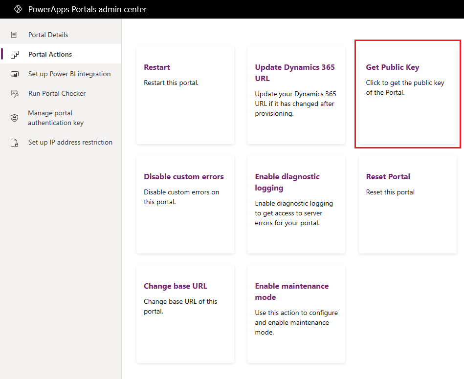

# Download public key of portal

[!include[cc-beta-prerelease-disclaimer](../../../includes/cc-beta-prerelease-disclaimer.md)]

The public key of a portal is used to configure Live Assist for Dynamics 365 model-driven applications to work with authenticated visitors for a portal. [Live Assist](https://www.cafex.com/en/products/live-assist-dynamics-365/), by CafeX, provides a chat solution through which users can embed live chat assistance in their portal. More information on how to use the public key to embed a chat on a portal: [Authenticated Visitors in the Dynamics Customer Portal](https://www.liveassistfor365.com/en/support/authenticated-visitors-in-the-dynamics-customer-portal/)

1. Open [PowerApps Portals admin center](admin-overview.md).

2.	Go to **Portal Actions** > **Get Public Key**. The key is displayed.

    > [!div class=mx-imgBorder]
    > 

3.	Select **Download as Text** to download the key in a text file.

Alternately, you can also get the public key by going to the URL: `<portal_base_URL>/_ services/auth/publickey` 

> [!NOTE]
> If the portal is currently being provisioned or the package install is not finished in the organization, an error is displayed if you try to download the public key. You must wait until portal provisioning is complete and the portal is up and running.
