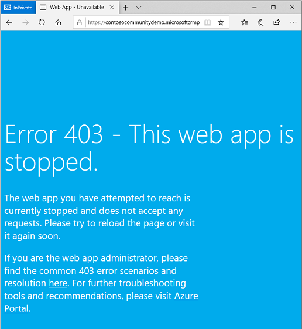
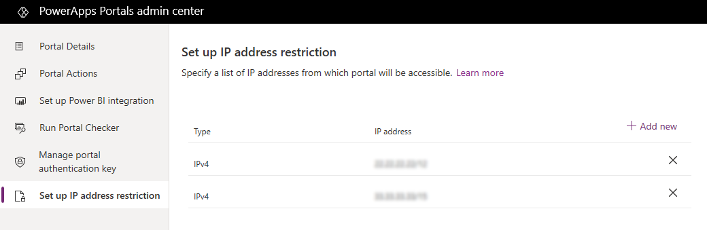
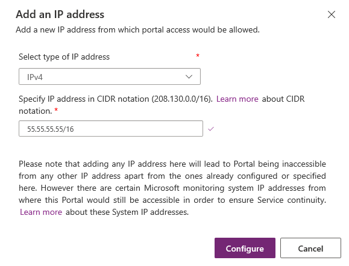

# Restrict portal access by IP address

The portal is public when provisioned and accessible by anyone from any computer. Now you can restrict access to your portal from a list of IP addresses. For example, a government organization might want to surface their content only within their corporate network. A commercial organization might want to display the portal only when it is published and not while it is in development to avoid any data leak.

When a request to the portal is generated from any user, their IP address is evaluated against the allow list. If the IP address is not on the list, the portal displays a web page with an HTTP 403 status code.

To add or remove IP addresses, you must be assigned any one of the following roles:
- Office 365 Global Administrator 
- Service Administrator. More information: [Use the service admin role to manage your tenant](/power-platform/admin/use-service-admin-role-manage-tenant)  
- System Administrator of the Microsoft Dataverse environment selected for the portal

## Add an IP address

To allow access to a portal from an IP address or a set of IP addresses, you can add the IP addresses to the list. This allows the portal to be accessed only from the list of added IP addresses. If you do not add any IP address, the portal will be accessible from all IP addresses.

Once you add an IP address to the restriction list, the portal will be accessible to the specified IP address only. If you try to access the portal from any other IP addresses, access will be denied and a web page with an HTTP 403 status code is displayed. The content of this web page is static and cannot be modified.

> [!div class=mx-imgBorder]
>   

> [!NOTE]
> You must specify a public IP address that can be accessed by the portal. Private IP address can't be accessed by the portal.

1.	Open [Power Apps portals admin center](admin-overview.md).

2.	Go to **Set up IP address restriction**. A list of IP addresses and their type is displayed.

    > [!div class=mx-imgBorder]
    > 

3.	On the Set up IP address restriction page, select **Add new**.

4.	In the Add an IP address window, enter the following values:

    - **Select type of IP address**: Select whether the IP address is IPv4 or IPv6.

    - **Specify IP address in CIDR notation**: Specify the IP address in CIDR notation. More information: [Classless Inter-Domain Routing](https://en.wikipedia.org/wiki/Classless_Inter-Domain_Routing)

      > [!div class=mx-imgBorder]
      >     

5.	Select **Configure**.

## Remove an IP address

To remove access to a portal from a previously allowed IP address, you can remove the IP address from the list. If you remove all IP addresses, the portal will be accessible from all IP addresses.

1.	Open [Power Apps portals admin center](admin-overview.md).

2.	Go to **Set up IP address restriction**. A list of IP addresses and their type is displayed.

    > [!div class=mx-imgBorder]
    > 

3.	Select **Remove an IP address (x)** next to the IP address to be removed.

4.	Select **Remove** in the confirmation message.

[!INCLUDE[footer-include](../../../includes/footer-banner.md)]