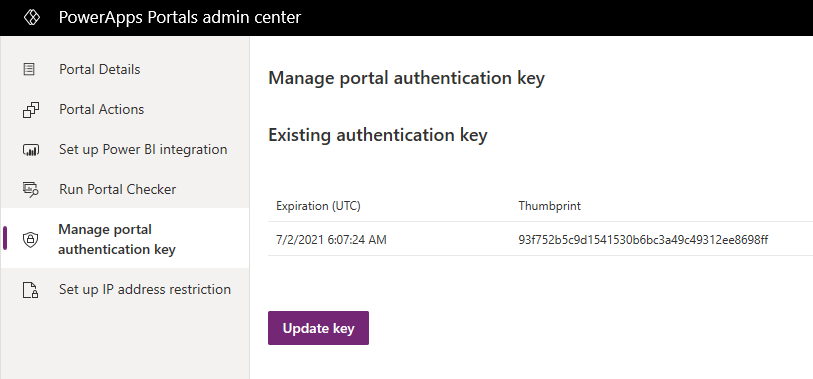
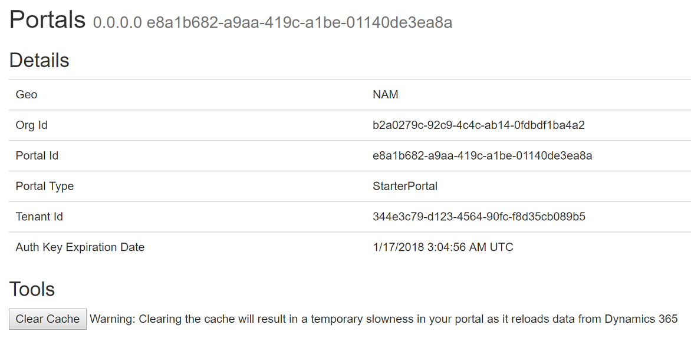
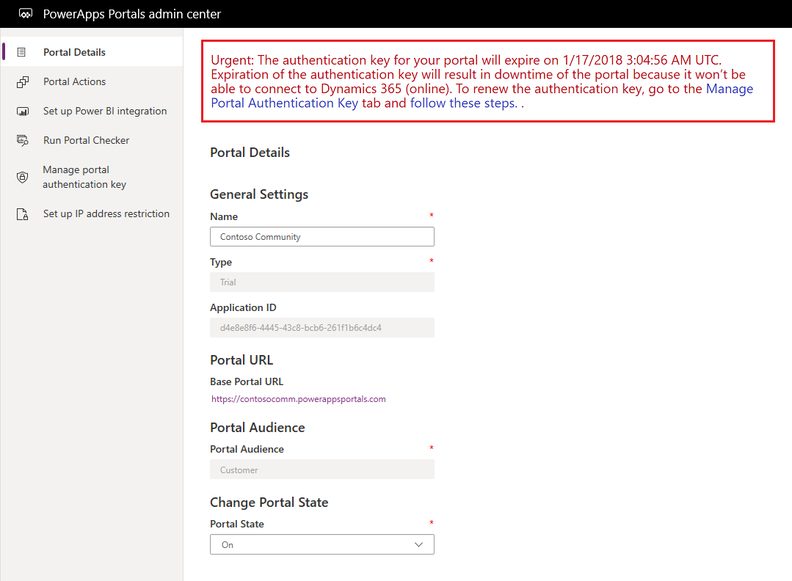
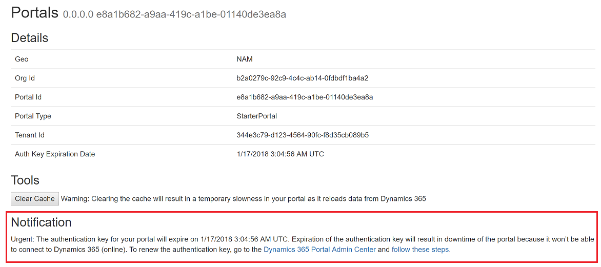
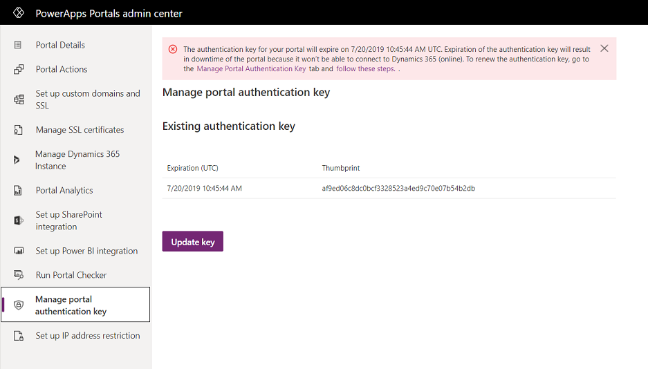
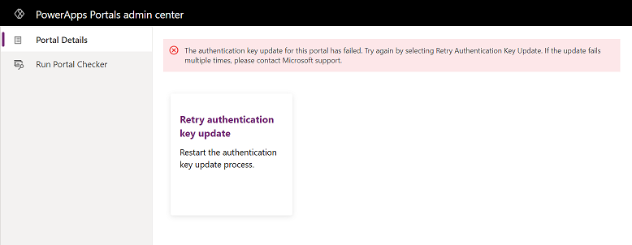

# Manage portal authentication key

Power Apps portals connectivity architecture explained how a portal connects to Microsoft Dataverse environment. When a portal is created, a new authentication key is generated with the public key uploaded to Azure Active Directory application. Portals uses this authentication key to connect to the Dataverse environment. You must renew the key every two years to ensure that your portal can connect to Dataverse environment.

## Check authentication key details

> [!TIP]
> To learn about the roles required to perform this task, read [Admin roles required for portal administrative tasks](portal-admin-roles.md).

The details of an authentication key are displayed on Power Apps portals admin center and portal.

**Power Apps portals admin center**

1. Open [Power Apps portals admin center](admin-overview.md).

2. Select **Manage portal authentication key**. The authentication key is displayed along with its expiration date and thumbprint.

   > [!div class=mx-imgBorder]
   > 

**Portal**

1. Sign in to the portal as administrator.

2. Navigate to the URL <portal_path>/_services/about. The authentication key expiration date is displayed. 

   > [!div class=mx-imgBorder]
   > 

> [!NOTE]
> To view authentication key information, you must sign in to the portal in the same browser session and you must have all website access permission.

## Check authentication key expiration notification

Before the authentication key expires, you'll be notified by emails, Power Apps portals admin center, and portal.

**Email**

Email will be sent to those users who have signed up for email notification for the organization connected to their portal. More information about signing up for email notification: [Manage email notifications to admins](/dynamics365/customer-engagement/admin/manage-email-notifications)

Email notifications are sent at the following intervals: 
- 90 days 
- 60 days 
- 30 days 
- 15 days 
- 7 days 
- 6 days 
- 5 days 
- 4 days 
- 3 days 
- 2 days 
- 1 day 
- 12 hours 
- 6 hours 
- 3 hours

You'll also be notified after the key expires every day until 1 week after key expiration.

> [!NOTE]
> - Intervals are calculated in UTC from the key expiration date.
> - Email is not guaranteed to be exactly at the intervals as listed above. Email notification can be delayed or missed. Be sure to check for the key expiration date online as well.

**Power Apps portals admin center**

A message about key expiration is displayed at the top of the page.

> [!div class=mx-imgBorder]
> 

### Portal

When you navigate to the URL <portal_path>/_services/about, a notification about key expiration is displayed at the bottom of the page.

> [!NOTE]
> You must sign in to your portal in the same browser session, and you must be assigned all website access permission.

> [!div class=mx-imgBorder]
> 

## Renew authentication key

Use the following steps if the authentication key for your portal is near expiration.

> [!NOTE]
> To renew the key, you must have permissions to manage your portal.

1. Open [Power Apps portals admin center](admin-overview.md).

2. Select **Manage portal authentication key**. The authentication key is displayed along with its expiration date and thumbprint.

    > [!div class=mx-imgBorder]
    > 

3. Select **Update key**.

4. Select **Update** in the message. The update process starts, and a message is displayed.

> [!NOTE]
> - While this process runs in the background, the portal will restart once.
> - When you update a key, it's valid for next two years.
> - This process will take five to seven minutes.
> - Updating authentication key doesn't change any other portal configuration or the portal state.

### Troubleshooting renewal of authentication key

If the key update fails, an error message is displayed along with the following action:

- **Retry Authentication Key Update**. This action allows you to restart the portal authentication key update process. If the update fails multiple times, contact Microsoft support.

    > [!div class=mx-imgBorder]
    > 

### See also

[Portals connectivity to a Microsoft Dataverse environment](connectivity.md)

[!INCLUDE[footer-include](../../../includes/footer-banner.md)]