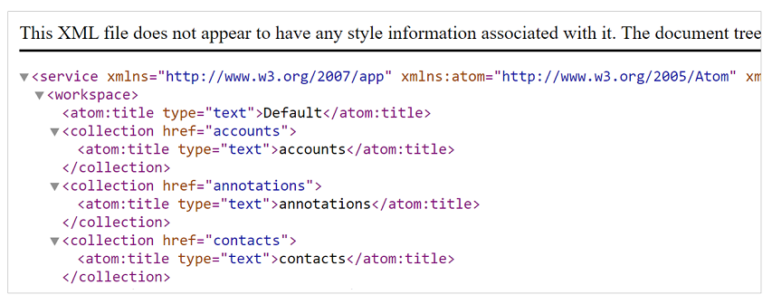
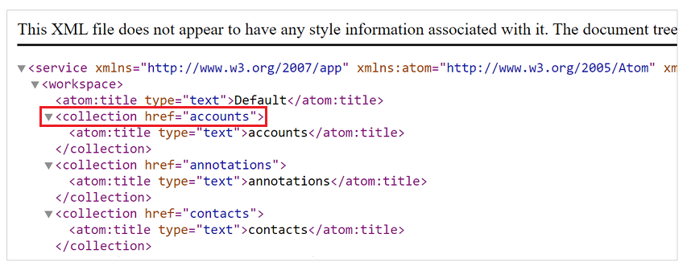

# Analyze and resolve Portal Checker diagnostics results

In this article, you'll learn about Portal Checker diagnostics results, and how to resolve any issues or problems found.

## An active Search site marker isn't available for this portal

This issue occurs when the **Search** site marker isn't available in your portal configuration. To fix this issue:

1. Open the [Portal Management app](configure/configure-portal.md).
1. In the left pane, select **Site Markers**.
1. If a site marker named **Search** is available and deactivated, activate it.
1. If not available, create a new site marker with following values:
    - **Name**: Search
    - **Website**: Select the website of your portal host.
    - **Page**: Select the webpage record that is set as the search page of your portal.
1. Select **Save & Close**.

## Anonymous access to Basic/Advanced forms and Lists

Basic Forms, Advanced Forms and Lists in portals can be excluded from enforcing table permissions by not selecting **Enable Table Permission** checkbox while creating or modifying these controls as explained in [Secure your Lists](../configure/entity-lists.md#securing-lists) and [Secure your forms](../configure/entity-forms.md#secure-your-forms) articles.

While this method is useful for quickly testing your configurations during development of portal, not securing Lists and Forms on portal can have unintended consequences including unauthorized access to data. That's why we don't advise this method to be used outside a secure dev or test environment.

To fix this issue for List/Basic forms:

1. Open the [Portal Management app](../configure/configure-portal.md).

1. On the left-pane, select **List** or **Basic forms** as appropriate.

1. Find the record mentioned in the Portal checker rule.

1. Update the property "Enable Table Permissions" for [List](../configure/entity-lists.md#securing-lists) or [Basic forms](../configure/entity-forms.md#secure-your-forms).

To fix this issue for Advanced forms:

> [!IMPORTANT]
> Portal checker rule doesn't mention Advanced form steps that might have similar configuration.

1. Open the [Portal Management app](../configure/configure-portal.md).

1. On the left-pane, select **Advanced form**.

1. Open each advanced form and go to **Advanced Form Steps**.

1. Go through each step, and update the **Enable Table Permission** property to be enabled.

Once these changes are made, appropriate table permissions would need to be created and assigned to appropriate web roles to ensure that all the users can access these components.

> [!NOTE]
> This method of disabling **Table Permissions** would be deprecated soon. Therefore, it shouldn't be used. Use proper [table permissions](../configure/entity-permissions-studio.md), and web role setup to provide access to users for any data instead. More information: [Table permission changes for forms and lists on new portals](../important-changes-deprecations.md#table-permission-changes-for-forms-and-lists-on-new-portals)

## Anonymous access available to OData feed

> [!NOTE]
> Starting with release [9.3.7.x](/power-platform/released-versions/portals/portalupdate1), lists on all portals (new or existing) that have [OData feed](../configure/entity-lists.md#list-odata-feeds) enabled will require appropriate [table permissions](../configure/entity-permissions-studio.md) setup for the feed on these lists to work.

List component in portal can be enabled for OData feed by enabling [OData feed configuration](../configure/entity-lists.md#list-odata-feeds) on lists. 

To find anonymous OData feeds enabled on your portal:

1. Go to '{Portal Url}/_odata' (for example, `https://contoso.powerappsportals.com/_odata`) in InPrivate mode without authenticating to the portal.

1. In the UI, you'll see a list of all OData feeds enabled on your portal.

    

    > [!NOTE]
    > The list of OData feeds on this page might be available anonymously depending on your security configuration. The next steps will help you verify the anonymous access of these feeds.

1. Go to each of OData feed by browsing to the URL format {Portal URL}/_odata/{collection href value} (for example, `https://contoso.powerappsportals.com/_odata/accounts`) where collection href value is highlighted below.

    

1. If the OData field is available anonymously, it will return the data with HTTP 200 response. If the feed isn't enabled anonymously, it will return HTTP 403 response with a message “Access to OData, with the entity set name of '{table set name}', has been denied.”

If you've unintended OData feed enabled on your portal anonymous, it could be because of one of these possibilities:

1. By not securing list on which OData feed is enabled as described in [Secure your Lists](../configure/entity-lists.md#securing-lists) article.

    - To fix this problem, secure the list as described in the [Secure your Lists](../configure/entity-lists.md#securing-lists) article, and use appropriate table permissions and web roles to provide access to users.

    - You can also find the lists that aren't secured through Portal Checker as described in the above mentioned article.

1. By securing lists, creating appropriate table permissions to the tables used in lists, and assigning those table permissions to anonymous web role.

    - To fix this problem, ensure that the table permissions assigned to **Anonymous** web role are updated to ensure that only intended data is made available anonymously.

## Portal doesn't load and displays a generic error page (Server Error in "/" application) 

This issue can be caused by several different reasons, such as when a portal isn't able to connect to the underlying Dataverse environment, the Dataverse environment doesn't exist or its URL has changed, or when a request to the Dataverse environment has timed out. When you run the Portal Checker tool, it will try to determine the exact reason and point you to the correct mitigation. 

Below is a list of common causes for this error and their corresponding mitigation steps:

### URL of the connected Dataverse environment has changed 

This happens when the URL of the Dataverse environment is changed by a user after a portal is provisioned against the organization. To fix this issue, update the Dynamics 365 URL:

1. Open [Power Apps portals admin center](admin-overview.md).
2. Go to **Portal Actions** > **Update Dynamics 365 URL**. 

Once this action is successfully completed, your Dataverse environment URL will be updated and your portal will start working.

### Dataverse environment connected to your portal is in administration mode

This issue occurs when the Dataverse environment is put in administration mode either when changing the organization from production to sandbox mode or manually by an organization administrator.

If this is the cause, you can disable administration mode by following the steps listed [here](/dynamics365/admin/manage-sandbox-instances#administration-mode). Once administration mode is disabled, your portal should work.

### Authentication connection between Dataverse environment and portal is broken

This issue occurs when the authentication connection between the Dynamics 365 organization and the portal is broken because the Dataverse environment was either restored from a backup or was deleted and recreated from a backup. To fix this issue:

1. Open [Power Apps portals admin center](admin-overview.md).
2. In the **Portal Details** tab, select **Off** from the **Portal State** list.
3. Select **Update**.
4. Select **On** from the **Portal State** list.
5. Select **Update**. 

Once these steps are completed, the portal restarts and can now make an authentication connection.

In certain situations, especially if the organization ID has changed after the restore operation (or if you reprovisioned the organization), these mitigation steps won't work. In these situations, you can reset and reprovision the portal against the same instance. For information on how to reset a portal, see [Reset a portal](reset-portal.md).

### Request to Dataverse environment has timed out

This issue can occur if the API request to your Dataverse environment has timed out. This issue should automatically mitigate itself once the API request starts working. You can also try restarting the portal:

1. Open [Power Apps portals admin center](admin-overview.md).
2. Go to **Portal Actions** > **Restart**.

If restarting the portal doesn't work and the issue continues for a long period of time, contact Microsoft Support for help.

### Website binding not found

This issue occurs when the website binding records for the portal are deleted from the underlying Dataverse environment and the portal isn't able to create binding automatically. To fix this issue:

1. Open the [Portal Management app](../configure/configure-portal.md).
2. Go to **Portals** > **Website Bindings**.
3. Delete all the website binding records that are pointing to your portal. The **Sitename** field helps you to identify the website binding records for your portal.
4. Restart the portal.

Once you complete these steps, your portal will restart and should recreate website binding records automatically.

However, there are situations in which the portal won't be able to recreate website binding records automatically. This can occur when the GUID of the website record available in your instance is different than the one created during default installation of your portal. In this situation, do the following:

1. Delete all website binding records related to your portal.

2. Create a website binding record manually with the following values:

      - **Name**: This can be any string.
      - **Website**: Select the website record that you want to be rendered on your portal.
      - **Sitename**: Type in the host name of your portal (i.e portal URL without `https://` in the beginning). If your portal is using a custom domain name, use that custom domain name here.
      - Leave all other fields blank.

3. Once website binding record is recreated, restart your portal from the Power Apps portals admin center.

### An unexpected error has occurred while trying to connect to your Dataverse environment

This situation can arise because of some unexpected issue. To mitigate this situation, try resetting or reprovisioning the portal. For information on how to reset a portal, see [Reset a portal](reset-portal.md).

If neither a portal reset nor reprovision solve the issue, contact Microsoft Support for help.

## Portal isn't displaying updated data from Dataverse environment

Any data displayed on the portal is rendered from the portal cache. This cache gets updated whenever data in the Dataverse environment is updated. However, this process can take up to 15 minutes. If changes are made in the metadata table of the portal (for example, webpages, web files, content snippet, or site setting), it's recommended to clear the cache manually or restart the portal from the Power Apps portals admin center. For information on how to clear cache, see [Clear the server-side cache for a portal](clear-server-side-cache.md). 

However, if you're seeing stale data for a long period of time in non-portal metadata tables, it could be because of one of the following issues:

### Tables not enabled for cache invalidation

If you're seeing stale data only for certain tables and not everything, this can be because the change tracking metadata isn't enabled on that specific table.

If you run the Portal Checker (self-service diagnostic) tool, it will list the Object Type Code of all the tables that are referenced on the portal that aren't enabled for change tracking. You can browse your metadata by following the steps outlined at [Browse the metadata for your organization](/dynamics365/customerengagement/on-premises/developer/browse-your-metadata).

If you're experiencing stale data issues in any of these tables, you can enable change tracking by using the Power Apps portals admin center UI or Dynamics 365 API. For more information, see [Enable change tracking for a table](/dynamics365/customerengagement/on-premises/developer/use-change-tracking-synchronize-data-external-systems#enable-change-tracking-for-an-entity).

### Organization not enabled for change tracking

Apart from each table being enabled for change tracking, organizations on a whole have to be enabled for change tracking as well. An organization is enabled for change tracking when a portal provisioning request is submitted. However, this can break if an organization is restored from an old database or reset. To fix this issue:

1. Open [Power Apps portals admin center](admin-overview.md).
2. In the **Portal Details** tab, select **Off** from the **Portal State** list.
3. Select **Update**.
4. Select **On** from the **Portal State** list.
5. Select **Update**.

### I'm getting "Page Not Found" error and the page content is different from the default Page Not Found site marker or web page.

You may see a *Page Not Found* error message that appears different from the default error page content on the **Page Not Found** site marker and webpage.

This *Page Not Found* error appears if: 

- The default **Page Not Found** site marker is configured incorrectly.
- The default **Page Not Found** site marker is deleted.
- The default **Page Not Found** webpage is deleted.

To resolve this error, ensure that you have the default site marker named **Page Not Found** present and configured correctly. If the site marker is present and correctly configured, check if the **Page Not Found** webpage is selected for the site marker or whether the **Page Not Found** webpage is present or not.

For steps to create a site marker for **Page Not Found**, go to [An active Page Not Found site marker isn't available for this portal](#an-active-page-not-found-site-marker-isnt-available-for-this-portal).

For steps to check site marker configuration and ensure it points to the correct webpage, go to [The Page Not Found site marker isn't pointing to any webpage](#the-page-not-found-site-marker-isnt-pointing-to-any-webpage).

For steps to change the site marker to point to the correct **Page Not Found** webpage, go to [The Page Not Found site marker is pointing to a deactivated webpage](#the-page-not-found-site-marker-is-pointing-to-a-deactivated-webpage).

## Web page tracking enabled

Enabling a portal web page for page tracking can lead to performance issues in your portal. 

> [!IMPORTANT]
> This functionality has been retired for portals with version [9.3.4.x](../versions/version-9.3.4.x.md) or later. For more information, see the deprecation announcement published earlier: [Dynamics 365 Portals - Deprecated Features](https://blogs.msdn.microsoft.com/crm/2018/03/20/portal-capabilities-for-dynamics-365-deprecated-features/).

The portal checker tool will list all the webpages (both root and content page) which are enabled for page tracking. These pages should be disabled by following these steps:

1. Open the [Portal Management app](../configure/configure-portal.md).
2. Go to Advanced find.
3. Search for all the webpages where **Enable Tracking (Deprecated)** field is enabled (value is set to Yes).
4. Bulk edit all the pages and set this field to **No**.

You can also go to each page listed in portal checker result and set the value of **Enable Tracking (Deprecated)** field to **No** instead.

It's important to understand that if you're on Dynamics 365 Portals solution version 9.x, this field won't be displayed on the form and you might need to add it to the form first. 

## Web file tracking enabled

Enabling a portal web file for page tracking can lead to performance issues in your portal. 

> [!IMPORTANT]
> This functionality has been retired for portals with version [9.3.4.x](../versions/version-9.3.4.x.md) or later. For more information, see the deprecation announcement published earlier: [Dynamics 365 Portals - Deprecated Features](https://blogs.msdn.microsoft.com/crm/2018/03/20/portal-capabilities-for-dynamics-365-deprecated-features/).

The Portal Checker tool will list all the web files that are enabled for page tracking. These files should be disabled by following these steps:

1. Open the [Portal Management app](../configure/configure-portal.md).
2. Go to Advanced find.
3. Search for all the web files where **Enable Tracking (Deprecated)** field is enabled (value is set to Yes).
4. Bulk edit all the records and set this field to **No**.

You can also go to each file listed in the Portal Checker result and set the value of **Enable Tracking (Deprecated)** field to **No**. It's important to know that if you're on portal solution version 9.x, this field won't be displayed on the form and you might need to add it to the form first. 

## Login tracking enabled

Enabling a portal login tracking can lead to performance issues in your portal. 

> [!IMPORTANT]
> This functionality has been retired for portals with version [9.3.4.x](../versions/version-9.3.4.x.md) or later. For more information, see the deprecation announcement published earlier: [Dynamics 365 Portals - Deprecated Features](https://blogs.msdn.microsoft.com/crm/2018/03/20/portal-capabilities-for-dynamics-365-deprecated-features/).

The Portal Checker tool will check to see if login tracking is enabled for your portal and show a failed check if it's enabled. Login tracking should be disabled by following these steps:

1.    Open the [Portal Management app](../configure/configure-portal.md).
2.    Go to **Portals** > **Site Settings**.
3.    Search for site setting named `Authentication/LoginTrackingEnabled`.
4.    Change the value of this site setting to **False** or delete the site setting.
5.    Restart the portal. 

## Header output cache is disabled

Disabling header output cache on your portal can lead to performance issues in your portal during high load. More details about this functionality can be found at [Enable header and footer output caching on a portal](../configure/enable-header-footer-output-caching.md).

The Portal Checker tool will check to see if header output cache is disabled on your portal and show a failed check if it's disabled. To enable it:

1.	Open the [Portal Management app](../configure/configure-portal.md).
2.	Go to **Portals** > **Site Settings**.
3.	Search for site setting named `Header/OutputCache/Enabled`.
4.	If the site setting is available, change the value to **True**. If the site setting isn't available, create a new site setting with this name and set its value to **True**.
5.	Restart the portal. 

## Footer output cache is disabled

Disabling footer output cache on your portal can lead to performance issues in your portal during high load. More details about this functionality can be found at [Enable header and footer output caching on a portal](../configure/enable-header-footer-output-caching.md).

The Portal Checker tool will check to see if footer output cache is disabled on your portal and show a failed check if it's disabled. To enable it:

1.	Open the [Portal Management app](../configure/configure-portal.md).
2.	Go to **Portals** > **Site Settings**.
3.	Search for site setting named `Footer/OutputCache/Enabled`.
4.	If the site setting is available, change the value to **True**. If the site setting isn't available, create a new site setting with this name and set its value to **True**.
5.	Restart the portal. 

## Large number of web file records

The web file table is used by a portal to store any static files you want to use on your portal. The main use case of this table is to store static content of your website such as CSS, JavaScript, image files, and so on. However, having a large number of these files can cause slowness during the startup of your portal.

The Portal Checker tool will check for this scenario and provide you an indication if you have more than 500 active web files in your portal. If all of these files represent static content, you can take the following actions to mitigate this issue:

- Use an external file server like Azure blob storage or CDN to store these files and then reference these files on the appropriate pages either within the page or in an underlying template.

- If you can't move files outside, ensure that all the files aren't loaded along with the homepage. A web file is loaded along with the homepage if the parent page of that file is set to home. To avoid this scenario, do the following:

  1. Create a dummy webpage with no content and a blank template. This page would be used to create a direct path to your web files. 
  2. For all the web files that aren't needed on the homepage, change the parent page to this dummy webpage. Once done, full path to your web file would be `Portal URL/{dummy_webpage}/{web file}`.
  3. Reference your web file directly in the HTML of the page template or web template of the page where you want to use it. This will load your file on demand on that page. 

## Loading static resources (CSS/JS) asynchronously

When working on portal implementation, it's important to understand that you completely manage the HTML of the page. That means that standard web development practices should be followed to ensure that your webpage's client side performance isn't affected.

One of the most common causes of performance issues on webpages is loading a lot of static resources (CSS/JS) synchronously on the the page. In portals, whenever you associate a web file directly to the homepage, it creates a dependency in the generated HTML. This means that web file is always loaded along with the homepage. Synchronous loading of a large number of CSS/JS files can lead to long client-side processing time for your webpages.

To avoid this, do the following:

1. If a web file isn't needed on the homepage, make sure its parent page isn't set to home, and reuse the steps described in the section above to load it on demand.
2. While loading a JavaScript file on demand on any page, use the `<async>` or `<defer>` HTML attribute to load the file asynchronously.
3. While loading a CSS file on demand, you can use the `<preload>` HTML attribute (https://www.w3.org/TR/preload/) or JavaScript-based approach since preload isn't supported on all the browsers yet.

## Basic form lookup configuration 

Enabling a lookup to render as a drop-down mode in basic forms or advanced forms can lead to performance issues if the number of records shown in the drop-down exceeds 200 and are changed frequently. Use this option for only static lookups, such as country and state list, having a limited number of records.

If this option is enabled for lookups that can have a large number of records, it will slow down the load time of the webpage on which the basic form is available. If this page is used by a lot of users and loaded many times, it can slow down the entire website by using website resources to render this page. For these situations, full lookup experience should be used, or a custom HTML control that calls an AJAX endpoint (created using web templates) should be built for the wanted look and feel.

## Number of web roles

Web roles are used in portals to enable role-based access control. Typically, the number of web roles in a portal are limited as the number of different combinations of permissions would be limited as well. If the number of web roles exceed 100 in your portal, it can cause performance issues that affect all pages of your portal.

## An active Home site marker isn't available for this portal

This issue occurs when the **Home** site marker isn't available in your portal configuration. To fix this issue:

1.	Open the [Portal Management app](../configure/configure-portal.md).
2.	In the left pane, select **Site Markers**.
3.	Create a new site marker with the following values:
    - **Name**: Home
    - **Website**: Select the website of your portal host.
    - **Page**: Select the webpage record that is set as the homepage of your portal.

## The Home site marker isn't pointing to any webpage

This issue occurs when the **Home** site marker is available but isn't pointing to any webpage. To fix this issue:

1.    Open the [Portal Management app](../configure/configure-portal.md).
2.    In the left pane, select **Site Markers**.
3.    Find the **Home** site marker record.
4.    Update the **Page** field to point to an active homepage of your portal.

## The Home site marker is pointing to a deactivated web page

This issue occurs when the **Home** site marker is available, but is pointing to a deactivated webpage. To fix this issue:

1.    Open the [Portal Management app](../configure/configure-portal.md).
2.    In the left pane, select **Site Markers**.
3.    Find the **Home** site marker record.
4.    Update the **Page** field to point to an active homepage of your portal.

## The Home site marker isn't pointing to homepage of the portal

This issue occurs when the **Home** site marker is available, but is pointing to a webpage that isn't a homepage of your portal. To fix this issue:

1.    Open the [Portal Management app](../configure/configure-portal.md).
2.    In the left pane, select **Site Markers**.
3.    Find the **Home** site marker record.
4.    Update the **Page** field to point to an active homepage of your portal.

## An active Profile site marker isn't available for this portal

This issue occurs when the **Profile** site marker isn't available in your portal configuration. To fix this issue:

1.	Open the [Portal Management app](../configure/configure-portal.md).
2.	In the left pane, select **Site Markers**.
3.	Create a new site marker with the following values: 
    - **Name**: Profile
    - **Website**: Select the website of your portal host.
    - **Page**: Select the webpage record that is set as the profile page of your portal.

## The Profile site marker isn't pointing to any webpage

This issue occurs when the **Profile** site marker is available but isn't pointing to any webpage. To fix this issue:

1.    Open the [Portal Management app](../configure/configure-portal.md).
2.    In the left pane, select **Site Markers**.
3.    Find the **Profile** site marker record.
4.    Update the **Page** field to point to an active profile page of your portal.

## The Profile site marker is pointing to a deactivated web page

This issue occurs when the **Profile** site marker is available, but is pointing to a deactivated webpage. To fix this issue:

1.    Open the [Portal Management app](../configure/configure-portal.md).
2.    In the left pane, select **Site Markers**.
3.    Find the **Profile** site marker record.
4.    Update the **Page** field to point to an active profile page of your portal.

## An active Page Not Found site marker isn't available for this portal

This issue occurs when the **Page Not Found** site marker isn't available in your portal configuration. To fix this issue:

1.	Open the [Portal Management app](../configure/configure-portal.md).
2.	In the left pane, select **Site Markers**.
3.	Create a new site marker with the following values: 
    - **Name**: Page Not Found
    - **Website**: Select the website of your portal host.
    - **Page**: Select the webpage record that is set as the Page Not Found page of your portal.

## The Page Not Found site marker isn't pointing to any webpage

This issue occurs when the **Page Not Found** site marker is available but isn't pointing to any webpage. To fix this issue:

1.    Open the [Portal Management app](../configure/configure-portal.md).
2.    In the left pane, select **Site Markers**.
3.    Find the **Page Not Found** site marker record.
4.    Update the **Page** field to point to an active Page Not Found page of your portal.

## The Page Not Found site marker is pointing to a deactivated webpage

This issue occurs when the **Page Not Found** site marker is available, but is pointing to a deactivated webpage. To fix this issue:

1.    Open the [Portal Management app](../configure/configure-portal.md).
2.    In the left pane, select **Site Markers**.
3.    Find the **Page Not Found** site marker record.
4.    Update the **Page** field to point to an active Page Not Found page of your portal.

## An active Access Denied site marker isn't available for this portal

This issue occurs when the **Access Denied** site marker isn't available in your portal configuration. To fix this issue:

1.	Open the [Portal Management app](../configure/configure-portal.md).
2.	In the left pane, select **Site Markers**.
3.	Create a new site marker with the following values: 
    - **Name**: Access Denied
    - **Website**: Select the website of your portal host.
    - **Page**: Select the webpage record that is set as the Access Denied page of your portal.

## The Access Denied site marker isn't pointing to any webpage

This issue occurs when the **Access Denied** site marker is available but isn't pointing to any webpage. To fix this issue:

1.    Open the [Portal Management app](../configure/configure-portal.md).
2.    In the left pane, select **Site Markers**.
3.    Find the **Access Denied** site marker record.
4.    Update the **Page** field to point to an active Access Denied page of your portal.

## The Access Denied site marker is pointing to a deactivated web page

This issue occurs when the **Access Denied** site marker is available, but is pointing to a deactivated webpage (root or content page can be deactivated). To fix this issue:

1.    Open the [Portal Management app](../configure/configure-portal.md).
2.    In the left pane, select **Site Markers**.
3.    Find the **Access Denied** site marker record.
4.    Update the **Page** field to point to an active Access Denied page of your portal.

## Profile advanced form isn't available for contact table

The profile page is one of the common pages used in your portal for all profile-related issues. This page shows a form that can be used by users to update their profiles. The form used on this page comes from the **Profile Web Page** main form available in the Contact table. This form is created in your Dataverse environment when the portal is provisioned. This error is displayed when the **Profile** advanced form is either deleted or disabled in your portal. This form is mandatory and deleting or disabling this form can break the whole website, displaying a runtime error on your portal. This is an irreparable state and requires the portal to be reinstalled in the environment.

## Published state isn't available for this website

To fix this issue, ensure that the publishing state **Published** is available and active.

## Published state isn't visible

To fix this issue, ensure that the publishing state **Published** has the **isVisible** checkbox is selected.

## List of tables with search result having invalid URL

To fix this issue, ensure that your table has appropriate security permission.

## List of tables with CMS security check failed

To fix this issue, ensure that your table has proper search page.

## Web file isn't active

To fix this issue, ensure that the web file is in active state.

## The partial URL of web file is misconfigured

To fix this issue, ensure that the partial URL is the file name with Home as the root page.

## Web file doesn't have a file attachment

To fix this issue, add the corresponding CSS file in the notes section of the web file.

## File attachment doesn't have content

To fix this issue, add the CSS file with entire content in the notes section of the web file.

## MIME type of file isn't text/CSS

To fix this issue, ensure that there are no plug-ins or flows that override the MIME type of the CSS file(s).

### See also

[Run Portal Checker](portal-checker.md)

[!INCLUDE[footer-include](../../../includes/footer-banner.md)]
