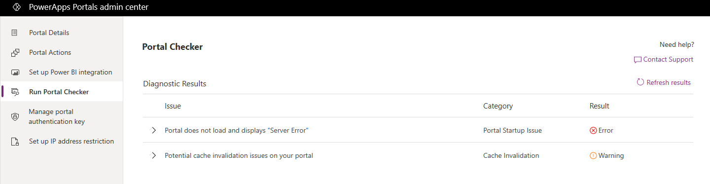
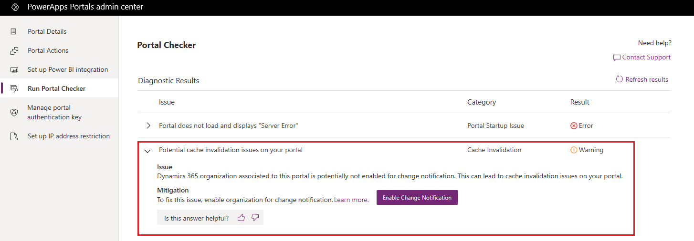
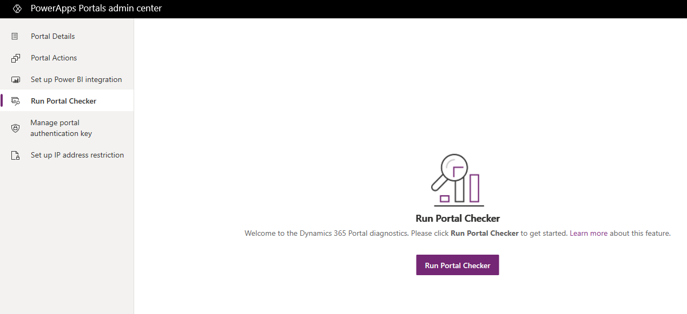
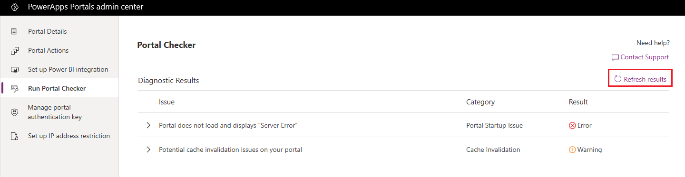

# Run Portal Checker

Portal Checker is a self-service diagnostic tool that can be used by portal administrators to identify common issues in their portal. Portal Checker helps to identify issues with a portal by looking at various configuration parameters and provides suggestions on how to fix them.

When you run Portal Checker, the results are displayed in the **Diagnostic Results** section in a grid format. The results grid has the following columns:

- **Issue**: Displays the top-level issue faced by a customer; for example, performance issue.
- **Category**: Displays the top-level area where issues can be categorized; for example, provisioning or solution upgrade.
- **Result**: Displays the status of the issue; for example, error or warning.

By default, information in the grid is sorted by the **Result** column in this order: error, warning, and pass.

> [!div class=mx-imgBorder]
> 

You can expand an issue to view detailed information and mitigation steps. If the mitigation requires any action, you'll see a button that will perform the action. You can also provide feedback on whether the mitigation was useful.

> [!div class=mx-imgBorder]
> 

If required, you can rerun the diagnostic checks, which will refresh the results with updated data.

> [!NOTE]
> If portal is turned off or IP address filtering is enabled, certain diagnostic checks will not be run on your portal.

For a list of common issues diagnosed by Portal Checker, see [Common portal issues diagnosed by Portal Checker and their best practices](/dynamics365/customer-engagement/portals/portal-faq).

To run Portal Checker:

1.	Open [Power Apps portals admin center](admin-overview.md).

2.	Go to **Run Portal Checker**.

    > [!div class=mx-imgBorder]
    > 

3.	Select the **Run Portal Checker** button. The diagnostic session will start and gather data about the customer issues. The results are displayed in the **Diagnostic Results** section.

    > [!div class=mx-imgBorder]
    > 

4.	To rerun the diagnostic checks, select **Refresh results**.

    > [!div class=mx-imgBorder]
    > 

## Next steps

[Analyze and resolve Portal Checker diagnostics results](portal-checker-analysis.md)

[!INCLUDE[footer-include](../../../includes/footer-banner.md)]
