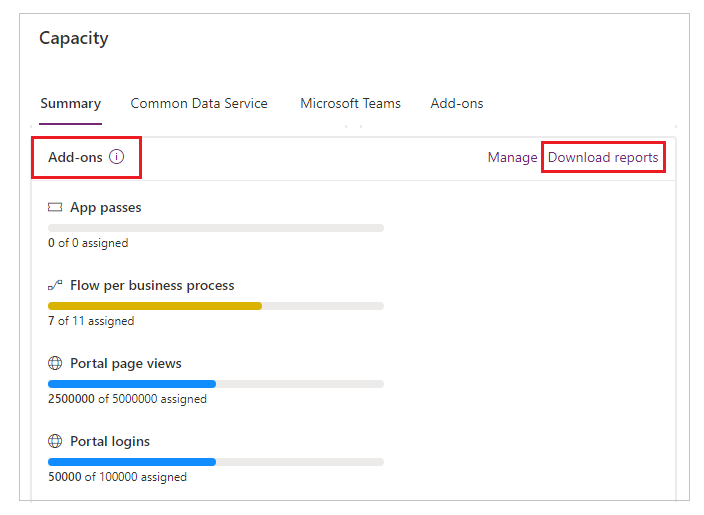
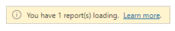
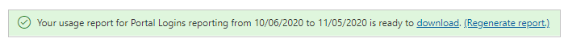

 
# Portals capacity consumption reports

Power Apps portals is licensed by using **per login** and **per page view** capacity add-ons for external users. This capacity must be allocated to a Microsoft Power Platform environment by an administrator. More information: [Licensing FAQ](/power-platform/admin/powerapps-flow-licensing-faq#portals)

Administrators can download portal sign-in and page view reports from the [Power Platform admin center](https://admin.powerplatform.com). These reports show the number of sign-ins ("logins") and page views for Power Apps portals across all environments for a tenant.

## Download the reports

The individual reports contain data for a duration of 30 days preceding the date you select while downloading the reports.
<!--markdownlint-disable MD036-->
**To download the reports**
<!--markdownlint-enable MD036-->
1. Go to [Power Platform admin center](https://admin.powerplatform.com).

1. On the left pane, expand **Resources**.

1. Select **Capacity**.

1. In the **Add-ons** section, select **Download reports**.

    

1. Select the **Portal Logins** or **Portal Views** report.

1. Select a **Target Date**. The report will include data for the 30 days preceding this date.

1. Select **Submit**.

    

    A notification appears that acknowledges your download request.

1. After the generated report becomes available, select **Download** in the notification that appears.

    

    > [!TIP]
    > To quickly regenerate the report for the selected report type and target date, select **Regenerate report** in the notification.

1. Select **Save**, and then select **Open**.

## Analyze reports

The report contains capacity consumption of all available portals across all environments for the tenant, organized by date. You can filter on different columns in the report&mdash;such as portal ID, environment ID, or date range&mdash;for additional analysis.

The following table describes the columns in the downloaded report.

> [!NOTE]
> The format is the same for both the **Portal Logins** and **Portal Views** reports.

| Column name | Description |
| - | - |
| **Date** | The date for the report data available in the row. |
| **PortalId** | The ID of the portal. To check the ID, [open the _services/about page](clear-server-side-cache.md) for that portal. |
| **EnvironmentId** | The ID of the Microsoft Power Platform environment. To check the ID of an environment: <ul><li> Go to [Power Apps](https://make.powerapps.com). </li><li> Select the environment from the environments list in the upper-right corner. </li> <li> Copy the environment ID from the browser's address bar.   For example, `https://make.powerapps.com/environments/xxxxxxxx-xxxx-xxxx-xxxx-xxxxxxxxxxxx/home` is the ID of the environment. </li> </ul> |
| **Consumption** | The total number of sign-ins or views, depending on the report you downloaded. You can compare the consumption number in the report for each environment by date with the configured maximum allowed numbers for sign-ins or views by using [Power Platform admin center - Manage add-ons](https://admin.powerplatform.microsoft.com/resources/capacity#add-ons). More information: [Microsoft Power Platform add-on capacity management](/power-platform/admin/capacity-add-on) |
| **PortalType** | The type of the portal: **Prod** for production or **Trial** for trial. |
| **LicenseType** | The type of the license: <ul> <li> **Capacity** - specifies that the portal uses the [new capacity-based licensing model](/power-platform/admin/powerapps-flow-licensing-faq#portals). </li> <li> **AddOn** - specifies that the portal uses, and was [provisioned using the older portal add-on plan](../provision-portal-add-on.md). </li> </ul> More information: [Licensing FAQ for Power Apps](/power-platform/admin/powerapps-flow-licensing-faq#portals) and [Download the Power Apps Licensing Guide](https://go.microsoft.com/fwlink/?linkid=2085130)

### See also

[Microsoft Power Platform add-on capacity management](/power-platform/admin/capacity-add-on)  
[Licensing FAQ for Power Apps](/power-platform/admin/powerapps-flow-licensing-faq#portals)  
[Download the Power Apps Licensing Guide](https://go.microsoft.com/fwlink/?linkid=2085130)

[!INCLUDE[footer-include](../../../includes/footer-banner.md)]