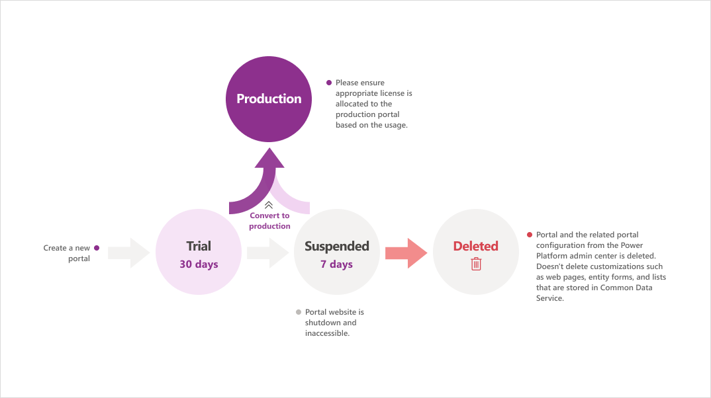

# Power Apps portals lifecycle

A portal is always created as a trial. A trial portal, which expires after 30 days, is useful for trying out its capabilities at no cost. After it expires, the portal is suspended and shut down. Seven days after it's suspended, the trial portal is deleted. You'll be notified at every stage of the portal lifecycle&mdash;nearing suspension, suspended, deleted, and converted from trial to production&mdash;through toast notifications and email.

As an administrator, you can convert a trial or suspended portal to a production portal. When converting a portal from trial to production, you must ensure that the environment is also a production environment. You can't convert a trial portal to a production portal in a trial environment. If you delete the environment in which a trial portal is created, the portal is also deleted.

The first portal is free to be created in an environment in a tenant. If you need to create more than one portal, you must have 1 GB of unused storage space in the tenant.

### Understanding portal lifecycle stages

The following diagram explains various stages that a Power Apps portals goes through, from creation until deletion.

Let's understand each portal lifecycle stage.

## Trial portal

Every portal begins as a trial portal that expires after 30 days. You can convert it to a production portal from the Power Apps Portals admin center if you have the required licenses. More information: [Convert a portal from trial to production](convert-portal.md#convert-a-portal-from-trial-to-production)

To convert a trial portal to a production portal, the environment should have required add-ons for external users or a license for internal users. More information: [Power Apps and Power Automate licensing FAQs](/power-platform/admin/powerapps-flow-licensing-faq) and [Power Apps portals licensing](/power-platform/admin/powerapps-flow-licensing-faq#can-you-share-more-details-regarding-the-new-power-apps-portals-licensing)

## Suspended portal

You'll continue to see notifications in the Power Apps portals admin center about the expiration of your trial portal. Trial portals expire after 30 days. If you don't convert your portal to production within the trial period, the portal is shut down and placed in suspended status.

You can't access your portal after it expires. However, you can still convert the suspended portal to production within seven days of suspension.

## Deleted portal

If you don't convert your portal to production within the seven-day suspension period, the portal is deleted. The portal data isn't deleted from the environment, but the space used by the portal in the environment will be released, and you can create a new portal.

## Next steps

[Available portal templates](../portal-templates.md)  
[Create portal a starter portal](../create-portal.md)  
[Create a portal in an environment containing customer engagement apps](../create-dynamics-portal.md)

### See also

[Microsoft Learn: Portal application lifecycle management](/learn/modules/extend-power-app-portals/2-portal-application-lifecycle)  
[Convert a portal from trial to production](convert-portal.md#convert-a-portal-from-trial-to-production)  
[Convert an existing portal to capacity-based model](convert-portal.md#convert-an-existing-portal-to-capacity-based-model)

[!INCLUDE[footer-include](../../../includes/footer-banner.md)]