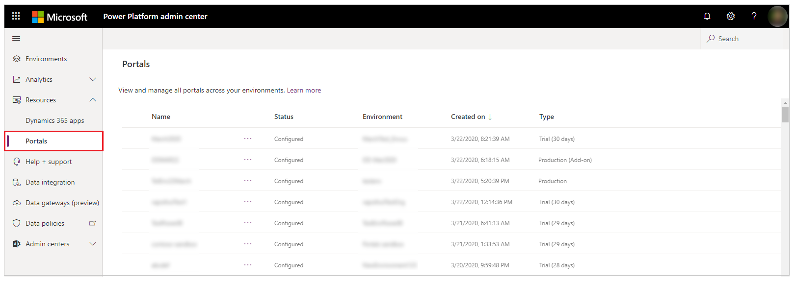
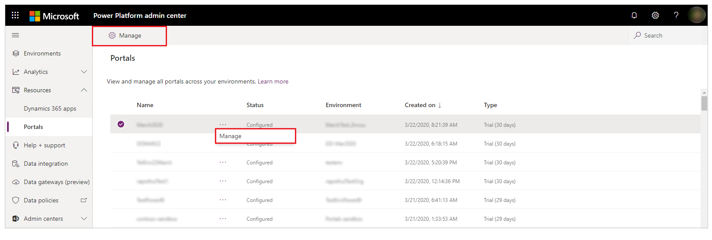
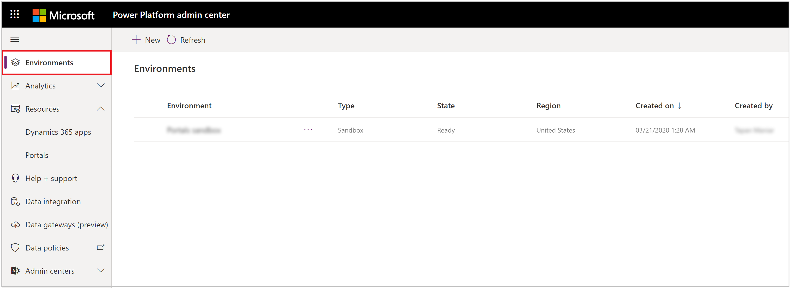
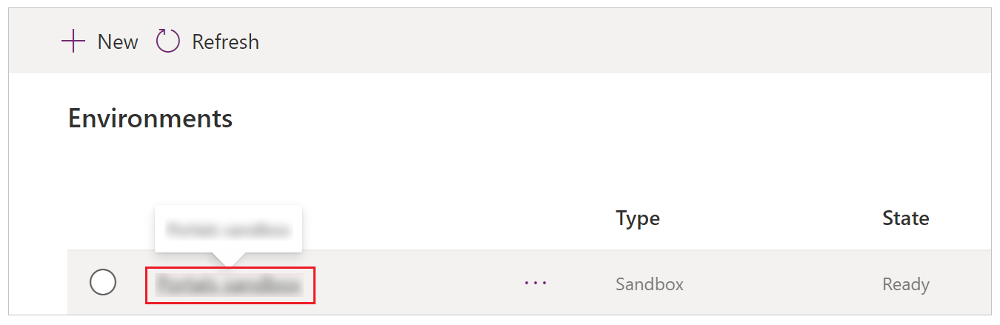
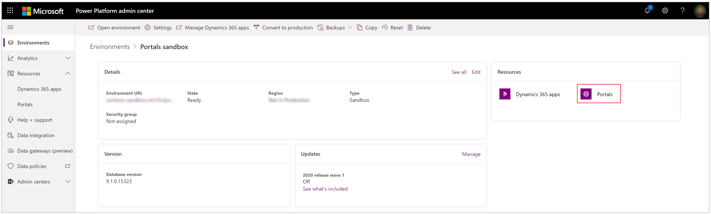
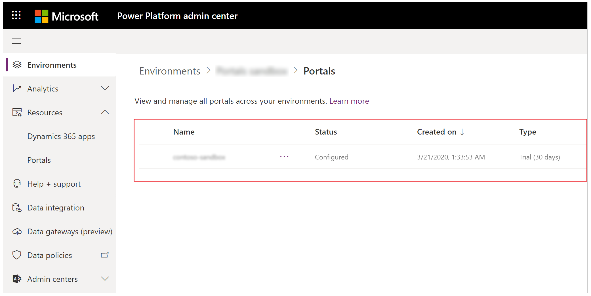
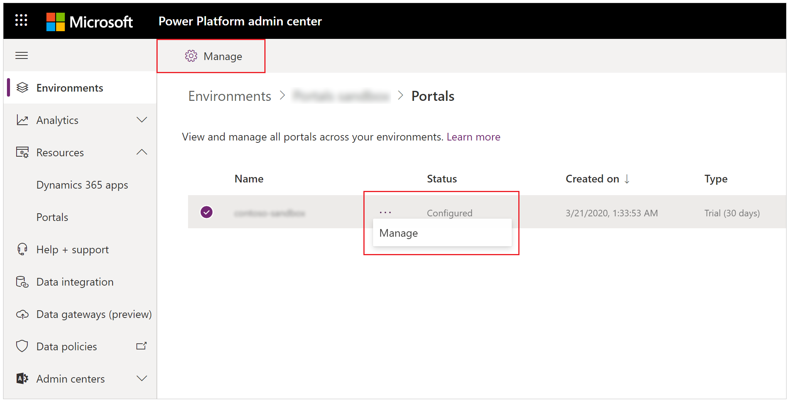
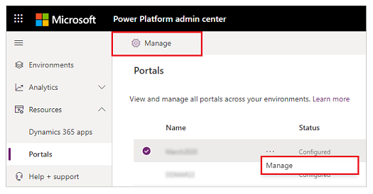
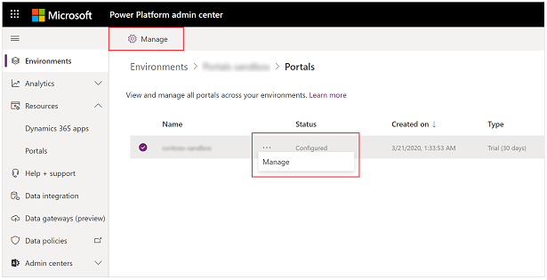

# Manage portals from the Power Platform admin center

You can now use the Power Platform admin center to manage portals that have both capacity-based and add-on licenses. You can also see information such as how many days are left before a trial portal expires. For more information about portal licensing, go to the [licensing FAQ](/power-platform/admin/powerapps-flow-licensing-faq#portals) and [portal differences](../overview.md#power-apps-portals-dynamics-365-portals-and-add-on-portals). For more information about the Power Platform admin center, go to [Administer Microsoft Power Platform](/power-platform/admin/admin-documentation).

You can manage portals in the Power Platform admin center in two ways:

- Manage all portals for the current tenant from **Resources** > **Portals**.
- Manage portals for a specific environment from **Environments**.

## Manage all portals for a tenant

1. Sign in to the [Power Platform admin center](https://admin.powerplatform.microsoft.com/).

1. On the left pane, select **Resources**, and then select **Portals**.

    

1. Select a portal.

1. Select **More portal actions** (**...**), and then select **Manage**. or Select the portal, and then select **Manage** at the top of the page.

    

To configure portal details, go to [Portal details](portal-details.md).

## Manage all portals for an environment

1. Sign in to the [Power Platform admin center](https://admin.powerplatform.microsoft.com/).

1. On the left pane, select **Environments**.

    

1. Hover over and select the hyperlinked environment name to open the environment details.

    

1. On the right side of the screen, under **Resources**, select **Portals**.

    

   You'll see a list of portals installed in the selected environment.

    

1. Select **More portal actions** (**...**), and then select **Manage**. or Select the portal, and then select **Manage** from the top of the page.

    

To configure portal details, see [Portal details](portal-details.md).

## Manage the portal add-on

Using the Power Platform admin center to manage portals as described in this article replaces earlier functionality, which is illustrated in the following image.

| Old method to manage an add-on portal | New method to manage an add-on portal for a tenant | New method to manage an add-on portal for an environment |
| - | - | - |
|  |  |  |

## Portal types in the admin center

The following table describes the different types of portals that are listed in the Power Platform admin center.

| Type                |Description                                                           |
|---------------------|----------------------------------------------------------------------|
| Production          | A production portal based on a capacity-based license.               |
| Trial (*n* days)    | A trial portal based on a capacity-based license, with _n_ days remaining until suspension. |
| Production (add-on) | A production portal based on an add-on license.     |
| Trial (add-on)      | A trial portal based on an add-on license.          |

## Portal status in the admin center

A portal can have the following status: *Configured*, *Suspended*, or *Not configured*. The following table describes each state.

| Status         |  Description    |
|----------------|-----------------|
| Configured     | This portal has been configured to an environment.     |
| Suspended      | This portal has been suspended because its trial period is over. It will be deleted in seven days, unless it's converted to a production portal. |
| Not configured | This portal is ready to be configured to an environment.   |

> [!NOTE]
> You can [create a new portal](../provision-portal-add-on.md) if the portal add-on status is *Not configured*. The status will change to *Configured* after the portal is provisioned.

## Next steps

[Configure portal details](portal-details.md)

### See also

- [Administer Microsoft Power Platform](/power-platform/admin/admin-documentation)
- [Manage Dynamics 365 apps](/power-platform/admin/manage-apps)  
- [Upgrade a portal](upgrade-portal.md)

[!INCLUDE[footer-include](../../../includes/footer-banner.md)]