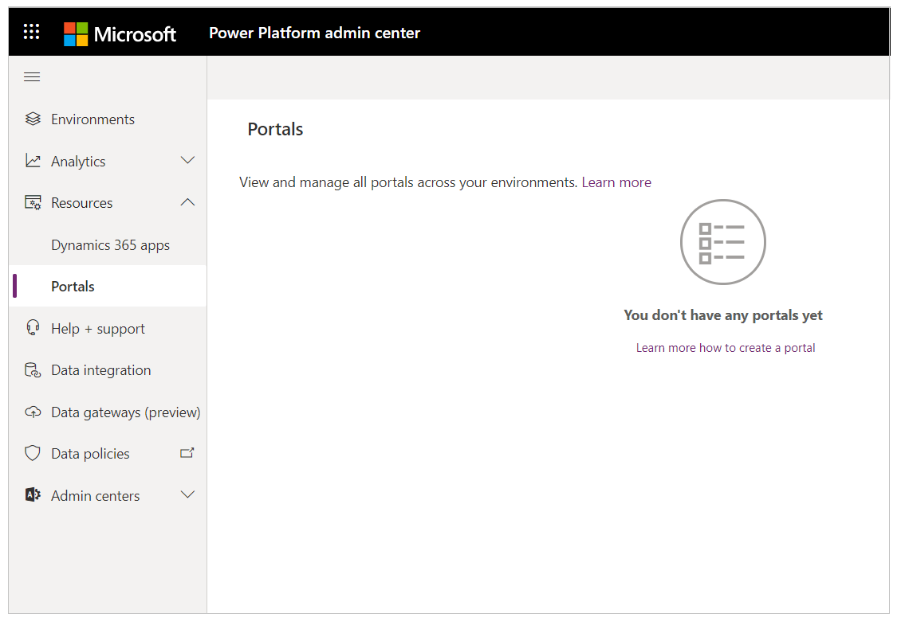
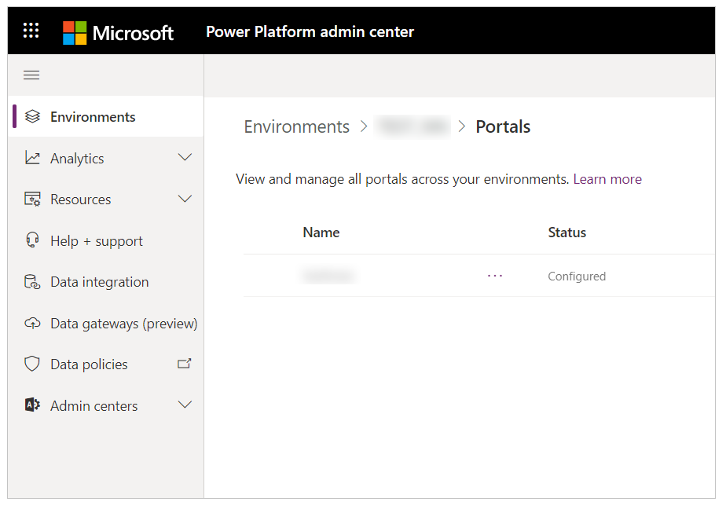

# Manage portals from Power Platform admin center

You can now manage portals in the Power Platform admin center.

## Manage all portals for a tenant

To see a list of all portals for your tenant:

1. Sign in to the [Power Platform admin center](https://admin.powerplatform.microsoft.com/).

1. Select **Resources** and then **Portals** from the left-side menu.

    

## Environment all portals for an environment

Follow these steps to see a list of all portals for your environment.

1. Sign in to the [Power Platform admin center](https://admin.powerplatform.microsoft.com/).

1. Select **Environments** and then select an environment.

1. Select **Portals** under **Resources**.

You'll see a list of Portals installed in the selected environment.

### Portal types

The following table explains different types of portals that you can see listed on admin center with descriptions:

| **Type**            | **Description**                                                                    |
|---------------------|------------------------------------------------------------------------------------|
| Production          | Production portal based on capacity-based license.                                  |
| Trial (n days)      | Trial portal based on capacity-based license with n days remaining for suspension. |
| Production (add-on) | Production portal based on add-on license.                                          |
| Trial (add-on)      | Trial portal based on add-on license.                                               |

### Portal status

A portal can be in *Configured*, *Suspended*, or *Not-configured* status. The following table describes each status:

| **Status**     | **Description**                                                                                                                 |
|----------------|---------------------------------------------------------------------------------------------------------------------------------|
| Configured     | This portal has been configured to an environment.                                                                              |
| Suspended      | This portal has been suspended due to trial period over. And this portal will be deleted in 7 days, if not converted to production. |
| Not-configured | This app is ready to be configured to an environment.                                                                           |

