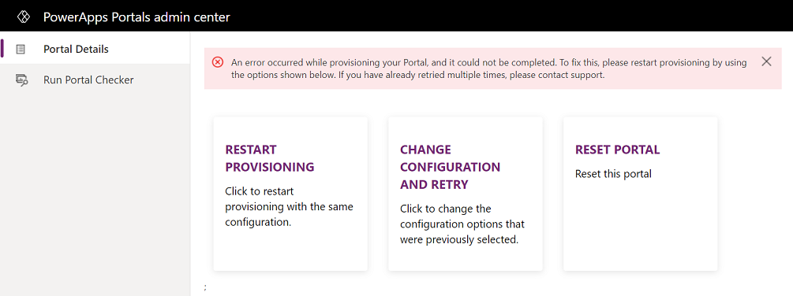
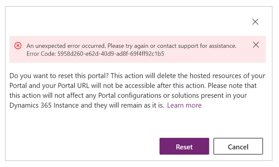
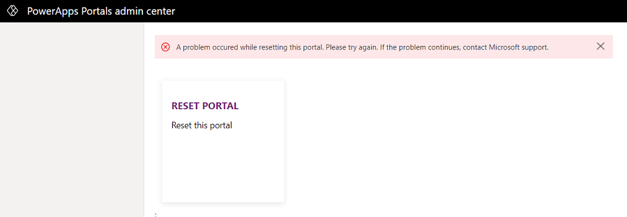

# Reset a portal

Once a portal is provisioned, you might need to delete resources from your portal under certain circumstances, such as if you move your organization to another tenant or another datacenter or if you want to remove the portal from your organization.

To do this, you can reset your portal, which will delete all the hosted resources associated with it. Then you can provision the portal again. Once the reset operation is finished, your portal URL will not be accessible anymore.

It is important to note that resetting your portal doesn't remove portal configuration or solutions present in your instance and they will remain as is.

You can reset a completely configured portal, or a portal for which provisioning or updating of an instance has failed.

> [!TIP]
> To learn about the roles required to perform this task, read [Admin roles required for portal administrative tasks](portal-admin-roles.md).

To reset a configured portal:

1.    Open [Power Apps portals admin center](admin-overview.md).

2.    Go to **Portal Actions** > **Reset Portal**.

        > [!div class=mx-imgBorder]
        > 

3.    Select **Reset** in the confirmation window.

> [!NOTE]
> - If you don't have appropriate permissions on an associated Azure Active Directory application, an error is displayed. You must contact the global administrator for the appropriate permissions.
> - If you have provisioned a portal using the older portal add-on and the portal is reset successfully, the portal name and its status on the **Applications** tab on the **Dynamics 365 Administration Center** page does not change. For example, if your portal name and status were Portal 1 and Configured respectively, then after resetting the portal, these values do not change. If you want to change the portal name, you can change it on the **Portal Details** tab in the Power Apps portals admin center. However, the status value cannot be reverted to Not Configured.
> - It is important to note that the portal's status on the **Applications** tab does not represent its provisioning status and does not affect the functioning of your portal. It just shows whether you have ever accessed the Power Apps portals admin center for that corresponding portal or not.
> - If you have provisioned a portal using the older portal add-on, you can reset the portal to **not configured** state and [create a new portal](../provision-portal-add-on.md).
> - If you reset a portal and provision a new portal, you must add portal application ID of the new portal to the **Portal Power BI Embedded service** Azure AD security group. For more information, read [Set up Power BI integration](set-up-power-bi-integration.md#create-security-group-and-add-to-power-bi-account).
 
If your portal is not provisioned correctly, it goes into an error state and the following screen is displayed. In this case, you can also reset the portal by selecting **Reset Portal** on the error screen.

> [!div class=mx-imgBorder]
> 

## Delete a portal

A Power Apps portal consists of the following components:

- **Portal website host**: Portal website host is the Portal code that forms the actual website.

- **Portal configuration**: The portal configuration in the Dataverse environment that defines portal components such as *Websites*, *Pages*, *Content Snippets* and *Web Roles* records.

- **Portal solutions**: Solutions that are installed in the Dataverse environment and contain the metadata tables for any portal.

**To delete a portal**, you must delete the **portal website host** and the  **portal configuration**.

- To delete **portal web site host**, do one of the following:
    - Option 1: Go to [Power Apps](https://make.powerapps.com), and [delete](../manage-existing-portals.md#delete) the portal.
    - Option 2: Go to [Power Apps portals admin center](admin-overview.md), and reset the portal as explained in this article above.

- To delete **portal configuration**, delete the corresponding website record for the portal you want to delete using the **Portal Management** app.

> [!NOTE]
> If you [delete](../manage-existing-portals.md#delete), or [reset](reset-portal.md) the portal but do not delete the corresponding website record associated with the portal using the [Portal Management](../configure/configure-portal.md) app, new portal that you create will re-use the existing **portal configuration**.

If you want, you can also delete **portal solutions**. Deleting **portal solutions** is not required to create a new portal with clean configuration. However, you may need to delete the **portal solutions** for other reasons such as a business requirement to not have any more portals in a specific environment.

If you deleted **Portal Management** app by mistake while trying to delete a portal, refer [how to create custom Portal Management app](../configure/create-custom-portal-management-app.md).

## Troubleshooting

This section provides information about troubleshooting issues while resetting a portal.

### Reset request could not be submitted

If a portal reset request could not be submitted, an error is displayed as shown in the following image. In this case, you must close and reopen the Power Apps portals admin center, and try to reset the portal again. If the issue persists, contact Microsoft support.

> [!div class=mx-imgBorder]
> 

### Reset portal job fails

If a reset portal job fails, an error message is displayed along with the **Reset Portal** action.

> [!div class=mx-imgBorder]
> 

Typically, these are transient errors and you must select **Reset Portal** to restart the job. If the issue persists, contact Microsoft support.

[!INCLUDE[footer-include](../../../includes/footer-banner.md)]