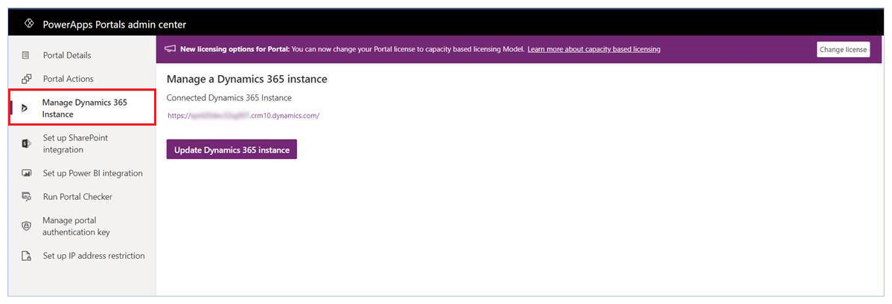
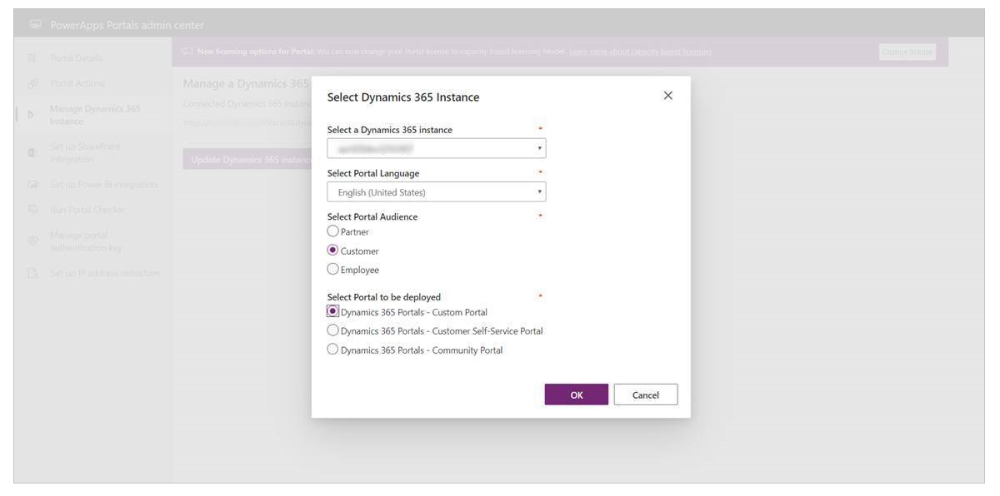
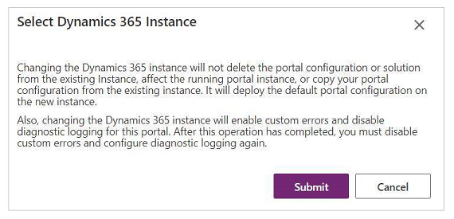
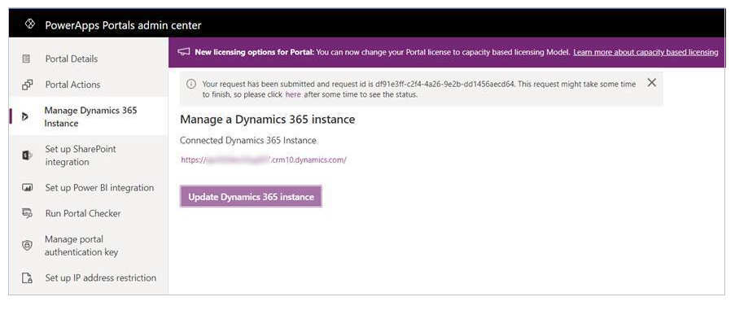

# Update the Dynamics 365 instance for your portal

You can use the Power Platform admin center to update the Dynamics 365 instance for your portal.

> [!IMPORTANT]
> When changing the Dynamics 365 instance for your portal, ensure that the new instance is from the same [region](/power-platform/admin/regions-overview) as the current instance. Changing the Dynamics 365 instance for Power Apps portals across regions isn't supported.

1. Using one of the methods described in the [Manage portals from the Power Platform admin center](power-platform-admin-center.md) article, select **Manage** to manage your portal.

1. On the left pane, select **Manage Dynamics 365 Instance**.

1. Select **Update Dynamics 365 Instance**.

    

1. Select your existing instance and portal.

    

1. Select **OK**.

1. Select **Submit** to confirm.

    

    You'll see a confirmation that the update request is in progress.

    

The update might take a while after you select **Submit**. More information: [Upgrade a portal](upgrade-portal.md)

## Next steps

[Configure portal details](portal-details.md)

### See also

[Upgrade a portal](upgrade-portal.md)  
[Administer Microsoft Power Platform](/power-platform/admin/admin-documentation)  
[Manage Dynamics 365 apps](/power-platform/admin/manage-apps)

[!INCLUDE[footer-include](../../../includes/footer-banner.md)]