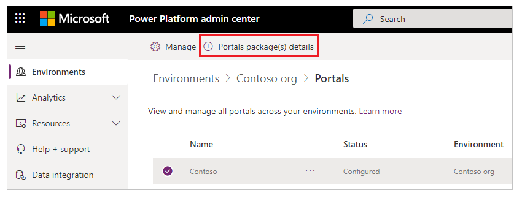
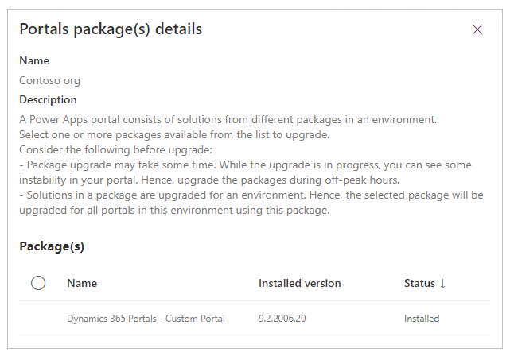
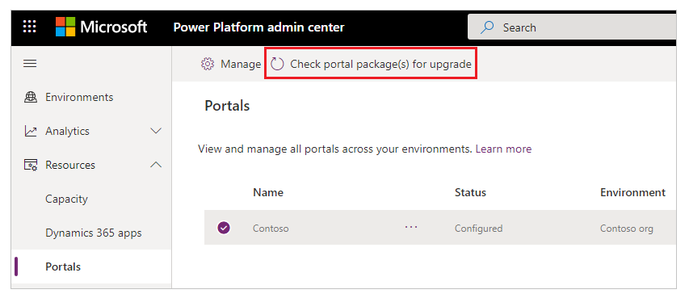
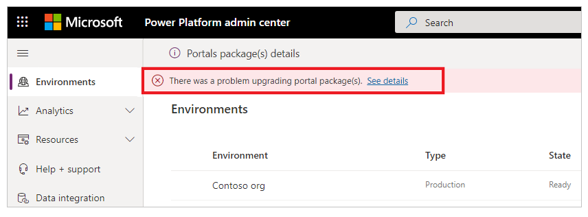
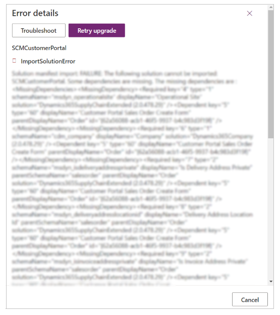

# Update the Power Apps portals solution

A Power Apps portal consists of solutions from different packages in an environment. You can use the Power Platform admin center to:

- View the details of installed packages (such as the version details).
- Update installed packages for the selected portal, if a package with a higher version is available.

> [!IMPORTANT]
> - Updating packages might take some time. While the upgrade is in progress, you might see some instability in your portal; hence, we recommend that you update packages during off-peak hours.
> - Solutions in a package are upgraded for an environment. Hence, the selected package will be upgraded for all portals in the environment using the package.

## Required permissions

You might see the following error message if you don't have the required permissions to view and update a portal package: "You don't have the permissions to access this portal's environment." More information: [Admin roles required for portal administrative tasks](portal-admin-roles.md)

## View portals package details

To view the portals package details:

1. Select the portal for your environment, as described in the [Manage portals from the Power Platform admin center](power-platform-admin-center.md) article.

1. Select **Portal Package(s) details**.

    

1. View the details of the packages for the selected portal.

    

## Update a portals package

You can use the Power Platform admin center to update portal packages, either by choosing to update based on the selected environment or by selecting from the list of portals for a tenant.

> [!NOTE]
> In addition to the methods listed below, you'll also see a notification when you edit the portal by using Power Apps portals Studio if any package updates are available.

### Method 1: Update portals packages by using the selected environment

1. Select a portal for your environment, as described in the [Manage portals from the Power Platform admin center](power-platform-admin-center.md) article.

1. Select **Upgrade now** from the notification at the top of the page that indicates that an update is available. You can also check for the notification from the package details page, as described [earlier in this article](#view-portals-package-details).

### Method 2: Update portals packages by using the portals list for a tenant

1. Select a portal from the list of all portals in a tenant, as described in the [Manage portals from the Power Platform admin center](power-platform-admin-center.md) article.

1. Select **Check portal package(s) for upgrade**.

    

1. Update any packages that are available.

## Check package update errors, and retry

If the package update fails, you'll see a notification with a link to more details about the problem.

When you select **See details**, a page appears with more information as shown in the following image.

Select **Retry upgrade** to try the installation again.

### See also

[Upgrade a portal](upgrade-portal.md)  
[Administer Microsoft Power Platform](/power-platform/admin/admin-documentation)  
[Manage Dynamics 365 apps](/power-platform/admin/manage-apps)

[!INCLUDE[footer-include](../../../includes/footer-banner.md)]