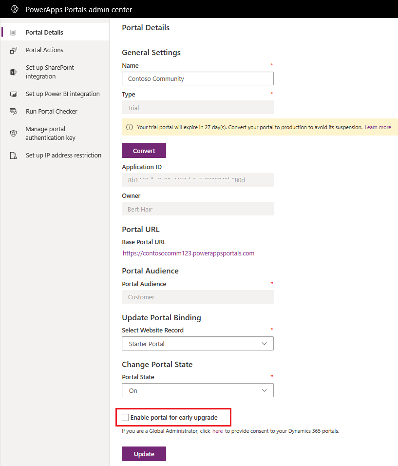

 
# Upgrade a portal

This section helps you understand the Dynamics 365 Portals release process to prepare for any new release properly and to reduce any impact on your customers. It also talks about various components which are part of your portal.

A portal consists of the following components:

|Component|Description|Update process|
|---------|-----------|--------------|
|[Portal solutions](#portal-solution-update)|Solutions which are installed in Microsoft Dataverse environment and contains the metadata tables for any portal.|Updated by customers themselves from the Dynamics 365 Administration Center page.|
|[Portal website host](#portal-website-host-update)|Portal website host is the Portal code which forms the actual website.|Portal website host is updated automatically for all portals. **Note**: A new version of Portal website host is backwards compatible with all supported versions of Portal solutions. However, once a solution version becomes unsupported, it is not certified to run with the new version of Portal website host.|
|||

## Impact of new releases on a Portal solution

As part of any Portal release, Portal website hosts are updated automatically to the latest versions while Portal solutions are updated by customers. It is important to understand the impact of each component update on your live Portal, so you can plan accordingly.

### Portal website host update

If you are running a production version of Portal (you can see it on Power Apps portals admin center), there will not be any downtime to your live Portal when your Portal is updated. However, if you are running a trial version of Portal, there will be around 6-10 minutes of downtime and you will not be able to access your Portal.

### Portal solution update

While installing or updating any solution in your instance, you can see some instability in your instance. Portal solution update process updates solutions available in your instance and will impact your instance which will in turn have an impact of your Portal as well. Hence, it is always advised to do solution updates in your instance during dark hours.

More details: [Update portal solution](update-portal-solution.md)

## Get notified about new releases

Every customer is notified about new Portal release through Office 365 message center (in Microsoft 365 admin center). Ensure that you either have access to Office 365 message center (Global administrator and service administrator have access) or have discussed with your global administrator or service administrator to inform you about any new Portal release.

Notifications are sent around 2-5 business days ahead of the release. Notifications are sent to only those customers whose portals are planned to be updated. Each notification provides details of the type of update and the date/time it will be rolled out along with the link to release notes.

## Enable a portal for new release

You can enable development or test portal to receive an early upgrade ahead of all customers, so you can test all core scenarios on your test portal before upgrades are rolled out to your live portal. Early upgrades are rolled out at least one week before the global rollout of any release. Also, notifications for early upgrades are sent as described in the [Get notified about new releases](#get-notified-about-new-releases) section.

To enable a portal for early upgrade:

1.	Open [Power Apps portals admin center](admin-overview.md).

2.	On the **Portal Actions** tab, select **Enable portal for early upgrade**.

    > [!div class="mx-imgBorder"]
    > 

> [!NOTE]
> You can enable or disable a portal for early upgrade anytime. However, a snapshot is taken for all portals marked for early access two days before any release, and any portal marked for early access after that is not guaranteed to get an early upgrade.

If you encounter any issue during the early upgrade phase, you can report it through Microsoft support.

### See also

[Update portal solution](update-portal-solution.md)  
[Microsoft Learn: Power App portal maintenance and troubleshooting](/learn/modules/portals-maintenance-troubleshooting/)
[Administer Power Platform](/power-platform/admin/admin-documentation)  
[Manage Dynamics 365 apps](/power-platform/admin/manage-apps)

[!INCLUDE[footer-include](../../../includes/footer-banner.md)]