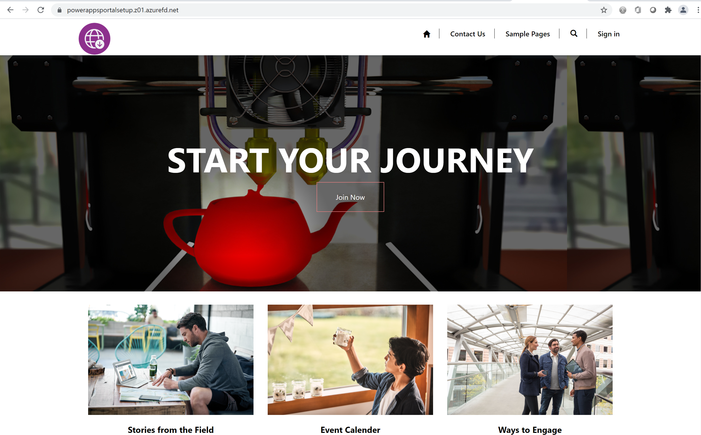
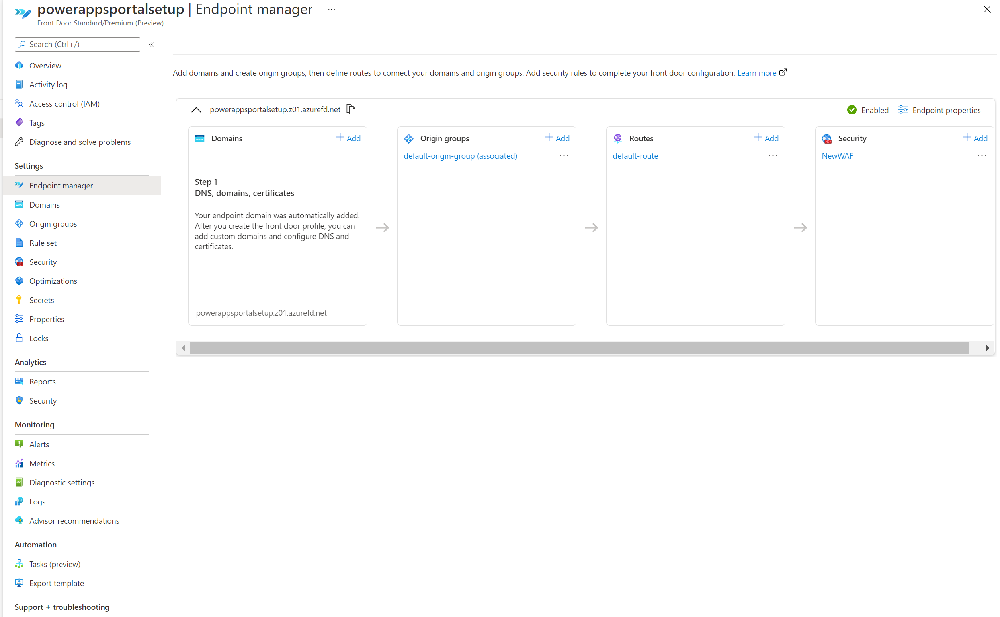
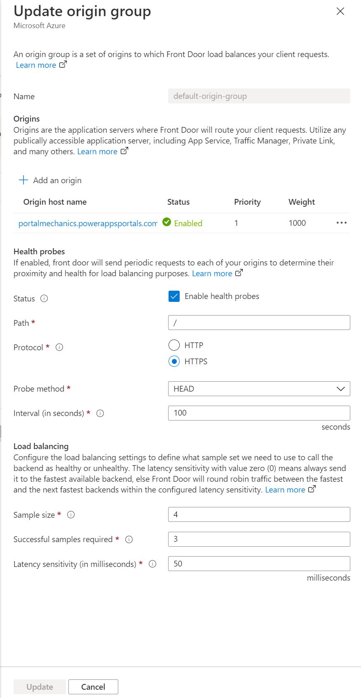
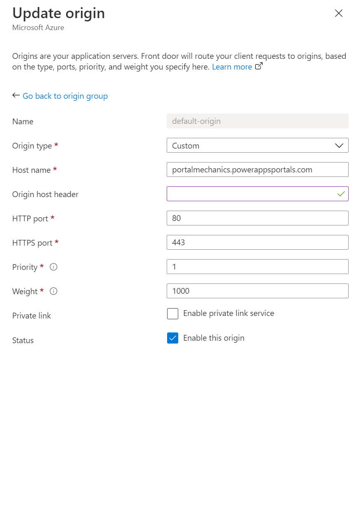
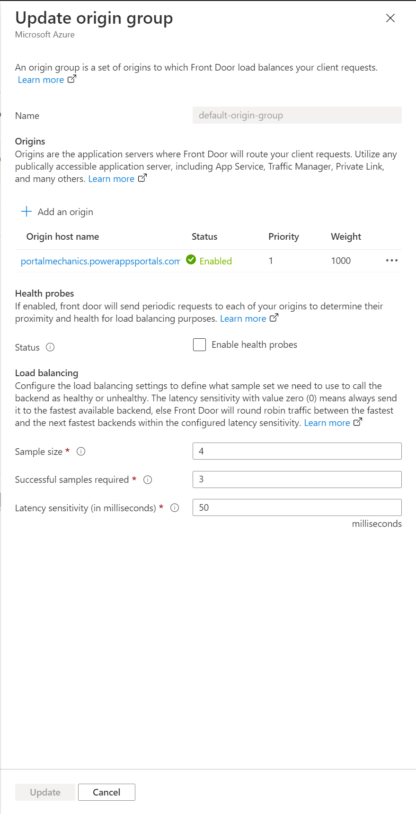
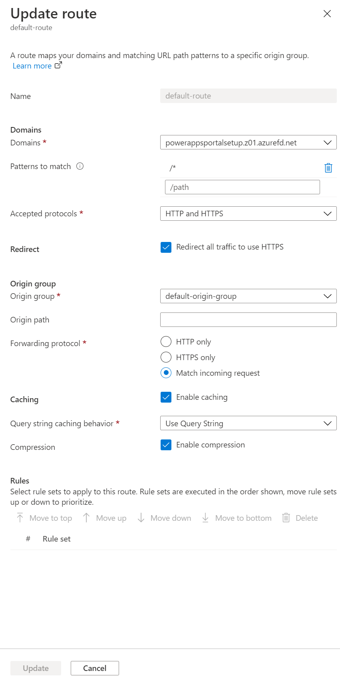

# Set up Azure Front Door with portals

As a portal maker, you can use [Azure Front Door](/azure/frontdoor/standard-premium/overview) with Power Apps portals to utilize its edge caching and Web Application Firewall (WAF) capabilities. In this article, you'll learn how to setup Azure Front Door with portals.

> [!NOTE]
> Although this article is focused on Azure Front Door, similar steps can be used for any CDN/WAF provider. The terminology used by various components might be different.

Follow these steps so setup Azure Front Door with portals:

1. [Setup Azure Front Door endpoint and custom domain name that the portal end users will use](#setup-azure-front-door-endpoint-and-custom-domain-name).

1. Configure your portal as the Origin.

1. Setup routing rules to cache static requests.

1. Setup WAF rules to analyze incoming requests.

1. Setup portal to only accept traffic from Azure Front Door.

## Setup Azure Front Door endpoint and custom domain name

In this section, you'll learn about how to setup Azure Front Door service and enable a custom domain name for this setup.

### Prerequisites

- An Azure subscription with the access to create new services.

- Custom domain name and access to the DNS provider for custom domain name setup.

- SSL certificate that will be used for custom domain name. The certificate must meet the [minimum requirements](admin/add-custom-domain.md) for portals.

- [Owner access](admin/portal-admin-roles.md#portal-owner) on portals in order to setup custom domain name.

### Setup Azure Front Door endpoint

To setup Azure Front Door endpoint:

1. Sign in to [Azure portal](https://portal.azure.com), and create a new Azure Front Door (Standard or Premium) resource. For more information, see [Quickstart: Create an Azure Front Door Standard/Premium profile - Azure portal](/azure/frontdoor/standard-premium/create-front-door-portal)

    

    > [!NOTE]
    > Skip this step if you've already created Azure Front Door resource.

1. Select **Quick create**, and configure Azure Front Door resource.

    > [!TIP]
    > Most of the Azure Front Door settings can be changed later.

    

    1.  Resource setup -\> These are related to resource organizations and are
        same as any other azure resource.

        1.  Subscription -\> Select the subscription in which front door would
            be created

        2.  Resource group -\> Select the resource group of which front door
            resource would be part of. If none exist, then you can create a new
            one

        3.  Resource group location -\> Location of Resource group, this is the
            place where all the metadata of front door would be stored in.

    2.  Front door configurations

        1.  Name -\> Name of the front door resource

        2.  Tier -\> You can select either standard or premium based on what
            suits your scenario. For this setup I will use premium tier since
            that comes with access to Microsoft managed rule set as well as bot
            prevention rule set for WAF.

    3.  Endpoint configuration

        1.  Endpoint name -\> Provide the name of the endpoint for your front
            door requests. This is the actual URL which will be serving traffic
            for end users. In subsequent steps, we will setup a custom domain
            name pointing to this URL.

        2.  Origin type -\> Select Custom as origin type

        3.  Origin hostname -\> Hostname of your PowerApps portal. This should
            be just the hostname in format xxxx.powerappsportals.com (or
            xxx.microsoftcrmportals.com) and should not have ”https://” appended
            in the beginning.

        4.  Private link -\> Leave it unchecked.

        5.  Caching -\> Enable caching as we do want to use the edge caching
            capabilities for static content. We will cover this again during
            routing rules setup to ensure only static content is cached.

        6.  Query String caching behavior -\> Select “Use Query String”, this
            will ensure that if a page has dynamic content based on query
            string, it is taking query string into account.

        7.  Compression -\> Enable compression

        8.  WAF policy -\> Create a new WAF policy or use an existing one. Setup
            for this would be covered later.

>   After providing all the information described above, click on review+create
>   and follow on screen instructions to finish the setup.

**Validate Setup -\>**

>   Once the setup is finished, after 5-10 mins, you should be able to browse to
>   the endpoint url (which we had setup above in format xxxx.yyy.azurefd.net)
>   and will notice that it is showing content coming from your Power Apps
>   portal

>   A screenshot of a video game Description automatically generated with medium
>   confidence

>   However, in case during browsing, a generic page with http response as 404
>   is shown, then the setup is still ongoing and retry after sometime. Once you
>   are able to validate setup, move to the next step of setting up Custom
>   domain name

1.  Setup Custom domain name on AFD and Portal -\> Till now we have been able to
    successfully setup an Azure Front Door which serves traffic from the portal
    backend.  
    However, this setup is still using Azure Front Door URL, in this step we
    will setup a custom domain name. There are two parts to this setup: -

    1.  Setup Custom domain name on your portals -\> First step here
        is to setup the custom domain name on your portal. This step
        is necessary because if this step is not done, then while serving the
        traffic from custom domain name, browser will reject the cookies set by
        portal server (as the domain would be different). This can lead to
        multiple issues like captcha check failures, scaling issues etc.

        In order to do this setup, follow the standard custom domain name setup
        doc described here
        <https://docs.microsoft.com/en-us/powerapps/maker/portals/admin/add-custom-domain>

    2.  Setup Custom domain name on your Front door instance -\> Once you are
        finished with setting up custom domain on your portal, next
        step is to enable it on front door so it can accept traffic. Following
        steps are to be followed for this: -

        1.  Update your dns provider and remove the cname record we created in
            previous step while doing custom domain name setup on portal. Ensure
            that you are only updating cname record, you don’t have to remove
            hostname setup on your portal.

            This is because at dns level we will be pointing cname to azure
            front door url (see subsequent steps) and the only purpose of
            previous step was to ensure that custom host name is present on the
            portal server. This ensures that portal server can serve traffic to
            this custom domain name through front door and all the portal
            cookies also have domain setup correctly.

        2.  Setup custom domain name on Azure Front Door endpoint, following
            these steps
            <https://docs.microsoft.com/en-us/azure/frontdoor/standard-premium/how-to-add-custom-domain>
            .

            **Validate Setup -\>** Following things should be validated when the
            setup is complete

2.  Custom domain name is pointing to Azure Front Door endpoint. This can be
    validated by doing nslookup and ensuring that a cname entry to Azure front
    door endpoint is returned.  
    If the cname entry is still pointing to portal server, then that needs to be
    corrected.

3.  When you browse to custom domain name, it is displaying Portal pages.

Once these steps are completed, we have a basic Azure Front Door setup done for
the Portal. In subsequent steps, we will be updating various settings and rules
in order to make this setup efficient and handle various use cases

Configure Portal as Origin server 
==================================

Once the basic setup is done, next steps is to optimize the origin server
settings in order to ensure that everything is setup correctly.

To do this setup, we will start at “Endpoint Manager” tab in front door
configurations on Azure Portal and work on Origin group settings

During quick create setup in previous steps, we had provided some endpoint
details which are automatically created with the name
“default-origin-group(associated)” (could differ for different languages). For
this step, we will modify the settings for this “default-origin-group”. This is
how the settings for this step looks like when you will open it for the first
time.

1.  Origins

    1.  Origins in front door represent the backend service which front door
        edge servers connect to in order to serve the content to end users.

    2.  You can have multiple origins added to front door in order to get
        content from multiple backend services.

    3.  In this setup, however we will keep it to a single origin since Portal
        service itself provides high availability at its service layer.

        1.  This single origin should be pointing to the hostname of your portal
            which we had setup earlier during quick setup.

        2.  If you didn’t follow quick setup steps, you can add a new origin
            pointing to your portal hostname. Following settings should be used
            while configuring origin

            1.  Origin type -\> Custom

            2.  Hostname -\> your portal hostname

            3.  Origin Host header -\> Should be left empty or use your custom
                domain name. This is to ensure that front door send the origin
                header as either custom domain name or just pass through
                whatever user provided while making the request.

            4.  Http port -\> 80

            5.  https port -\> 443

            6.  Priority -\> 1

            7.  Weight -\> 1000

            8.  Private Link -\> Disabled

            9.  Status -\> Check “Enable this origin”

1.  Health probes

    1.  Health probes are a mechanism to ensure that origin service is up and
        running and take traffic routing decisions on the basis of it.

    2.  In this case we don’t require this and hence it will be turned off.

2.  Load Balancing

    1.  Since we have a single origin setup and health probe is turned off, this
        setting will not play any role in this setup as well.

Validate Setup -\> After the changes are done, this is how your settings should
look like

Setup Routing rules to cache static requests.
=============================================

After Step 1 and 2 are done, we come to a very important step which determines
how we can use the edge caching capabilities of front door to be able to improve
scalability of the portal.

It is also an important step to ensure that we are not caching dynamic content
served by portal which can lead to unintended data access.

For this setup, we will be doing two important things

1.  Setup Routes configuration

    1.  To do this, in endpoint manager, go to Routes -\> click on default
        route. “Default-route” is created by default during quick setup
        experience.

    2.  This is how the default settings looks like

1.  As part of this step, following settings should be reviewed and updated

    1.  Domains -\> This should be pointing to the Custom domain name setup in
        Step \#1

    2.  Patterns to Match - \> This should be set to /\* (default value) as all
        the portal requests would be sent to same origin in our setup.

    3.  Accepted protocols -\> This should be set to https only to ensure that
        all the traffic served is through https

    4.  Redirect -\> This should be enabled

    5.  Origin group

        1.  Origin group should be set to the origin group defined in Step \#1 (

        2.  Forwarding protocol can be set to either https only or to “Match
            incoming request”

    6.  Caching

        1.  Caching should be enabled if you want to utilize edge caching. If
            you don’t, then this should be disabled

        2.  Query String caching behavior should be set to “Use Query string” to
            ensure that dynamic content based on query string can be served

        3.  Compression should be enabled to optimize for content delivery.

2.  Setup Rule set which will govern how the content should be cached -\> This
    is a very important step as this governs how the content would be cached by
    edge servers which improves scaling for the portal. However, if not setup
    correctly, this can lead to caching of dynamic content which should differ
    from user to user.

    In order to set this up correctly, most important thing is an understanding
    of the type of content portal is serving to be able to come up with
    effective rules.

    For this article, the portal I am using uses dynamic content on all pages
    but it does serve static files, hence this is what I am trying to achieve: -

3.  All static files are cached and served from edge servers.

4.  None of the page content is cached

>   This is how the rule configuration will look like: -

1.  To setup routing rules, you will need to go to “Rule Set” tab and add a new
    rule set.

1.  Give ruleset a name and save it

1.  Now lets start with rule setup, starting with the first requirement

    1.  All static files are cached and served from edge servers -\>

        1.  In my portal all the static files have one of the following
            extensions css, png, jpg, js, svg, woff or ico.

        2.  Hence, we write a rule to evaluate file extension of the request and
            check for specific file extension types. (Do note that there are
            other ways to write this rule as well like using request url or
            filename etc, follow front door articleation on what all options
            are available)

1.  Now in the action configuration, we want to override the cache header set by
    portal server, so that these files are cached a little longer on the
    browser. By default portal will set the caching expiration to 1 day, but in
    this setup we will override it to 7 days. To do this, we setup an action
    looking like this where Action type is “Cache expiration” and “Cache
    behavior” is set to override

1.  In the end, full rule will look like this

1.  None of the page content is cached -\>

    1.  In general, portal setup ensures that if a page has a form embedded in
        it which means it is serving content specific to a record, it will have
        “Cache-control” header value set to “private” which ensures that front
        door will not cache that request. However, this method doesn’t take into
        account scenarios where you are using liquid templates to embed user
        specific content on the pages like displaying a specific record to a set
        of users. Hence, we will be adding an explicit rule to ensure no portal
        page is cached.

    2.  First step is setting up the condition, condition is actually pretty
        straightforward, we are basically doing an inverse check of what we did
        in first rule and check that request doesn’t have a file extension
        pointing to the file types we want to cache

1.  In action condition, similar to previous rule, we will write an action for
    “Cache expiration”. However, this time, we will set the behavior to “Bypass
    cache”. This will ensure that any request fulfilling this rule is not
    cached.

1.  This is how the full rule would look like

Now, once you have created a rule set, next step is to associate it with a
route. To do that,

1.  click on Associate a route action after selecting the rule set

1.  In the dialog, select endpoint name and available route. There could be
    multiple routes available, so set the one which we had configured
    previously.

1.  Setup rule set orders -\> If there multiple rule sets, then decide the order
    in which they should be evaluated. In this setup, we have only created a
    single ruleset. Once done click associate.

**Validation Steps: -** There are few important things we need to validate after
this step

1.  Ensuring that all the traffic is served on https only and all http calls are
    redirected to https

    1.  To do this, in the browser type in domain name} .

    2.  Ensure that when the content is rendered, the URL is changed to https
        automatically.

2.  Ensure that caching rules are evaluated properly and are working - \> Do
    note that rule changes can take upto 10 mins to reflect.

    1.  To do this we will need to analyze network trace in browser developer
        toolbar to ensure right caching headers are set on different type of
        content.

    2.  To do this open a new browser tab -\> open developer toolbar -\>
        navigate to portal url in this tab (ensure that it is done after opening
        developer toolbar).

    3.  Now, in developer toolbar, go to network tab which should show all
        network requests.

    4.  Select the request for any css file from the list of request, and
        analyze the request details. In the “Response headers” section, ensure
        that a header called “x-cache” is present. This ensures that the request
        is served through edge servers and can be cached.

        1.  If the value is set to “CONFIG_NOCACHE” or any other value
            containing the term “NOCACHE” , then the setup is not correct.

1.  Similar to last step, select a “Page” request this time and check its
    headers. If x-cache is set to “CONFIG_NOCACHE”, then your setup is working
    correctly.

Setup WAF rules to analyze incoming requests.
=============================================

Next Step in the setup is to configure WAF rules on incoming requests. In this
article, we will cover only the basic steps and for advanced WAF configuration,
please follow [WAF
articleation](https://docs.microsoft.com/en-us/azure/web-application-firewall/afds/afds-overview)

Following steps should be followed to finish the WAF setup

1.  Go to Security tab

1.  During quick create setup, we had already setup a new WAF policy which will
    appear here, however if you skipped that step, you can do that from this UI
    by click on New button.

2.  Click on the Name of WAF policy to go to WAF configuration

3.  In WAF configuration, first thing to setup is policy settings, to do that
    click on Policy Settings and setup following settings

    1.  Enable request body inspection -\> Enable this setting if you want
        request body to be inspected as well along with cookies, headers and
        urls

    2.  Redirect URL -\> Set this to a non Portal URL . This is the URL to which
        a user would be redirected to if a WAF rule is set to redirect. Ensure
        that this url is accessible publicly and anonymously

    3.  Block Request Status Code -\> This is the http status code returned to
        the user if the request is blocked by WAF

    4.  Block response body -\> You can add a custom message here which will be
        returned to the user if the request is blocked by WAF.

1.  Next thing to configure would be ruleset against which every request would
    be evaluated. In this article, we will only cover Managed ruleset. To do
    this setup click on “Managed Rules” tab

1.  Click on Assign button at the top and select from the list of default rule
    set. Managed Rule sets are Managed by microsoft and are updated regularly,
    [learn more about managed rule
    set,](https://docs.microsoft.com/en-us/azure/web-application-firewall/afds/waf-front-door-drs?tabs=drs20)

>   Graphical user interface, table Description automatically generated

1.  Once Managed rule set is assigned, your setup is effectively complete. As
    additional setup you can also look at setting up exclusion lists for
    existing rules as well as enabling custom rules

Do note that by default WAF is setup in Detection Policy mode in which it will
detect issues against the defined rule set and log it. However, in this mode, it
will not block the requests. To do that WAF must be switched to prevention mode.

It is highly advisable to first do a thorough testing in prevention mode to
ensure that all the scenarios are working fine, in order to ensure that you
don’t have to tweak the rule set or add exclusion policies. Once it is all
working fine, then WAF prevention mode should be enabled.

Setup Portal to only accept traffic from Front Door
===================================================

One of the last step in this whole setup is to ensure that Portal only accepts
traffic from Azure Front Door. To do this, we will need to enable IP address
restrictions
<https://docs.microsoft.com/en-us/powerapps/maker/portals/admin/ip-address-restrict>
on the portal.

To do this we will need to find the IP address range on which Azure Front Door
operates, this is described
[here](https://docs.microsoft.com/en-us/azure/frontdoor/front-door-faq#how-do-i-lock-down-the-access-to-my-backend-to-only-azure-front-door-)
.

Do note that we don’t support “**X-Azure-FDID**' based filtering today in
portals.

Increase Origin response time
=============================

By default, Azure Front Door has an origin response timeout of 60 sec. However,
we recommend increasing this to 240 sec to match Portal request timeout, this
would be important to ensure long running scenarios like file uploads or export
to excel works properly.

To do this: -

1.  Go to Endpoint tab

1.  Click on Edit endpoint button

1.  Click on Endpoint properties

1.  Change the origin response time to 240 and click on update

