# Set up Azure Front Door with portals

As a portal maker, you can use Azure Front Door with Power Apps portals to use its edge caching and Web Application Firewall (WAF) capabilities. In this article, you'll learn how to set up [Azure Front Door Standard/Premium (preview)](/azure/frontdoor/standard-premium/overview) with portals.

> [!NOTE]
> - Since Azure Front Door Standard/Premium (preview) is in preview, ensure you follow the preview guidelines as outlined in [Azure documentation](/azure/frontdoor/standard-premium/overview).
> - Although this article is focused on [Azure Front Door Standard/Premium (preview)](/azure/frontdoor/standard-premium/overview), similar steps can be used for [Azure Front Door](/azure/frontdoor/front-door-overview) or any other content delivery network or WAF provider. The terminology used by various components might be different.
> - While [custom domain HTTPS settings using Azure portal](/azure/frontdoor/front-door-faq#can-i-configure-tls-policy-to-control-tls-protocol-versions-) allows you to choose a [default minimum](/azure/frontdoor/front-door-faq#what-tls-versions-are-supported-by-azure-front-door-) TLS version between 1.0 and 1.2, use TLS version 1.2 for strong ciphers.

Follow these steps to set up Azure Front Door with portals:

1. [Set up the Azure Front Door endpoint and custom domain name that portal users will use](#set-up-the-azure-front-door-endpoint-and-custom-domain-name).
1. [Configure your portal as the origin](#configure-the-portal-as-an-origin-server).
1. [Set up routing rules to cache static requests](#set-up-routing-rules-to-cache-static-requests).
1. [Set up WAF rules to analyze incoming requests](#set-up-waf-rules-to-analyze-incoming-requests).
1. [Set up the portal to accept traffic only from Azure Front Door](#set-up-power-apps-portals-to-accept-traffic-only-from-azure-front-door).

## Set up the Azure Front Door endpoint and custom domain name

In this section, you'll learn how to set up the Azure Front Door service and enable a custom domain name for this setup.

### Prerequisites

- An Azure subscription with the access to create new services.

- A custom domain name and access to the DNS provider for custom domain name setup.

- An SSL certificate that will be used for the custom domain name. The certificate must meet the [minimum requirements](admin/add-custom-domain.md) for portals.

- [Owner access](admin/portal-admin-roles.md#portal-owner) to portals, to set up the custom domain name.

### Set up the Azure Front Door endpoint

> [!NOTE]
> If you've already created the Azure Front Door resource, go to step 3 of the following procedure.

1. Sign in to the [Azure portal](https://portal.azure.com), and create a new Azure Front Door (Standard or Premium) resource. More information: [Quickstart: Create an Azure Front Door Standard/Premium profile - Azure portal](/azure/frontdoor/standard-premium/create-front-door-portal)

    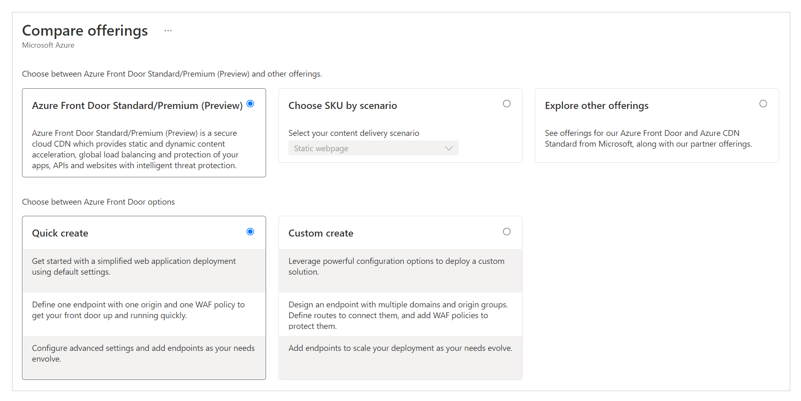

1. Select **Quick create**.

    > [!TIP]
    > Most of the Azure Front Door settings can be changed later.

    

1. Select, or fill in, the following details to configure the resource.

    | Option | Description |
    | - | - |
    | **Project details** | Settings related to the resource organization, similar to any other Azure resource.
    | Subscription |Select the subscription where the Azure Front Door resource will be created.  |
    | Resource group | Select the resource group for Azure Front Door. You can also create a new resource group. |
    | Resource group location | The location of the resource group. |
    | **Profile details** | The configuration for Azure Front Door. |
    | Name | Name of the Azure Front Door resource. |
    | Tier | Select a tier for the Azure Front Door resource. For this article, we've selected the Premium tier, which allows access to the Microsoft-managed rule set and bot prevention rule set for WAF. |
    | **Endpoint settings** | Settings for the Azure Front Door endpoint. |
    | Endpoint name | Enter a name for your Azure Front Door requests. This name is the actual URL that will serve the traffic for users. Later, we'll set up a custom domain name that points to this URL. |
    | Origin type | Select **Custom**. |
    | Origin host name | The host name of your Power Apps portal.   Format: `YourPortalName.powerappsportals.com` or `YourPortalName.microsoftcrmportals.com` without `https://` at the beginning.   For example, `contoso.powerappsportals.com` |
    | Private link | Don't enable the private link service. |
    | Caching | Enable caching. Caching uses the edge caching capabilities for static content.   Caching is discussed further in "[Set up routing rules to cache static requests](#set-up-routing-rules-to-cache-static-requests)," later in this article. |
    | Query string caching behavior | Select **Use Query String**. This option will ensure that if a page has dynamic content that satisfies the query string, it takes the query string into account. |
    | Compression | Enable compression. |
    | WAF policy | Create a new WAF policy, or use an existing one.   For information about WAF policy, go to ["Set up WAF rules to analyze incoming requests"](#set-up-waf-rules-to-analyze-incoming-requests) later in this article, and also [Tutorial: Create a Web Application Firewall policy on Azure Front Door using the Azure portal](/azure/web-application-firewall/afds/waf-front-door-create-portal). |

1. Select **Review + Create**, and wait for setup to finish. This typically takes 5 to 10 minutes.<

1. Validate the setup by browsing to the endpoint URL (for example, `contoso.example.azurefd.net`) and verifying that it shows the content from your Power Apps portal.

    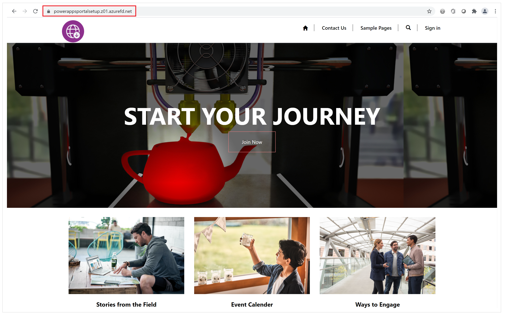

    > [!TIP]
    > If you see a "404 Not Found" response, setup might not have finished. Wait a while and try again.

### Set up a custom domain name

So far, the Azure Front Door endpoint has been set up to serve traffic from the Power Apps portals back end. However, this setup still uses the Azure Front Door URL, which will cause problems such as captcha check failures or scaling issues.

Web browsers reject cookies set by Power Apps portals when you use an Azure Front Door endpoint URL that's different from the URL of your portal. Hence, you must set up a custom domain name both for your portal and the Azure Front Door endpoint.

1. Set up a custom domain name on your portal. More information: [Add a custom domain name](admin/add-custom-domain.md)

1. Enable your portal custom domain name on the Azure Front Door resource by doing the following:

    1. Update your DNS provider by removing the CNAME record created earlier during the custom domain setup for portals. Only CNAME should be updated; don't remove the origin host name. DNS will point CNAME to the Azure Front Door endpoint. The only purpose for adding CNAME was to ensure that the custom host name will be present on portals. This presence ensures that portals can serve traffic to this custom domain name through Azure Front Door, and all portal cookies will also have the domain set up correctly.

    1. Set up the custom domain name on the Azure Front Door endpoint by following these steps: [Create a custom domain on Azure Front Door Standard/Premium SKU (preview) using the Azure portal](/azure/frontdoor/standard-premium/how-to-add-custom-domain).

1. Check the following to validate the setup:

    1. The custom domain name points to the Azure Front Door endpoint. Use [nslookup](/windows-server/administration/windows-commands/nslookup) to verify that a CNAME entry to the Azure Front Door endpoint is returned correctly. If the CNAME entry still points to portals, you need to correct that.

    1. Browsing to the custom domain name shows your portal page.

After following these steps, you have a basic Azure Front Door endpoint setup completed for the portal. In the next steps, you'll update various settings and rules to make this configuration more efficient and better at handling different use cases.

## Configure the portal as an origin server

The next step is to optimize the origin server settings to ensure that the setup works correctly. Use **Endpoint manager** in Azure Front Door configurations on the Azure portal to update the origin group settings.

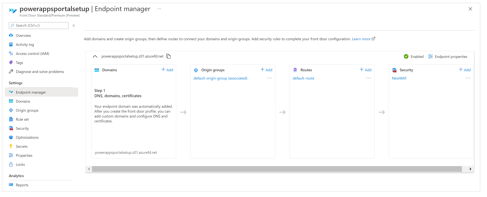

During the quick-create setup you performed earlier, you entered endpoint details that automatically created the configuration with the name **default-origin-group(associated)** (this name can vary depending on locale settings). For this step, you'll modify the settings for the **default-origin-group**. The following image shows what the settings for this step look like when you open the origin group for the first time.

Origins in Azure Front Door represent the back-end service that the Azure Front Door edge servers connect to, to serve content to users. You can add multiple origins to your Azure Front Door instance to get content from multiple back-end services.

> [!TIP]
> Power Apps portals provides high availability at its service layer, hence a single origin server is sufficient when setting up origins for portals.

The single origin for portals should point to the host name of your portal (which you set up earlier). If you didn't follow the quick-create setup steps, you can add a new origin that points to your portal host name. 

The following image shows an example of the origin configuration.

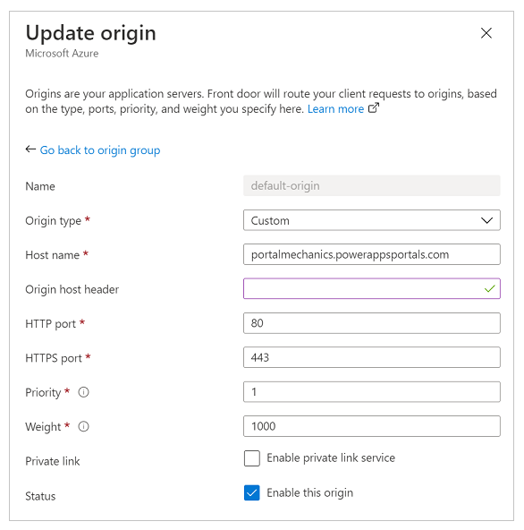

Use the following settings to configure the origin for portals.

| Option | Configuration type or value |
| - | - |
| Origin type | Select **Custom**. |
| Origin host name | Enter your portal host name. For example, `contoso.powerappsportals.com` |
| Origin host header | Enter your custom domain name, or leave empty. The former ensures that Azure Front Door sends the origin header as a custom domain name; the later causes it to pass through whatever the user provided while making the request. |
| HTTP port | 80 |
| HTTPS port | 443 |
| Priority | 1 |
| Weight | 1000 |
| Private link | Disabled |
| Status | Select the **Enable this origin** checkbox. |

After you've configured the origin and returned to the origin group, update the settings for health probes and load-balancing options as described in the following table.

| Option | Configuration type or value |
| - | - |
| Health probes | Health probes are a mechanism to ensure that the origin service is up and running, and to make the traffic routing decisions depending on the probe results. In this case, we don't require health probes, so we turned it off. |
| Load balancing | Because we have a single origin set up and health probes are turned off, this setting won't play any role in this setup. |

Validate that the origin group configuration looks like the following image.

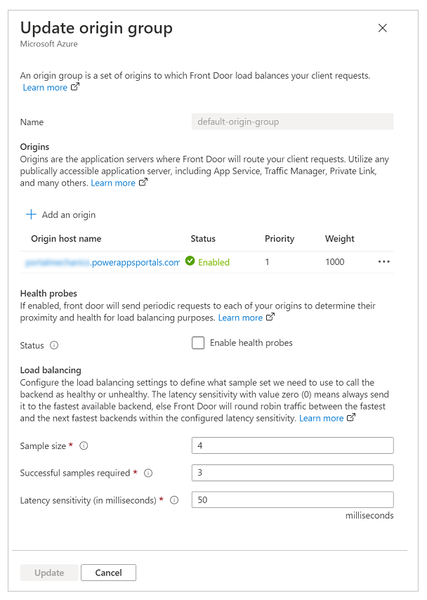

## Set up routing rules to cache static requests

Routes determine how we use the edge caching capabilities of Azure Front Door to improve the scalability of a portal. Setting up routes is also an important step to ensure that we're not caching dynamic content served by the portal, which can lead to unintended data access.

For rules setup, we'll need to do the following:

1. [Set up route configuration](#set-up-route-configuration).
1. [Set up a rule set](#set-up-a-rule-set).
1. [Associate the rule set with a route](#associate-the-rule-set-with-a-route).
1. [Validate the rules and route configuration](#validate-the-rules-and-route-configuration).

### Set up route configuration

To set up route configuration, select **Endpoint manager** on the left pane, select **Routes**, and then select the default route. **Default-route** is created during the quick-create setup experience.

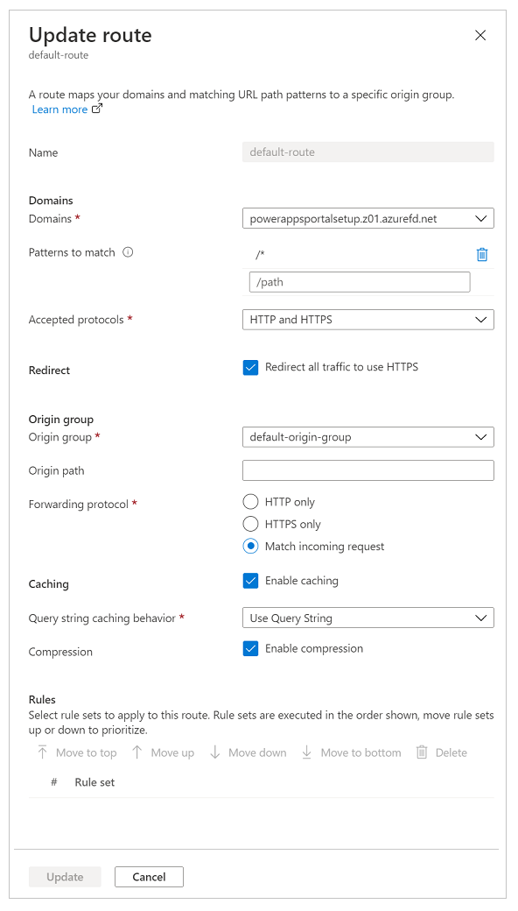

Update the route configuration as described in the following table.

| Option | Configuration |
| - | - |
| **Domains section** |  |
| Domains | The domain name you used while setting up the custom domain name earlier. |
| Patterns to match | Set to **/\*** (default value); all portal requests will be sent to the same origin in our setup. |
| Accepted protocols | Set to **HTTPS only** to ensure that all the traffic served is secure. |
| Redirect | Select the **Redirect all traffic to use HTTPS** checkbox. |
| **Origin group section** |  |
| Origin group | Set to the origin group you defined earlier. |
| Origin path | Keep empty. |
| Forwarding protocol | Set to either **HTTPS only** or **Match incoming request**. |
| **Caching section** |  |
| Caching | Select the **Enable caching** checkbox if you want to use edge caching. |
| Query string caching behavior | Select **Use Query String** to ensure that dynamic content based on the query string can be served. |
| Compression | Select **Enable compression** to optimize content delivery. |

### Set up a rule set

Rule sets govern how content should be cached. This step is important, because it governs how content will be cached by edge servers to improve scaling for the portal. However, an incorrectly configured rule set can lead to caching dynamic content that should be served specifically for each individual user.

To set up the rule set correctly, it's important that you understand the type of content your portal is serving. This understanding helps you configure the rule set by using effective rules. For the scenario in this article, the portal uses dynamic content on all pages and it also serves static files; therefore, the portal is trying to achieve the following:

- All static files are cached and served from the edge servers.
- None of the page content is cached.

<!--markdownlint-disable MD036-->
**To configure this rule set**

1. On the left pane, select **Rule set**, and then select **Add a rule set**.

    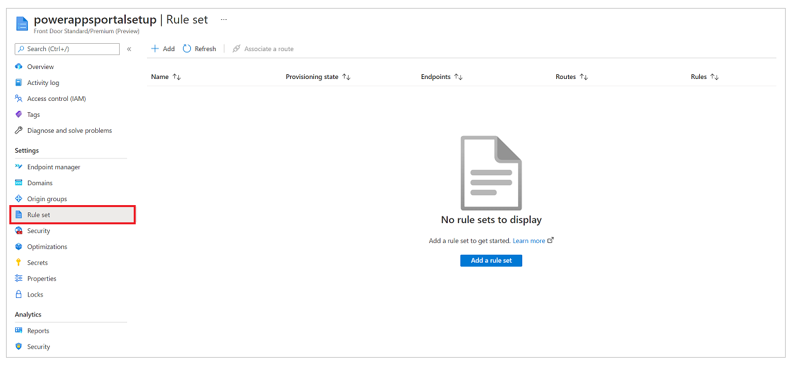

1. Enter a rule set name, and then save it.

    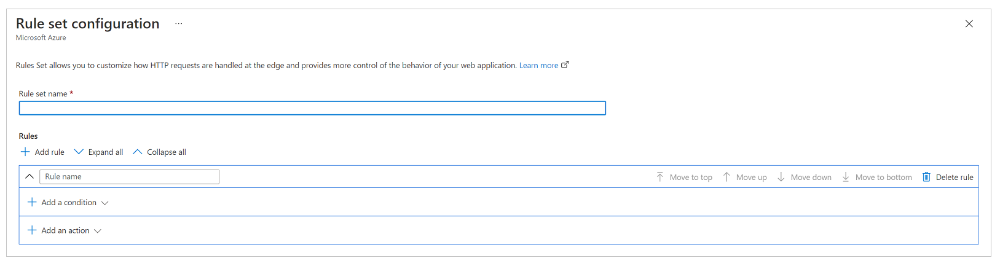

Now, lets configure the rule set based on the business requirement, with the following configuration to meet the requirements for the scenario mentioned earlier.

#### Requirement: All static files are cached and served from the edge servers

The portal in this scenario can contain static files with file name extensions of .css, .png, .jpg, .js, .svg, .woff, or .ico. Hence, we need a rule to evaluate the file name extension of the request and check for specific file types.

> [!NOTE]
> There are other ways to write this rule, such as by using the request URL or file name. For more information about the Azure Front Door rules matching conditions, go to [Azure Front Door Rules Engine match conditions](/azure/frontdoor/front-door-rules-engine-match-conditions).

:::image type="complex" source="media/azure-front-door/file-extensions-rule-set.png" alt-text="Example Request file extensions condition.":::
   Screenshot of an IF condition named "Request file extension" with the Operator set to Equal, the Value set to css png jpg js svg woff ico, and Case transform set to No transform.
:::image-end:::

In the following action configuration, you override the cache header set by portals so that these files will be cached a little longer on the browser. By default, portals sets the caching expiration to one day. But we'll override that in this scenario and set it to seven days. To do this, we set up a **Cache expiration** action and set **Cache behavior** to **Override**, as shown in the following image.

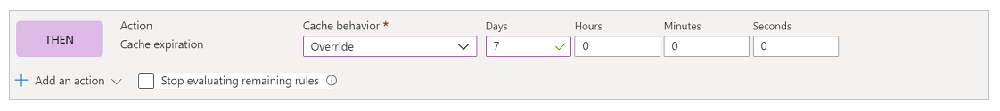

At the end, the complete rule looks like the following image.

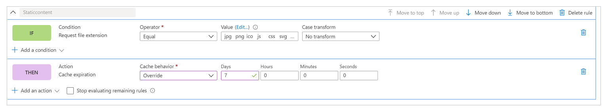

#### Requirement: None of the page content is cached

In general, portal setup ensures that if a page has a form embedded in it (which means it's serving content specific to a record), it will have its **Cache-control** header value set to **private**, which ensures that Azure Front Door won't cache that request. However, this method doesn't take into account the scenarios where you're using liquid templates to embed user-specific content on the pages, such as displaying a specific record to a set of users. Hence, we'll add an explicit rule to ensure that no portal page is cached.

The first step is setting up the condition. The condition does an inverse check of what we did in the first rule, and checks that the request *doesn't* include a file name extension that points to one of the file types we want to cache.

:::image type="complex" source="media/azure-front-door/caching-condition.png" alt-text="Example of a Not equal Request file extensions condition.":::
   Screenshot of an IF condition named "Request file extension" with the Operator set to Not equal, the Value set to css png jpg js svg woff ico, and Case transform set to No transform.
:::image-end:::

In the action condition, similar to previous rule, we'll write an action for **Cache expiration**. However, this time, we'll set the behavior to **Bypass cache**. This will ensure that any request that fulfills this rule isn't cached.

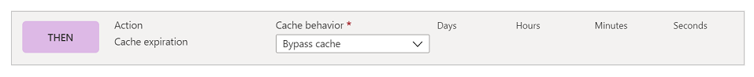

The complete rule looks like the following image.

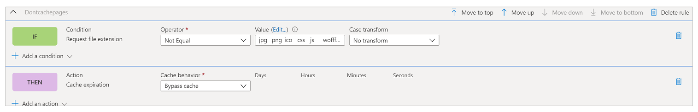

### Associate the rule set with a route

After you've created the rule set, the next step is to associate it with a route.

1. Select the rule set, and then select **Associate a route** in the command bar.

    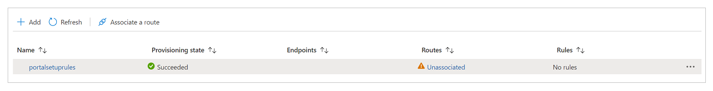

1. Select the endpoint name and available route. There might be multiple routes available, so select the one you configured earlier.

    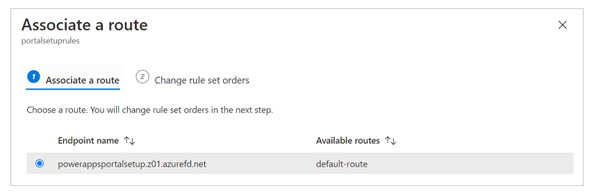

1. If you have multiple rule sets and you want to define the order they should be evaluated in, select **Change rule set orders** and configure the order. Our example scenario has only one rule set.

    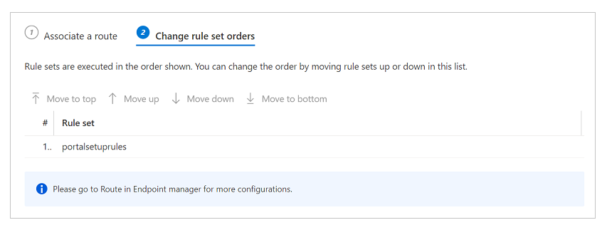

1. Select **Done** to finish.

### Validate the rules and route configuration
<!--note from editor: Edits to this section are suggested. I thought the steps ran together a bit.-->
To validate that rules and route configurations are working correctly, ensure that all traffic is served through HTTPS and that caching rules are evaluated correctly.

**To ensure that all traffic is served through HTTPS and all HTTP calls are redirected to HTTPS**

* Enter the domain name in a browser and ensure that the URL changes to HTTPS automatically while the content is rendered.

**To ensure that caching rules are evaluated and working as expected**

To check caching rules, we'll need to analyze network traces in a web browser's developer toolbar to validate that the caching headers for different types of content are set correctly.

> [!NOTE]
> Rule changes might take up to 10 minutes to be reflected.

1. Open a new browser tab, open the developer toolbar, and browse to the portal URL (ensure that you open the developer toolbar *before* you browse to the URL).

1. Go to the network tab to see all network requests.

1. Select a request for any **CSS** file from the list of requests.

   In the **Response headers** section of the request details, ensure that a header named **x-cache** is present. This header ensures that the request is served through edge servers and can be cached. If the value of **x-cache** is set to **CONFIG_NOCACHE**&mdash;or any other value containing the term **NOCACHE**&mdash;the setup isn't correct.

    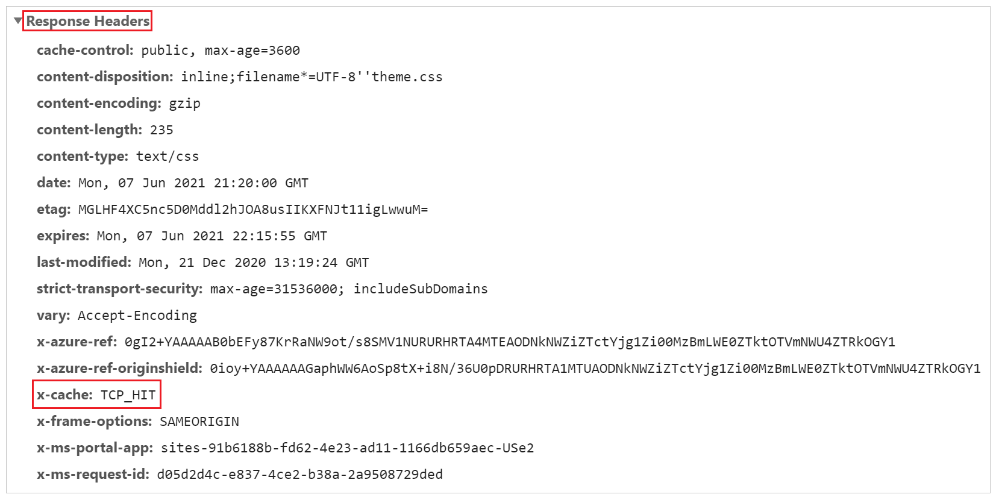

1. Similar to the previous step, select a **Page** request and check its headers. If **x-cache** is set to **CONFIG_NOCACHE**, your setup is working correctly.

    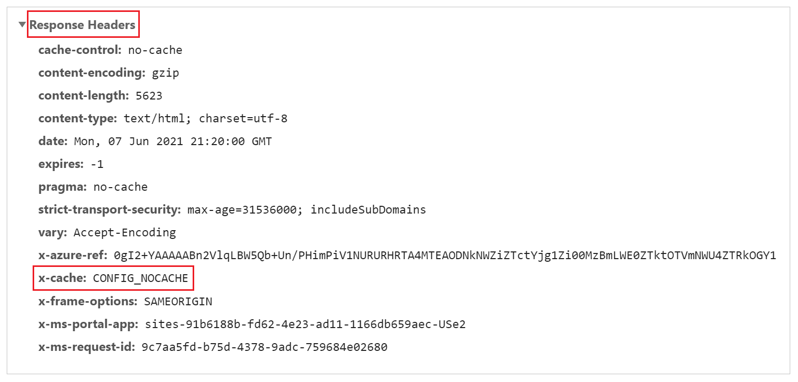

## Set up WAF rules to analyze incoming requests

The next step in the setup is to configure the WAF rules on incoming requests. In this article, we'll cover only basic steps. For advanced WAF configuration, go to [Azure Web Application Firewall on Azure Front Door](/azure/web-application-firewall/afds/afds-overview).

1. On the left pane, select **Security**.

    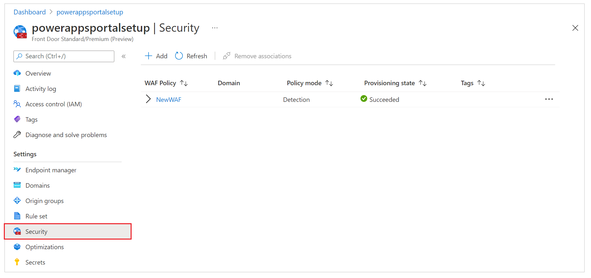

    During quick-create setup, we already set up a new WAF policy that shows up here. However, if you skipped that step, you can set up a new policy by selecting **New**.

1. Select the name of the WAF policy.

1. Select **Policy Settings**, and then do the following:

    1. **Enable request body inspection**: Select this checkbox if you want the request body to be inspected in addition to cookies, headers, and URLs.

    1. **Redirect URL**: Enter a non-portal URL. This URL is where the user would be redirected if a WAF rule were set to redirect. Ensure that this URL is accessible publicly and anonymously.

    1. **Block Request Status Code**: This HTTP status code is returned to the user if the request is blocked by WAF.

    1. **Block response body**: You can add a custom message here that will be shown to the user if the request is blocked by WAF.

    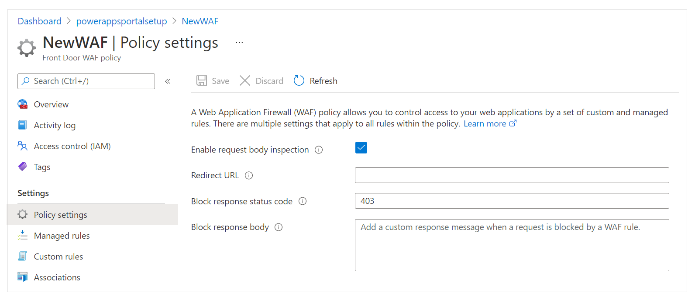

1. To configure the rule set against which every request will be evaluated, do the following:

    1. On the left pane, select **Managed Rules**.

       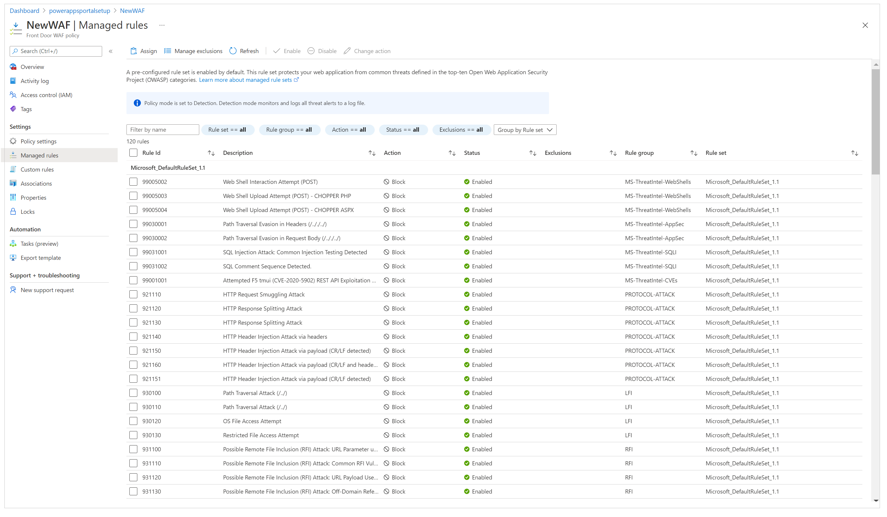

    1. On the command bar, select **Assign**, and then select from the list of default rule sets. Managed rule sets are managed by Microsoft and updated regularly. For more information about rule sets, go to [Web Application Firewall DRS rule groups and rules](/azure/web-application-firewall/afds/waf-front-door-drs).

       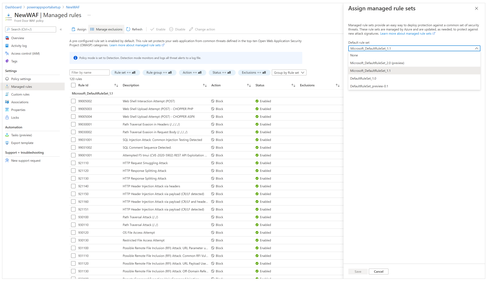

After the managed rule set is assigned, your setup is complete. As an extra step, you can also look at setting up exclusion lists for existing rules and enabling custom rules.

> [!IMPORTANT]
> By default, WAF is set up in **Detection Policy** mode, which detects issues against the defined rule set and logs them. However, this mode doesn't block the requests. To block requests, WAF must be switched to **Prevention** mode.

We recommend that you perform thorough testing in Prevention mode to verify that all the scenarios are working and to ensure that you don't have to tweak the rule set or add exclusion policies. You should only enable Prevention mode after you've verified that the entire setup is working as expected.

## Set up Power Apps portals to accept traffic only from Azure Front Door

The last step in this setup is to ensure that your portal accepts traffic only from Azure Front Door. For this verification, we'll need to enable [IP address restrictions](admin/ip-address-restrict.md) on the portal.

To find the IP address range on which Azure Front Door operates, go to [How do I lock down the access to my back end to only Azure Front Door?](/azure/frontdoor/front-door-faq#how-do-i-lock-down-the-access-to-my-backend-to-only-azure-front-door-).

> [!NOTE]
> Power Apps portals doesn't support **X-Azure-FDID**–based filtering.

## Increase origin response time

By default, Azure Front Door has an origin response timeout of 60 seconds. However, we recommend increasing this to 240 seconds to ensure that long-running scenarios like file uploads or export to Excel work as expected.

1. On the left pane, select **Endpoint manager**.

    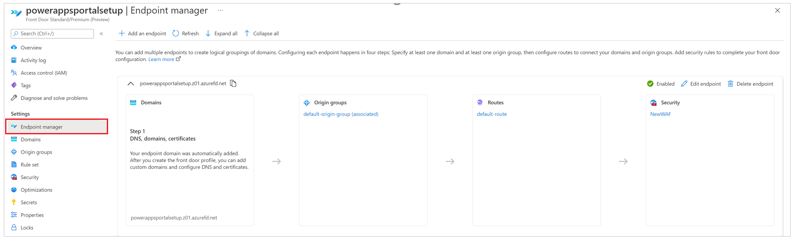

1. Select **Edit endpoint**.

    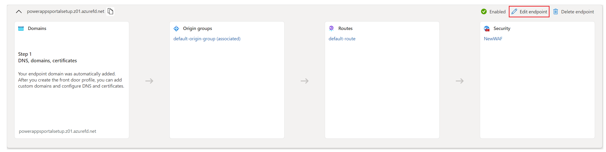

1. In the upper-right corner, select **Endpoint properties**.

    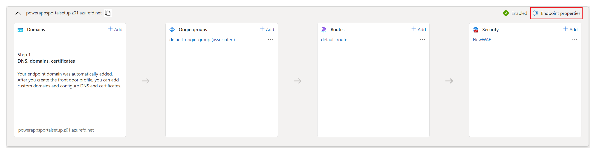

1. Change the origin response time to 240 seconds, and then select **Update**.

    

### See also

[What is Azure Front Door?](/azure/frontdoor/standard-premium/overview)  
[Quickstart: Create an Azure Front Door Standard/Premium profile - Azure portal](/azure/frontdoor/standard-premium/create-front-door-portal)  
[Create a custom domain on Azure Front Door Standard/Premium SKU (preview) using the Azure portal](/azure/frontdoor/standard-premium/how-to-add-custom-domain)  
[How do I lock down the access to my back end to only Azure Front Door?](/azure/frontdoor/front-door-faq#how-do-i-lock-down-the-access-to-my-backend-to-only-azure-front-door-)  
[Azure Front Door Rules Engine match conditions](/azure/frontdoor/front-door-rules-engine-match-conditions)  
