# Set up Azure Front Door with portals

As a portal maker, you can use [Azure Front Door](/azure/frontdoor/standard-premium/overview) with Power Apps portals to utilize its edge caching and Web Application Firewall (WAF) capabilities. In this article, you'll learn how to setup Azure Front Door with portals.

> [!NOTE]
> Although this article is focused on Azure Front Door, similar steps can be used for any CDN/WAF provider. The terminology used by various components might be different.

Follow these steps so setup Azure Front Door with portals:

1. [Setup Azure Front Door endpoint and custom domain name that the portal end users will use](#setup-azure-front-door-endpoint-and-custom-domain-name).
1. [Configure your portal as the Origin](#configure-portal-as-origin-server).
1. Setup routing rules to cache static requests.
1. Setup WAF rules to analyze incoming requests.
1. Setup portal to only accept traffic from Azure Front Door.

## Setup Azure Front Door endpoint and custom domain name

In this section, you'll learn about how to setup Azure Front Door service and enable a custom domain name for this setup.

### Prerequisites

- An Azure subscription with the access to create new services.

- Custom domain name and access to the DNS provider for custom domain name setup.

- SSL certificate that will be used for custom domain name. The certificate must meet the [minimum requirements](admin/add-custom-domain.md) for portals.

- [Owner access](admin/portal-admin-roles.md#portal-owner) on portals in order to setup custom domain name.

### Setup Azure Front Door endpoint

To setup Azure Front Door endpoint:

1. Sign in to [Azure portal](https://portal.azure.com), and create a new Azure Front Door (Standard or Premium) resource. For more information, see [Quickstart: Create an Azure Front Door Standard/Premium profile - Azure portal](/azure/frontdoor/standard-premium/create-front-door-portal)

    

    > [!NOTE]
    > Skip this step if you've already created Azure Front Door resource.

1. Select **Quick create**, and configure Azure Front Door resource.

    > [!TIP]
    > Most of the Azure Front Door settings can be changed later.

    

1. Select, or fill in the appropriate details.

    | Option | Description |
    | - | - |
    | **Project details** | Settings related to the resource organizations, similar to any other Azure resource.
    | Subscription |Select the subscription where the Front Door will be created.  |
    | Resource group | Select the resource group for the Front Door. You can also create a new resource group. |
    | Resource group location | Location of the resource group. |
    | **Profile details** | Configuration for the Front Door. |
    | Name | Name of the Front Door resource. |
    | Tier | Select a tier for the Front Door. For this tutorial, we've selected Premium tier that allows access to Microsoft managed rule set and bot prevention rule set for WAF. |
    | **Endpoint settings** | Settings for the Azure Front Door endpoint. |
    | Endpoint name | Enter a name for your Front Door requests. This is the actual URL that will serve the traffic for end users. Later, we'll setup a custom domain name pointing to this URL. |
    | Origin type | Select **Custom** as the origin type. |
    | Origin host name | Hostname of your Power Apps portal.   Format: `YourPortalName.powerappsportals.com` or `YourPortalName.microsoftcrmportals.com` without `https://` at the beginning.   For example, `contoso.powerappsportals.com` |
    | Private link | Don't enable the private link service. |
    | Caching | Enable caching. Caching uses the edge caching capabilities for static content.   Caching is discussed more during the routing rules setup later in this article to ensure only static content is cached. |
    | Query string caching behavior | Select **Use Query String**. This will ensure that if a page has dynamic content based on query string, it's taking query string into account. |
    | Compression | Enable compression. |
    | WAF policy | Create a new WAF policy, or use an existing one.   WAF policy is discussed more later in this article. For more information about WAF policy, go to [Create WAF policy](/azure/web-application-firewall/afds/waf-front-door-create-portal). |

1. Select **Review + Create** and complete the setup.

1. Validate the setup.

    Once the setup is finished (5-10 minutes), browse to the endpoint URL (for example, `contoso.example.azurefd.net`) and verify that it shows the content from your Power Apps portal.

    

    > [!TIP]
    > If you see a "404 Not Found" response, try again after some time as the setup might not have finished.

### Setup custom domain name

So far, Azure Front Door endpoint has been setup to serve traffic from the Power Apps portals backend. However, this setup is still using the Front Door URL.

To setup a custom domain with Azure Front Door:

1. Setup custom domain name on your portal.

    Web browsers reject cookies set by Power Apps portals when you use Azure Front Door endpoint URL that is different from the URL of your portal. Hence, setup a custom domain name for both your portal and the Azure Front Door endpoint to problems such as captcha check failures, or scaling problems.

    To learn about how to setup custom domain name for your portal, go to [Add a custom domain name](admin/add-custom-domain.md).

1. Setup custom domain name on your Azure Front Door resource.

    After you've finished setting up custom domain name on your portal, enable it on the Azure Front Door resource so it can accept the traffic. For more information, see [Create a custom domain on Azure Front Door Standard/Premium SKU (Preview) using the Azure portal](/azure/frontdoor/standard-premium/how-to-add-custom-domain).

    1. Update your DNS provider and remove the CNAME record created earlier during the custom domain setup for portals. Only CNAME needs to be updated, don't remove the origin host name. DNS will point CNAME to Azure Front Door endpoint. The only purpose of adding CNAME was to ensure that custom host name is present on portals. This presence ensures that portals can serve traffic to this custom domain name through the Front Door, and all the portal cookies also have domain setup correctly.

    1. Setup custom domain name on Azure Front Door endpoint by following these steps: [Create a custom domain on Azure Front Door Standard/Premium SKU (Preview) using the Azure portal](/azure/frontdoor/standard-premium/how-to-add-custom-domain)

1. Check the following to validate the setup:

    1. Custom domain name is pointing to the Azure Front Door endpoint. Use [nslookup](/windows-server/administration/windows-commands/nslookup) to verify that a CNAME entry to the Azure Front Door endpoint returns correctly. If the CNAME entry is still pointing to portals, then that needs to be corrected.

    1. Browsing to the custom domain name shows your portal page.

After following these steps, you'll have a basic Azure Front Door endpoint setup completed for the portal. In the next steps, you'll update various settings and rules to make this configuration more efficient and better at handling different use cases.

## Configure portal as origin server

The next steps is to optimize the origin server settings to ensure that the setup works correctly. To do this setup, start at the **Endpoint Manager** tab in Front Door configurations on Azure portal to update the origin group settings.

During quick create setup earlier, you've entered endpoint details that automatically created the configuration with the name **default-origin-group(associated)** (this name may vary depending on the locale settings). For this step, you'll modify the settings for this **default-origin-group**. The following image shows how the settings for this step looks like when you open it for the first time.

Origins in Azure Front Door represent the backend service that the Azure Front Door edge servers connect to in order to serve the content to end users. You can have multiple origins added to your Front Door in order to get content from multiple backend services.

> [!TIP]
> Power Apps portals provides high availability at its service layer, hence a single origin server is sufficient when setting up origins for portals.

The single origin for portals should point to the hostname of your portal (setup earlier during quick setup). If you didn’t follow quick setup steps, you can add a new origin pointing to your portal hostname. 

Here's an example of the origin configuration:

Use the following settings when configuring origin for portals:

| Option | Configuration type or value |
| - | - |
| Origin type | Custom |
| Origin host name | Your portal host name. For example, `contoso.powerappsportals.com` |
| Origin host header | Should be left empty, or use your custom domain name. This configuration is to ensure that the Front Door sends the origin header as either a custom domain name, or just pass through whatever user provided while making the request. |
| HTTP port | 80 |
| HTTPS port | 443 |
| Priority | 1 |
| Weight | 1000 |
| Private link | Disabled |
| Status | Check "Enable this origin" |

After you've configured origin and go back to the origin group, update the settings for health probes and load balancing options.

| Option | Configuration type or value |
| - | - |
| Health probes | Health probes are a mechanism to ensure that the origin service is up and running, and to make the traffic routing decisions depending on the probe results. In this case, we don’t require health probes; and hence, turned it off. |
| Load balancing | Since we have a single origin setup and health probe is turned off, this setting won't play any role in this setup. |

Validate the origin group configuration so it looks like the following image.

## Setup routing rules to cache static requests

Routes determine how we use the edge caching capabilities of Azure Front Door to improve the scalability of a portal. It's also an important step to ensure that we're not caching dynamic content served by the portal that can lead to unintended data access.

For rules setup, we'll need to do the following:

1. [Setup routes configuration](#setup-routes-configuration).
1. [Associate rule set with a route](#associate-rule-set-with-a-route).

And then, [validate the rules and route configuration](#validate-rules-and-route-configuration).

### Setup routes configuration

To setup route configuration, open Endpoint Manager > select **Routes** > select default route. The **Default-route** is created during the quick setup experience.

Update the route configuration as below.

| Option | Configuration |
| - | - |
| **Domains** | |
| Domains | Domain name used while setting up the custom domain name earlier. |
| Patterns to match | Set to /\* (default value) as all the portal requests would be sent to same origin in our setup. |
| Accepted protocols | Set to HTTPS only to ensure that all the traffic served is secure. |
| Redirect | Enable to redirect all traffic to use HTTPS. |
| **Origin group** | |
| Origin group | Set to the origin group defined earlier. |
| Origin path | Keep empty. |
| Forwarding protocol | Set to either **HTTPS only**, or **Match incoming request**. |
| **Caching** | |
| Caching | Enable caching if you want to utilize edge caching. |
| Query string caching behavior | Set to **Use Query String** to ensure the dynamic content based on query string can be served. |
| Compression | Enable compression to optimize content delivery. |

### Setup rule set

Rule set governs how the content should be cached. This step is very important as it governs how the content would be cached by the edge servers to improve scaling for the portal. However, incorrectly configured rules set can lead to caching of dynamic content which should differ from user to user.

To setup the rule set correctly, it becomes important to understand the type of content your portal is serving. This understanding helps you configure the rule set with effective rules.

For this article, the portal in context uses dynamic content on all pages, and also serves static files, hence this is what this portal's scenario is trying to achieve:

1. All static files are cached, and served from the edge servers.
1. None of the page content is cached.

To configure this rule set:

1. Go to **Rule set** tab and add a new rule set.

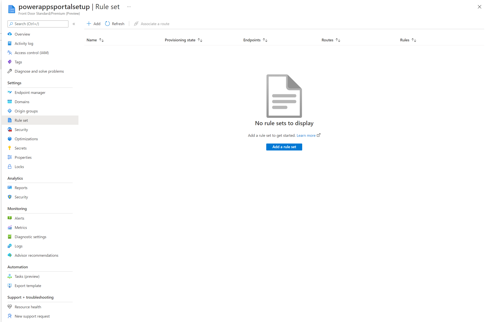

1.  Give ruleset a name and save it

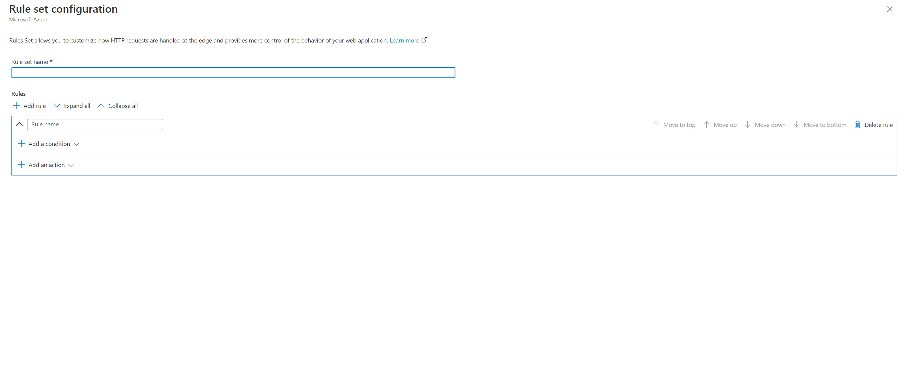

1.  Now lets start with rule setup, starting with the first requirement

    1.  All static files are cached and served from edge servers -\>

        1.  In my portal all the static files have one of the following
            extensions css, png, jpg, js, svg, woff or ico.

        2.  Hence, we write a rule to evaluate file extension of the request and
            check for specific file extension types. (Do note that there are
            other ways to write this rule as well like using request url or
            filename etc, follow front door articleation on what all options
            are available)

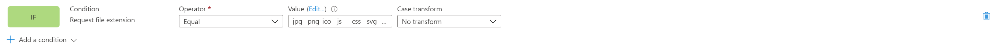

1.  Now in the action configuration, we want to override the cache header set by
    portal server, so that these files are cached a little longer on the
    browser. By default portal will set the caching expiration to 1 day, but in
    this setup we will override it to 7 days. To do this, we setup an action
    looking like this where Action type is “Cache expiration” and “Cache
    behavior” is set to override

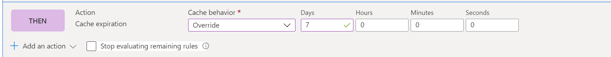

1.  In the end, full rule will look like this

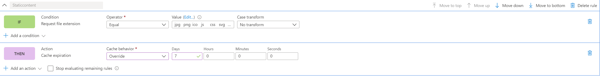

1.  None of the page content is cached -\>

    1.  In general, portal setup ensures that if a page has a form embedded in
        it which means it is serving content specific to a record, it will have
        “Cache-control” header value set to “private” which ensures that front
        door will not cache that request. However, this method doesn’t take into
        account scenarios where you are using liquid templates to embed user
        specific content on the pages like displaying a specific record to a set
        of users. Hence, we will be adding an explicit rule to ensure no portal
        page is cached.

    2.  First step is setting up the condition, condition is actually pretty
        straightforward, we are basically doing an inverse check of what we did
        in first rule and check that request doesn’t have a file extension
        pointing to the file types we want to cache

1.  In action condition, similar to previous rule, we will write an action for
    “Cache expiration”. However, this time, we will set the behavior to “Bypass
    cache”. This will ensure that any request fulfilling this rule is not
    cached.

1.  This is how the full rule would look like

### Associate rule set with a route

Now, once you have created a rule set, next step is to associate it with a
route. To do that,

1.  click on Associate a route action after selecting the rule set

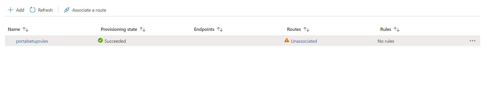

1.  In the dialog, select endpoint name and available route. There could be
    multiple routes available, so set the one which we had configured
    previously.

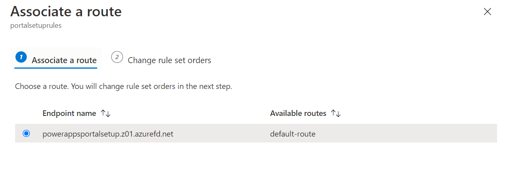

1.  Setup rule set orders -\> If there multiple rule sets, then decide the order
    in which they should be evaluated. In this setup, we have only created a
    single ruleset. Once done click associate.

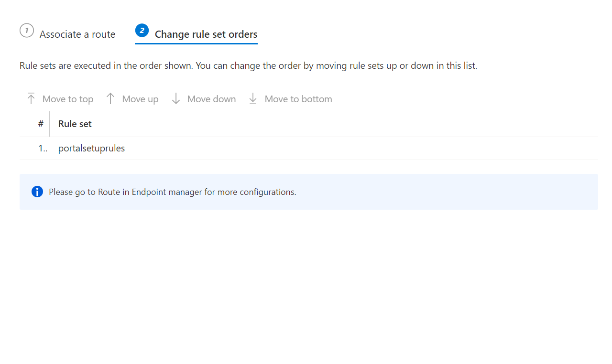

### Validate rules and route configuration

**Validation Steps: -** There are few important things we need to validate after
this step

1.  Ensuring that all the traffic is served on https only and all http calls are
    redirected to https

    1.  To do this, in the browser type in domain name} .

    2.  Ensure that when the content is rendered, the URL is changed to https
        automatically.

2.  Ensure that caching rules are evaluated properly and are working - \> Do
    note that rule changes can take upto 10 mins to reflect.

    1.  To do this we will need to analyze network trace in browser developer
        toolbar to ensure right caching headers are set on different type of
        content.

    2.  To do this open a new browser tab -\> open developer toolbar -\>
        navigate to portal url in this tab (ensure that it is done after opening
        developer toolbar).

    3.  Now, in developer toolbar, go to network tab which should show all
        network requests.

    4.  Select the request for any css file from the list of request, and
        analyze the request details. In the “Response headers” section, ensure
        that a header called “x-cache” is present. This ensures that the request
        is served through edge servers and can be cached.

        1.  If the value is set to “CONFIG_NOCACHE” or any other value
            containing the term “NOCACHE” , then the setup is not correct.

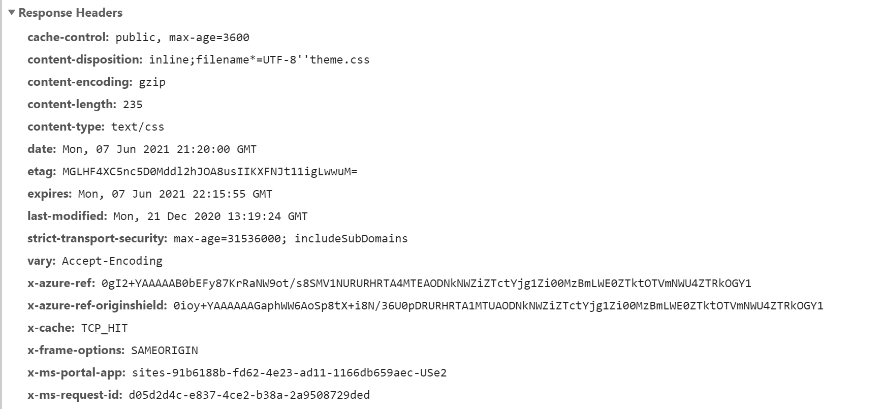

1.  Similar to last step, select a “Page” request this time and check its
    headers. If x-cache is set to “CONFIG_NOCACHE”, then your setup is working
    correctly.

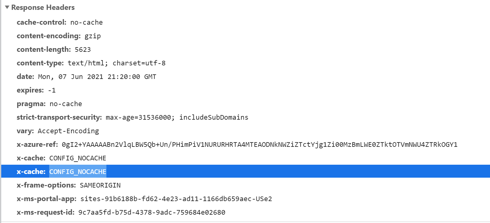

Setup WAF rules to analyze incoming requests.
=============================================

Next Step in the setup is to configure WAF rules on incoming requests. In this
article, we will cover only the basic steps and for advanced WAF configuration,
please follow [WAF
articleation](https://docs.microsoft.com/en-us/azure/web-application-firewall/afds/afds-overview)

Following steps should be followed to finish the WAF setup

1.  Go to Security tab

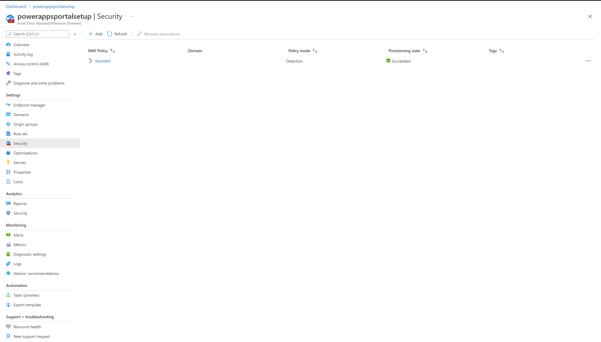

1.  During quick create setup, we had already setup a new WAF policy which will
    appear here, however if you skipped that step, you can do that from this UI
    by click on New button.

2.  Click on the Name of WAF policy to go to WAF configuration

3.  In WAF configuration, first thing to setup is policy settings, to do that
    click on Policy Settings and setup following settings

    1.  Enable request body inspection -\> Enable this setting if you want
        request body to be inspected as well along with cookies, headers and
        urls

    2.  Redirect URL -\> Set this to a non Portal URL . This is the URL to which
        a user would be redirected to if a WAF rule is set to redirect. Ensure
        that this url is accessible publicly and anonymously

    3.  Block Request Status Code -\> This is the http status code returned to
        the user if the request is blocked by WAF

    4.  Block response body -\> You can add a custom message here which will be
        returned to the user if the request is blocked by WAF.

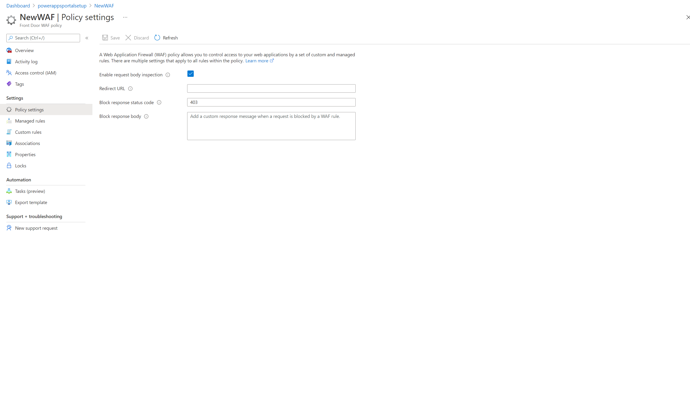

1.  Next thing to configure would be ruleset against which every request would
    be evaluated. In this article, we will only cover Managed ruleset. To do
    this setup click on “Managed Rules” tab

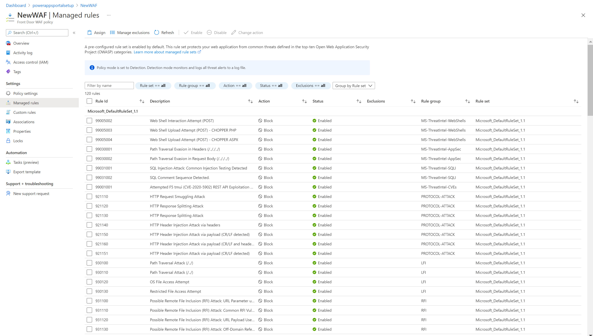

1.  Click on Assign button at the top and select from the list of default rule
    set. Managed Rule sets are Managed by microsoft and are updated regularly,
    [learn more about managed rule
    set,](https://docs.microsoft.com/en-us/azure/web-application-firewall/afds/waf-front-door-drs?tabs=drs20)

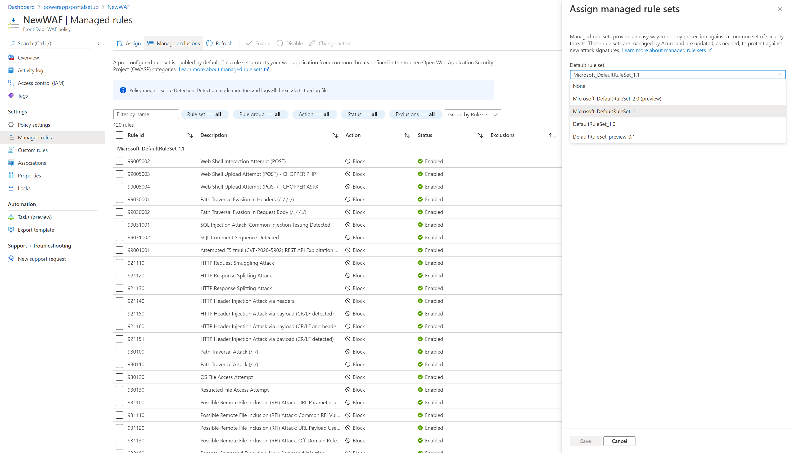

>   Graphical user interface, table Description automatically generated

1.  Once Managed rule set is assigned, your setup is effectively complete. As
    additional setup you can also look at setting up exclusion lists for
    existing rules as well as enabling custom rules

Do note that by default WAF is setup in Detection Policy mode in which it will
detect issues against the defined rule set and log it. However, in this mode, it
will not block the requests. To do that WAF must be switched to prevention mode.

It is highly advisable to first do a thorough testing in prevention mode to
ensure that all the scenarios are working fine, in order to ensure that you
don’t have to tweak the rule set or add exclusion policies. Once it is all
working fine, then WAF prevention mode should be enabled.

Setup Portal to only accept traffic from Front Door
===================================================

One of the last step in this whole setup is to ensure that Portal only accepts
traffic from Azure Front Door. To do this, we will need to enable IP address
restrictions
<https://docs.microsoft.com/en-us/powerapps/maker/portals/admin/ip-address-restrict>
on the portal.

To do this we will need to find the IP address range on which Azure Front Door
operates, this is described
[here](https://docs.microsoft.com/en-us/azure/frontdoor/front-door-faq#how-do-i-lock-down-the-access-to-my-backend-to-only-azure-front-door-)
.

Do note that we don’t support “**X-Azure-FDID**' based filtering today in
portals.

Increase Origin response time
=============================

By default, Azure Front Door has an origin response timeout of 60 sec. However,
we recommend increasing this to 240 sec to match Portal request timeout, this
would be important to ensure long running scenarios like file uploads or export
to excel works properly.

To do this: -

1.  Go to Endpoint tab

1.  Click on Edit endpoint button

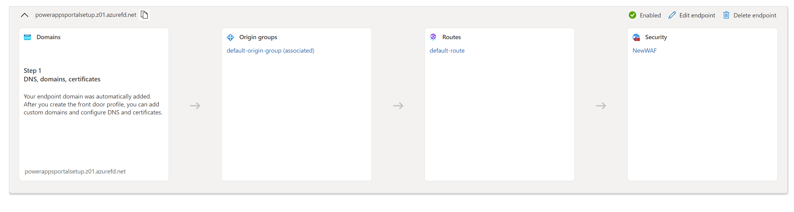

1.  Click on Endpoint properties

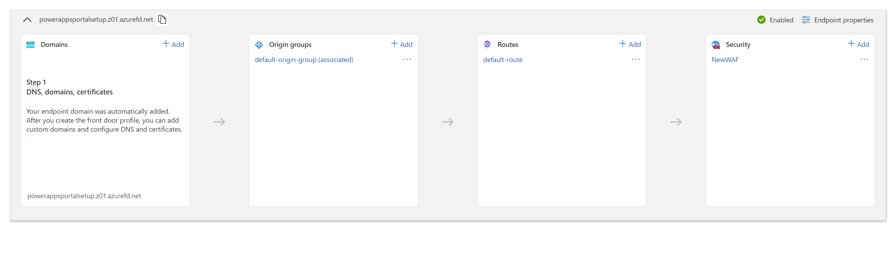

1.  Change the origin response time to 240 and click on update

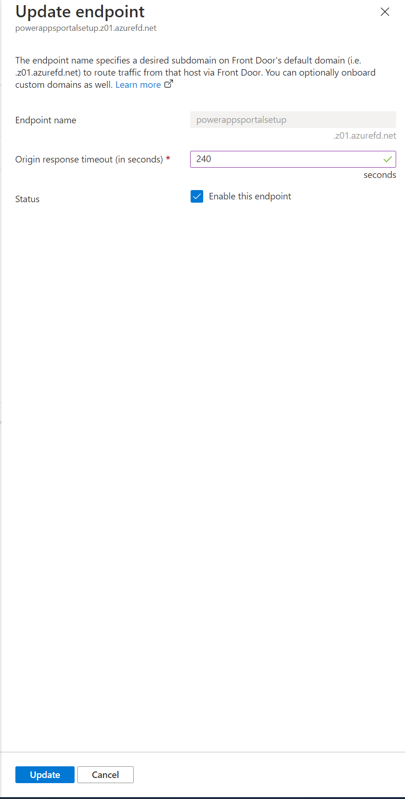
