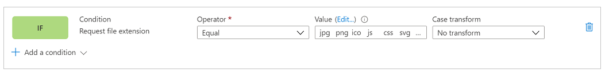
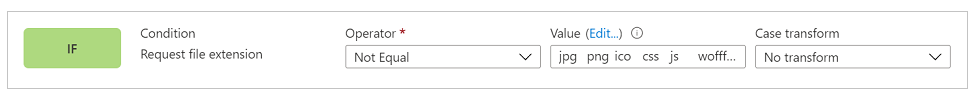

# Set up Azure Front Door with portals

As a portal maker, you can use [Azure Front Door](/azure/frontdoor/standard-premium/overview) with Power Apps portals to use its edge caching and Web Application Firewall (WAF) capabilities. In this article, you'll learn how to set up Azure Front Door with portals.

> [!NOTE]
> Although this article is focused on Azure Front Door, similar steps can be used for any CDN/WAF provider. The terminology used by various components might be different.

Follow these steps so set up Azure Front Door with portals:

1. [Setup Azure Front Door endpoint and custom domain name that the portal end users will use](#setup-azure-front-door-endpoint-and-custom-domain-name).
1. [Configure your portal as the Origin](#configure-portal-as-origin-server).
1. [Set up routing rules to cache static requests](#set-up-routing-rules-to-cache-static-requests).
1. [Set up WAF rules to analyze incoming requests](#set-up-waf-rules-to-analyze-incoming-requests).
1. [Set up portal to only accept traffic from Azure Front Door](#setup-power-apps-portals-to-only-accept-traffic-from-azure-front-door).

## Setup Azure Front Door endpoint and custom domain name

In this section, you'll learn about how to set up Azure Front Door service and enable a custom domain name for this setup.

### Prerequisites

- An Azure subscription with the access to create new services.

- Custom domain name and access to the DNS provider for custom domain name setup.

- SSL certificate that will be used for custom domain name. The certificate must meet the [minimum requirements](admin/add-custom-domain.md) for portals.

- [Owner access](admin/portal-admin-roles.md#portal-owner) on portals in order to set up custom domain name.

### Setup Azure Front Door endpoint

To set up Azure Front Door endpoint:

1. Sign in to [Azure portal](https://portal.azure.com), and create a new Azure Front Door (Standard or Premium) resource. For more information, see [Quickstart: Create an Azure Front Door Standard/Premium profile - Azure portal](/azure/frontdoor/standard-premium/create-front-door-portal)

    

    > [!NOTE]
    > Skip this step if you've already created Azure Front Door resource.

1. Select **Quick create**, and configure Azure Front Door resource.

    > [!TIP]
    > Most of the Azure Front Door settings can be changed later.

    

1. Select, or fill in the appropriate details.

    | Option | Description |
    | - | - |
    | **Project details** | Settings related to the resource organizations, similar to any other Azure resource.
    | Subscription |Select the subscription where the Front Door will be created.  |
    | Resource group | Select the resource group for the Front Door. You can also create a new resource group. |
    | Resource group location | Location of the resource group. |
    | **Profile details** | Configuration for the Front Door. |
    | Name | Name of the Front Door resource. |
    | Tier | Select a tier for the Front Door. For this tutorial, we've selected Premium tier that allows access to Microsoft-managed rule set and bot prevention rule set for WAF. |
    | **Endpoint settings** | Settings for the Azure Front Door endpoint. |
    | Endpoint name | Enter a name for your Front Door requests. This name is the actual URL that will serve the traffic for end users. Later, we'll set up a custom domain name pointing to this URL. |
    | Origin type | Select **Custom** as the origin type. |
    | Origin host name | Hostname of your Power Apps portal.   Format: `YourPortalName.powerappsportals.com` or `YourPortalName.microsoftcrmportals.com` without `https://` at the beginning.   For example, `contoso.powerappsportals.com` |
    | Private link | Don't enable the private link service. |
    | Caching | Enable caching. Caching uses the edge caching capabilities for static content.   Caching is discussed more during the routing rules setup later in this article to ensure only static content is cached. |
    | Query string caching behavior | Select **Use Query String**. This option will ensure that if a page has dynamic content based on query string, its taking query string into account. |
    | Compression | Enable compression. |
    | WAF policy | Create a new WAF policy, or use an existing one.   WAF policy is discussed more later in this article. For more information about WAF policy, go to [Create WAF policy](/azure/web-application-firewall/afds/waf-front-door-create-portal). |

1. Select **Review + Create** and complete the setup.

1. Validate the setup.

    Once the setup is finished (5-10 minutes), browse to the endpoint URL (for example, `contoso.example.azurefd.net`) and verify that it shows the content from your Power Apps portal.

    

    > [!TIP]
    > If you see a "404 Not Found" response, try again after some time as the setup might not have finished.

### Setup custom domain name

So far, Azure Front Door endpoint has been set up to serve traffic from the Power Apps portals backend. However, this setup is still using the Front Door URL.

To set up a custom domain with Azure Front Door:

1. Set up custom domain name on your portal.

    Web browsers reject cookies set by Power Apps portals when you use Azure Front Door endpoint URL that is different from the URL of your portal. Hence, setup a custom domain name for both your portal and the Azure Front Door endpoint to problems such as captcha check failures, or scaling problems.

    To learn about how to set up custom domain name for your portal, go to [Add a custom domain name](admin/add-custom-domain.md).

1. Set up custom domain name on your Azure Front Door resource.

    After you've finished setting up custom domain name on your portal, enable it on the Azure Front Door resource so it can accept the traffic. For more information, see [Create a custom domain on Azure Front Door Standard/Premium SKU (Preview) using the Azure portal](/azure/frontdoor/standard-premium/how-to-add-custom-domain).

    1. Update your DNS provider and remove the CNAME record created earlier during the custom domain setup for portals. Only CNAME should be updated, don't remove the origin host name. DNS will point CNAME to Azure Front Door endpoint. The only purpose of adding CNAME was to ensure that custom host name is present on portals. This presence ensures that portals can serve traffic to this custom domain name through the Front Door, and all the portal cookies also have domain set up correctly.

    1. Set up custom domain name on Azure Front Door endpoint by following these steps: [Create a custom domain on Azure Front Door Standard/Premium SKU (Preview) using the Azure portal](/azure/frontdoor/standard-premium/how-to-add-custom-domain)

1. Check the following to validate the setup:

    1. Custom domain name is pointing to the Azure Front Door endpoint. Use [nslookup](/windows-server/administration/windows-commands/nslookup) to verify that a CNAME entry to the Azure Front Door endpoint returns correctly. If the CNAME entry is still pointing to portals, then that needs to be corrected.

    1. Browsing to the custom domain name shows your portal page.

After following these steps, you'll have a basic Azure Front Door endpoint setup completed for the portal. In the next steps, you'll update various settings and rules to make this configuration more efficient and better at handling different use cases.

## Configure portal as origin server

The next step is to optimize the origin server settings to ensure that the setup works correctly. To do this setup, start at the **Endpoint Manager** tab in Front Door configurations on Azure portal to update the origin group settings.

During quick create setup earlier, you've entered endpoint details that automatically created the configuration with the name **default-origin-group(associated)** (this name may vary depending on the locale settings). For this step, you'll modify the settings for this **default-origin-group**. The following image shows how the settings for this step look like when you open it for the first time.

Origins in Azure Front Door represent the backend service that the Azure Front Door edge servers connect to in order to serve the content to end users. You can have multiple origins added to your Front Door in order to get content from multiple backend services.

> [!TIP]
> Power Apps portals provides high availability at its service layer, hence a single origin server is sufficient when setting up origins for portals.

The single origin for portals should point to the hostname of your portal (setup earlier during quick setup). If you didn’t follow quick setup steps, you can add a new origin pointing to your portal hostname. 

Here's an example of the origin configuration:

Use the following settings when configuring origin for portals:

| Option | Configuration type or value |
| - | - |
| Origin type | Custom |
| Origin host name | Your portal host name. For example, `contoso.powerappsportals.com` |
| Origin host header | Should be left empty, or use your custom domain name. This configuration is to ensure that the Front Door sends the origin header as either a custom domain name, or just pass through whatever user provided while making the request. |
| HTTP port | 80 |
| HTTPS port | 443 |
| Priority | 1 |
| Weight | 1000 |
| Private link | Disabled |
| Status | Check "Enable this origin" |

After you've configured origin and go back to the origin group, update the settings for health probes and load-balancing options.

| Option | Configuration type or value |
| - | - |
| Health probes | Health probes are a mechanism to ensure that the origin service is up and running, and to make the traffic routing decisions depending on the probe results. In this case, we don’t require health probes; and hence, turned it off. |
| Load balancing | Since we have a single origin set up and health probe is turned off, this setting won't play any role in this setup. |

Validate the origin group configuration so it looks like the following image.

## Set up routing rules to cache static requests

Routes determine how we use the edge caching capabilities of Azure Front Door to improve the scalability of a portal. It's also an important step to ensure that we're not caching dynamic content served by the portal that can lead to unintended data access.

For rules setup, we'll need to do the following:

1. [Setup routes configuration](#setup-routes-configuration).
1. [Associate rule set with a route](#associate-rule-set-with-a-route).

And then, [validate the rules and route configuration](#validate-rules-and-route-configuration).

### Setup routes configuration

To setup route configuration, open Endpoint Manager > select **Routes** > select default route. The **Default-route** is created during the quick setup experience.

Update the route configuration as below.

| Option | Configuration |
| - | - |
| **Domains** | |
| Domains | Domain name used while setting up the custom domain name earlier. |
| Patterns to match | Set to /\* (default value) as all the portal requests would be sent to same origin in our setup. |
| Accepted protocols | Set to HTTPS only to ensure that all the traffic served is secure. |
| Redirect | Enable to redirect all traffic to use HTTPS. |
| **Origin group** | |
| Origin group | Set to the origin group defined earlier. |
| Origin path | Keep empty. |
| Forwarding protocol | Set to either **HTTPS only**, or **Match incoming request**. |
| **Caching** | |
| Caching | Enable caching if you want to utilize edge caching. |
| Query string caching behavior | Set to **Use Query String** to ensure the dynamic content based on query string can be served. |
| Compression | Enable compression to optimize content delivery. |

### Setup rule set

Rule set governs how the content should be cached. This step is important as it governs how the content would be cached by the edge servers to improve scaling for the portal. However, incorrectly configured rules set can lead to caching of dynamic content that should differ from user to user.

To set up the rule set correctly, it becomes important to understand the type of content your portal is serving. This understanding helps you configure the rule set with effective rules.

For this article, the portal in context uses dynamic content on all pages, and also serves static files, hence this is what the portal in this scenario is trying to achieve:

1. All static files are cached, and served from the edge servers.
1. None of the page content is cached.

To configure this rule set:

1. Go to **Rule set** tab and add a new rule set.

    

1. Enter a rule set name and save it.

    

Now, lets configure the rule set based on the business requirement, with the following configuration to meet the requirements for the scenario mentioned earlier.

#### Requirement: All static files are cached, and served from the edge servers

The portal in this scenario has static files with file name extensions of css, png, jpg, js, svg, woff, or ico. Hence, a rule is required to evaluate file extension of the request, and check for specific file extension types.

> [!NOTE]
> There are other ways to write this rule, such as using the request URL, or file name. For more information about the Azure Front Door rules matching conditions, see [Azure Front Door Rules Engine match conditions](/azure/frontdoor/front-door-rules-engine-match-conditions).

In the action configuration, override the cache header set by portals, so that these files are cached a little longer on the browser. By default, portals will set the caching expiration to one day. But in this scenario, we'll override it to seven days. To do this, we set up an action looking like the following image where the action type is **Cache expiration**, and **Cache behavior** is set to "override".

At the end, the complete rule looks like the following image:

#### Requirement: None of the page content is cached

In general, portal setup ensures that if a page has a form embedded in it (which means it's serving content specific to a record), it will have “Cache-control” header value set to “private” which ensures that Front Door won't cache that request.

However, this method doesn’t take into account the scenarios where you're using liquid templates to embed user-specific content on the pages like displaying a specific record to a set of users. Hence, we'll add an explicit rule to ensure no portal page is cached.

The first step is setting up the condition. The condition does an inverse check of what we did in the first rule, and check that request doesn’t have a file name extension pointing to the file types we want to cache.

In the action condition, similar to previous rule, we'll write an action for “Cache expiration”. However, this time, we'll set the behavior to “Bypass cache”. This will ensure that any request fulfilling this rule isn't cached.

The complete rule would look like the following image:

### Associate rule set with a route

After you've created a rule set, the next step is to associate it with a route.

1. Select **Associate a route** action after selecting the rule set.

    

1. Select the endpoint name and available route. There could be multiple routes available, so set the one configured earlier.

    

1. If there are multiple rule sets, then configure the order in which they should be evaluated. This scenario has only one rule set. Select **Done** to finish.

    

### Validate rules and route configuration

1. Ensure that all the traffic is served only through HTTPS, and all the HTTP calls are redirected to HTTPS. To verify, enter the domain name in a browser, and ensure the URL changes to HTTPS automatically while rendering the content.

1. Ensure that caching rules are evaluated, and working as expected. To check caching rules, we'll need to analyze network trace in a web browser's developer toolbar to validate the caching headers for different types of content are set correctly.

    > [!NOTE]
    > Rule changes might take up to 10 minutes to reflect.

    1. Open a new browser tab > open developer toolbar > browse to the portal url (ensure you browse to the URL after opening the developer toolbar).

    1. Go to the network tab to see all network requests.

    1. Select the request for any CSS file from the list of requests. And then, analyze the request details. In the “Response headers” section, ensure a header called “x-cache” is present. This header ensures that the request is served through edge servers, and can be cached.

    If the value is set to “CONFIG_NOCACHE” or any other value containing the term “NOCACHE”, then the setup isn't correct.

    

1. Similar to the previous step, select a “Page” request this time, and check its headers. If x-cache is set to “CONFIG_NOCACHE”, then your setup is working correctly.

    

## Set up WAF rules to analyze incoming requests

The next step in the setup is to configure the WAF rules on incoming requests. In this article, we'll cover only basic steps. For advanced WAF configuration, see [Azure Web Application Firewall on Azure Front Door](/azure/web-application-firewall/afds/afds-overview)

1. Go to the **Security** tab.

    

    During quick create setup, we had already setup a new WAF policy that shows up here. However, if you skipped that step, you can do that from this user interface by selecting the **New** button.

1. Select the name of WAF policy to go to WAF configuration.

1. Select **Policy Settings**, and setup following policy settings.

    1. **Enable request body inspection** > Enable this setting if you want request body to be inspected as well along with cookies, headers, and URLs.

    1. **Redirect URL** > Set this to a non-portal URL. This URL is where the user would be redirected to if a WAF rule is set to redirect. Ensure this URL is accessible publicly and anonymously.

    1. **Block Request Status Code** > This HTTP status code is returned to the user if the request is blocked by WAF.

    1. **Block response body** > You can add a custom message here that will be returned to the user if the request is blocked by WAF.

        

    1. To configure rule set against which every request would be evaluated, select the **Managed Rules** tab.

        

    1. Select **Assign** button at the top, and select from the list of default rule set. Managed rule sets are managed by Microsoft, and updated regularly. For more information about rule sets, go to [Web Application Firewall DRS rule groups and rules](/azure/web-application-firewall/afds/waf-front-door-drs).

        

After the managed rule set is assigned, your setup is complete. As an extra step, you can also look at setting up exclusion lists for existing rules and enabling custom rules.

> [!IMPORTANT]
> By default, WAF is setup in **Detection Policy** mode that detects issues against the defined rule set and logs them. However, this mode doesn't block the requests. To block requests, WAF must be switched to **Prevention** mode.

We recommend you do a thorough testing in prevention mode to ensure all the scenarios are working fine, and to ensure you don’t have to tweak the rule set or add exclusion policies. Prevention mode should be enabled only after verifying the entire setup is working as expected.

## Setup Power Apps portals to only accept traffic from Azure Front Door

The last step in this setup is to ensure that your portal only accepts traffic from Azure Front Door. For this verification, we'll need to enable [IP address restrictions](admin/ip-address-restrict.md) on the portal.

To find the IP address range on which Azure Front Door operates, see [How do I lock down the access to my backend to only Azure Front Door?](/azure/frontdoor/front-door-faq#how-do-i-lock-down-the-access-to-my-backend-to-only-azure-front-door-).

> [!NOTE]
> Power Apps portals doesn't support **X-Azure-FDID** based filtering.

## Increase Origin response time

By default, Azure Front Door has an origin response timeout of 60 seconds. However, we recommend increasing this to 240 seconds to ensure long running scenarios like file uploads or export to Excel work as expected.

1. Go to the **Endpoint Manager** tab.

    

1. Select **Edit endpoint**.

    

1. Select endpoint properties.

    

1. Change the origin response time to 240 seconds, and then select **Update**.

    

### See also

[What is Azure Front Door](/azure/frontdoor/standard-premium/overview)  
[Quickstart: Create an Azure Front Door Standard/Premium profile - Azure portal](/azure/frontdoor/standard-premium/create-front-door-portal)  
[Create a custom domain on Azure Front Door Standard/Premium SKU (Preview) using the Azure portal](/azure/frontdoor/standard-premium/how-to-add-custom-domain)  
[How do I lock down the access to my backend to only Azure Front Door?](/azure/frontdoor/front-door-faq#how-do-i-lock-down-the-access-to-my-backend-to-only-azure-front-door-)  
[Azure Front Door Rules Engine match conditions](/azure/frontdoor/front-door-rules-engine-match-conditions)  
