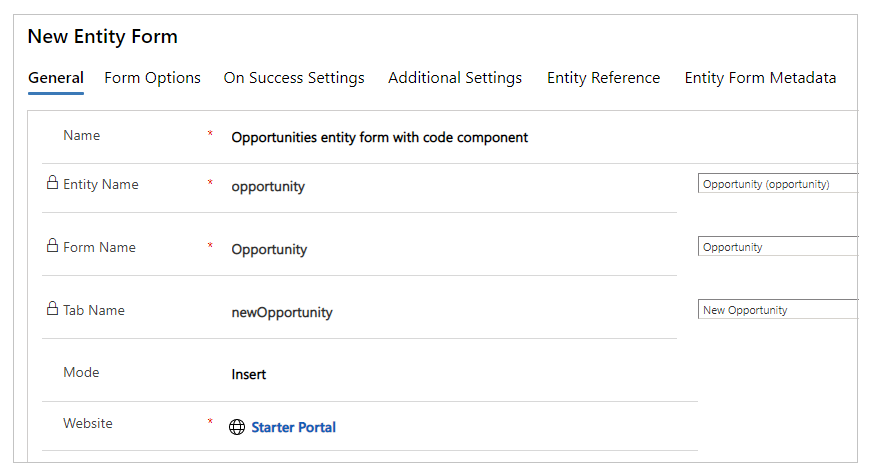
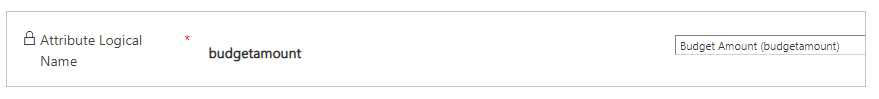
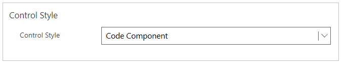
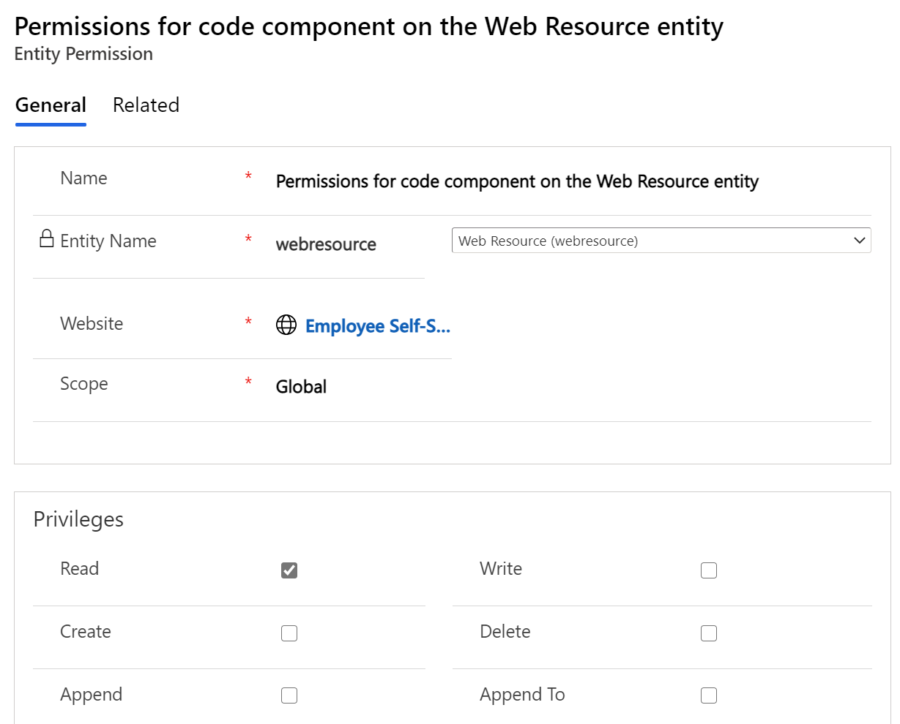
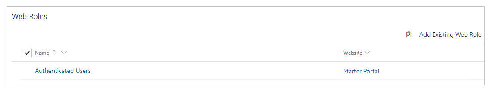
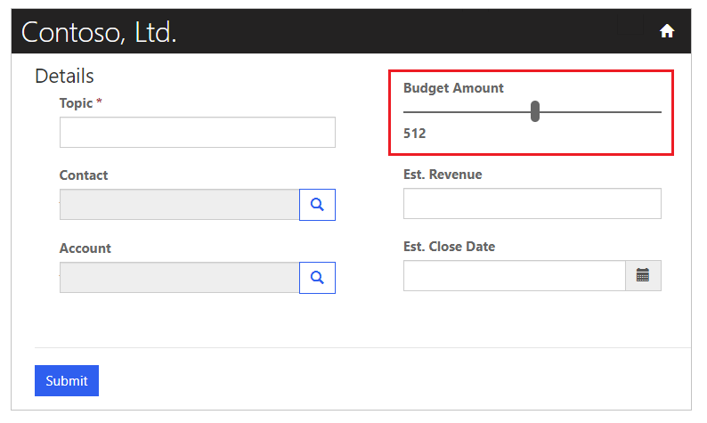

# Tutorial: Use code components in portals (preview)

[This article is pre-release documentation and is subject to change.]

In this tutorial, you'll create a sample component using Power Apps component framework. You'll package this component to a Dataverse environment and add the component to a model-driven app. You'll then configure Power Apps portals to add the component to a basic form, set access for the **Web Resource** table, and add the basic form to a webpage. Finally, you'll visit the portals webpage and interact with the component.

## Prerequisites

- Your portal version must be [9.3.3.x](versions/version-9.3.3.x.md) or higher.
- Your starter portal package must be [9.2.2103.x](versions/package-version-9.2.2103.md) or higher.

> [!NOTE]
> This tutorial is based on the existing Power Apps component framework tutorial that walks you through creating the [TSLinearInputComponent](../../developer/component-framework/implementing-controls-using-typescript.md) for the **Opportunity** table on the **Main** form. You can also use any existing or new component, and any other table for this tutorial. In this case, be sure to use your component and form when following the steps in this tutorial.

## Step 1. Create your first component

To create a sample component, follow the steps in the tutorial [Create your first component](../../developer/component-framework/implementing-controls-using-typescript.md).
At the end of this tutorial, you'll have the component named TSLinearInputComponent packaged and uploaded to your Dataverse environment.

## Step 2. Add the code component to a field in a model-driven app

Now that you have the TSLinearInputComponent uploaded to your Dataverse environment, follow the steps in the tutorial [Add a code component to a field in model-driven apps](../../developer/component-framework/add-custom-controls-to-a-field-or-entity.md) to add the component to the **Opportunity** table on the **Main** form.

## Step 3. Verify the model-driven app with the new component

You can [update an existing model-driven app](../model-driven-apps/design-custom-business-apps-using-app-designer.md) or [create a new app](../model-driven-apps/build-first-model-driven-app.md) with the form to which you added the component. For example, the following image shows how the **Opportunity** table **Main** form looks when using the code component in this tutorial.

## Step 4. Add code component to a basic form in portals

In this step, you’ll create a new basic form in portals and then add the component to the created basic form. You can also use an existing basic form instead.

### Step 4.1. Create a new basic form

1.  Open [Portal Management](configure/configure-portal.md) app.

2.  On the left pane, under **Content**, select **Basic Forms.**

3.  Select **New**.

4.  Enter **Name**. For example, *Opportunities basic form with code
    component*.

5.  Select **Basic Name** as *Opportunity*.

6.  For **Form Name**, select the model-driven app form that you added the code
    component to earlier in this tutorial.

7.  Select the **Tab Name**.

8.  Select your portal **Website**.

    

9.  Select **Save & Close**.

### Step 4.2. Add code component to the basic form

1.  Open [Portal Management](configure/configure-portal.md) app.

2.  On the left pane, under **Content**, select **Basic Forms.**

3.  Select the basic form you created in the previous step.

4.  Select **Related**.

5.  Select **Basic Form Metadata**.

6.  Select **New Basic Form Metadata**.

7.  Select **Type** as **Attribute**.

8.  Select **Attribute Logical Name** as *Budget Amount (budgetamount)*.

    

9.  Enter **Label**. For example, *Budget Amount*.

10. For **Control Style**, select **Code component**.

    

11. Select **Save & Close**.

## Step 5. Allow Read access to the Web Resource table

1.  Open [Portal Management](configure/configure-portal.md) app.

2.  On the left pane, under **Security**, select **Table Permissions.**

3.  Select **New**.

4.  Enter **Name**. For example, *Permissions for code component on the Web
    Resource table*.

5.  Select **Table** as **Web Resource (webresource)**.

6.  Select your **Website**.

7.  For **Scope**, select **Global**.

8.  In the **Privileges** section, select **Read**.

9.  Select **Save.**

    

10. Under **Web Roles**, select **Add Existing Web Role**.

11. Choose the web role as required. For example, choose the *Authenticated Users* web role of a portal website record to allow access to all authenticated users.

    

12. Select **Save & Close**.

## Step 6. Create a webpage in portals with the basic form

1.  Open your portal in [Power Apps portals Studio](portal-designer-anatomy.md).

2.  On the top-left corner, select **New page**.

3.  Select **Blank**.

4.  On the right-side property pane, update the webpage name. For example, *Opportunities.*

5.  Update partial URL. For example, *opportunities.*

6.  Expand **Permissions**.

7.  Disable **Page available to everyone**.

8.  Select the web roles that should be allowed access to this page.

9.  Inside the page editor, below the Header section, select the **Column** section.

10. On the left pane, select **Components**.

11. Under **Portal components**, select **Form**.

12. On the right-side property pane, select **Use existing**.

13. Under **Name**, select the basic form that you created earlier in this tutorial.

    > [!TIP]
    > If you don’t see the form available, try **Sync Configuration** to synchronize changes from Dataverse.

14. On the top-right corner, select **Browse website**.

The webpage will now show the basic form for the **Opportunities** table with the code component as the slider, similar to how it appears using the model-driven app for the same form.

## Next steps

[Overview: Use code components in portals](component-framework.md)

### See also

[Power Apps component framework overview](../../developer/component-framework/overview.md)  
[Create your first component](../../developer/component-framework/implementing-controls-using-typescript.md)  
[Add code components to a field or table in model-driven apps](../../developer/component-framework/add-custom-controls-to-a-field-or-entity.md)

