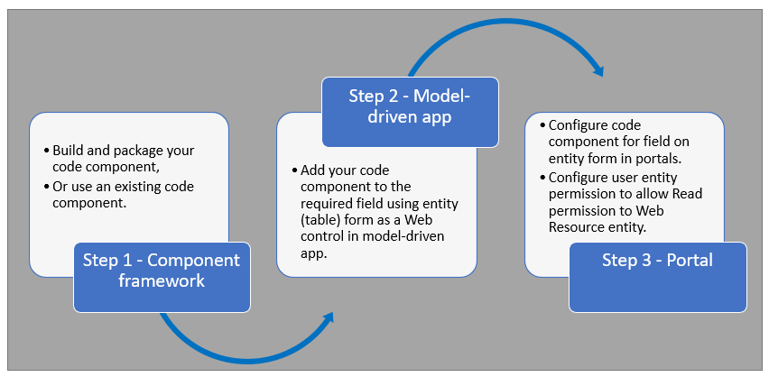

# Use code components in portals (preview)

[This article is pre-release documentation and is subject to change.]

Power Apps component framework empowers professional developers and app makers to create code components for model-driven and canvas apps (public preview). These code components can provide an enhanced experience for users working with data on forms, views, and dashboards. More information: [Power Apps component framework overview](../../developer/component-framework/overview.md)

Power Apps portals now supports controls for model-driven apps created using Power Apps component framework. To use code components in portals webpages, follow these steps:

After following these steps, your users can now interact with the code component using the portal page that has the respective basic form.  

> [!IMPORTANT]
> - This is a preview feature.
> - [!INCLUDE[cc_preview_features_definition](../../includes/cc-preview-features-definition.md)]
> - Portals only currently supports [code components that are added to a field](../../developer/component-framework/add-custom-controls-to-a-field-or-entity.md#add-a-code-component-to-a-column) in a model-driven app.

## Prerequisites

-   User must have a valid Power Apps license. More information: [Power Apps component framework licensing](../../developer/component-framework/overview.md#licensing)
-   System Administrator privileges are required to enable the Power Apps component feature in the environment.
- Your portal version must be [9.3.3.x](versions/version-9.3.3.x.md) or higher.
- Your starter portal package must be [9.2.2103.x](versions/package-version-9.2.2103.md) or higher.

## Create and package code component

To learn about creating and packaging code components created using Power Apps component framework, go to [Create your first component](../../developer/component-framework/implementing-controls-using-typescript.md).

### Supported field types and formats

Portals supports restricted field types and formats for using code components. The following table lists all supported field data types and formats:

:::row:::
   :::column span="":::
      Currency
   :::column-end:::
   :::column span="":::
      DateAndTime.DateAndTime
   :::column-end:::
   :::column span="":::
      DateAndTime.DateOnly
   :::column-end:::
   :::column span="":::
      Decimal
   :::column-end:::
:::row-end:::
:::row:::
   :::column span="":::
      Enum
   :::column-end:::
   :::column span="":::
      Floating Point Number
   :::column-end:::
   :::column span="":::
      Multiple
   :::column-end:::
   :::column span="":::
      OptionSet
   :::column-end:::
:::row-end:::
:::row:::
   :::column span="":::
      SingleLine.Email
   :::column-end:::
   :::column span="":::
      SingleLine.Phone
   :::column-end:::
   :::column span="":::
      SingleLine.Text
   :::column-end:::
   :::column span="":::
      SingleLine.TextArea
   :::column-end:::
:::row-end:::
:::row:::
   :::column span="":::
      SingleLine.Ticker
   :::column-end:::
   :::column span="":::
      SingleLine.URL
   :::column-end:::
   :::column span="":::
      TwoOptions
   :::column-end:::
   :::column span="":::
      Whole
   :::column-end:::
:::row-end:::

More information: [Attributes list and descriptions](../../developer/component-framework/manifest-schema-reference/property.md#remarks)

### Unsupported code components in portals

-   [Data-set
    components](../../developer/component-framework/sample-controls/data-set-grid-control.md)
    aren’t supported.

-   The following code component APIs aren’t supported:

    -   [Device.captureAudio](../../developer/component-framework/reference/device/captureaudio.md)

    -   [Device.captureImage](../../developer/component-framework/reference/device/captureimage.md)

    -   [Device.captureVideo](../../developer/component-framework/reference/device/capturevideo.md)

    -   [Device.getBarcodeValue](../../developer/component-framework/reference/device/getbarcodevalue.md)

    -   [Device.getCurrentPosition](../../developer/component-framework/reference/device/getcurrentposition.md)

    -   [Device.pickFile](../../developer/component-framework/reference/device/pickfile.md)

    -   [Utility](../../developer/component-framework/reference/utility.md)

    -   [WebAPI](../../developer/component-framework/reference/webapi.md)

-   The [uses-feature](../../developer/component-framework/manifest-schema-reference/uses-feature.md) element must not be set to **true**.

-   [Value elements not supported](../../developer/component-framework/manifest-schema-reference/property.md#value-elements-that-are-not-supported)
    by Power Apps component framework.

## Add a code component to a field in a model-driven app

To learn about how to add a code component to a field in model-driven app, go to [Add a code component to a field](../../developer/component-framework/add-custom-controls-to-a-field-or-entity.md#add-a-code-component-to-a-column).

> [!IMPORTANT]
> Code components for portals are available for web browsers using the client option of **Web**.

## Configure portal for code component

After the code component is added to a field in a model-driven app, you can configure portals to use the code component in the basic form. Once you configure the code component on a basic form, ensure you configure table permission to allow portal users **Read** access to the **Web Resource** table before they can see the component on the portal page.

To add a code component to a basic form:

1. Open [Portal Management](configure/configure-portal.md) app.

1. On the left pane, select **Basic Forms**.

1. Select the basic form to which you want to add the code component.

1. Select **Related**.

1. Select **Basic Form Metadata**.

1. Select **New Basic Form Metadata**.

1. Select **Type** as **Attribute**.

1. Select **Attribute Logical Unit Name.**

1. Enter **Label**.

1. For **Control Style**, select **Code Component.**

1. Save and close the form.

> [!Important]
> If the basic form *Auto Generate Steps From Tabs* is selected in the **Miscellaneous** section of the **Form Options** tab, the code component will not be loaded for the attribute on the web page.

## Allow Read access to a Web Resource table

Portals requires **Read** permission to be set on the **Web Resource** table before users can see the code component on the webpage with the basic form.

To configure Read access on a Web Resource table:

1.  Open [Portal Management](configure/configure-portal.md) app.

2.  On the left pane, select **Table Permission**.

3.  Select **New**.

4.  Enter **Name.**

5.  Select *Web Resource (webresource)* for **Table Name**.

6.  Select your website record.

7.  Select *Global* for **Scope.**

8.  In **Privileges**, select *Read*.

9.  Select **Save**.

10. Under the **Web Roles** section, select **Add Existing Web Role**.

11. Select the web role for the users that should see the code component in portals.

    For example, **Anonymous Users** for anonymous users, **Authenticated Users** for users authenticated by portals, or a custom web role.

12. Select **Save & Close**.

Once you add the basic form to a webpage, users assigned to the selected web
role can now see the code component on the portal page having the selected
basic form.

## Next steps

[Tutorial: Use code components in portals](component-framework-tutorial.md)

### See also

[Power Apps component framework overview](../../developer/component-framework/overview.md)  
[Create your first component](../../developer/component-framework/implementing-controls-using-typescript.md)  
[Add code components to a field or table in model-driven apps](../../developer/component-framework/add-custom-controls-to-a-field-or-entity.md)

