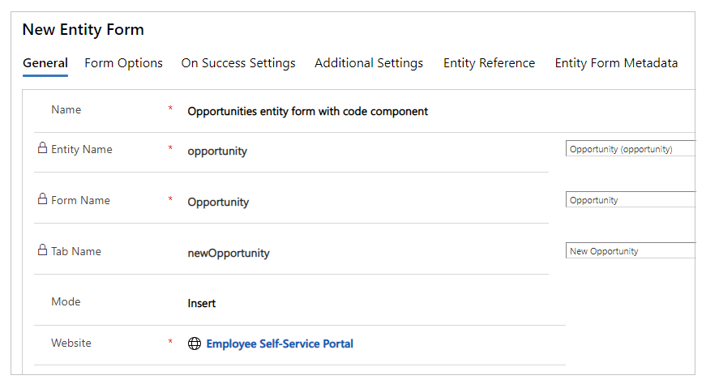
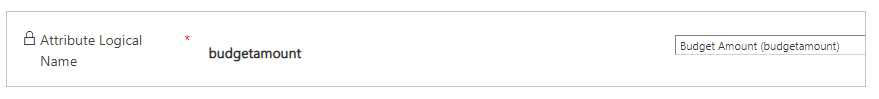

Overview
========

Power Apps component framework empowers professional developers and app makers
to create code components for model-driven and canvas apps (public preview) to
provide enhanced user experience for the users to work with data on forms,
views, and dashboards. More information: [Power Apps component framework
overview](https://docs.microsoft.com/powerapps/developer/component-framework/overview)

Power Apps portals now supports controls for model-driven apps created using
Power Apps component framework. To use code components in portals webpages,
follow these steps:

After following these steps, your users can now interact with the code component
using the portal page that has the respective entity form.  
**NOTE:** In this version, portals only supports [code components that are added
to a
field](https://docs.microsoft.com/powerapps/developer/component-framework/add-custom-controls-to-a-field-or-entity#add-a-code-component-to-a-field)
in a model-driven app.

Prerequisites
=============

-   User must have a valid Power Apps license. More information: [Power Apps
    component framework
    licensing](https://docs.microsoft.com/powerapps/developer/component-framework/overview#licensing)

-   System Administrator privileges are required to enable the Power Apps
    component feature in the environment.

Create and package code component
=================================

To learn about creating and packaging code components created using Power Apps
component framework, go to [Create your first
component](https://docs.microsoft.com/en-us/powerapps/developer/component-framework/implementing-controls-using-typescript).

Supported field types and formats
=================================

Portals supports restricted field types and formats for using code components.
The following table lists all supported field data types, and formats.

| **Supported field data types** | **Supported formats** |
|--------------------------------|-----------------------|
| Currency                       | N/A                   |
| DateTime                       | DateAndTime           |
|                                | DateOnly              |
| Decimal                        | N/A                   |
| Enum                           | N/A                   |
| Floating Point Number          | N/A                   |
| Multiple Line                  | N/A                   |
| OptionSet                      | N/A                   |
| SingleLine                     | Email                 |
|                                | Phone                 |
|                                | Text                  |
|                                | TextArea              |
|                                | Ticker                |
|                                | URL                   |
| TwoOptions                     | N/A                   |
| Whole                          | N/A                   |

Unsupported code components in portals
======================================

-   [Data-set
    components](https://docs.microsoft.com/powerapps/developer/component-framework/sample-controls/data-set-grid-control)
    aren’t supported.

-   The following code component APIs aren’t supported:

    -   [Device.captureAudio](https://docs.microsoft.com/powerapps/developer/component-framework/reference/device/captureaudio)

    -   [Device.captureImage](https://docs.microsoft.com/powerapps/developer/component-framework/reference/device/captureimage)

    -   [Device.captureVideo](https://docs.microsoft.com/powerapps/developer/component-framework/reference/device/capturevideo)

    -   [Device.getBarcodeValue](https://docs.microsoft.com/powerapps/developer/component-framework/reference/device/getbarcodevalue)

    -   [Device.getCurrentPosition](https://docs.microsoft.com/powerapps/developer/component-framework/reference/device/getcurrentposition)

    -   [Device.pickFile](https://docs.microsoft.com/powerapps/developer/component-framework/reference/device/pickfile)

    -   [Utility](https://docs.microsoft.com/powerapps/developer/component-framework/reference/utility)

    -   [WebAPI](https://docs.microsoft.com/powerapps/developer/component-framework/reference/webapi)

-   [uses-feature](https://docs.microsoft.com/powerapps/developer/component-framework/manifest-schema-reference/uses-feature)
    element must not be set to **true**.

-   [Value elements not
    supported](https://docs.microsoft.com/powerapps/developer/component-framework/manifest-schema-reference/property#value-elements-that-are-not-supported)
    by Power Apps component framework.

Add a code component to a field in model-driven app
===================================================

To learn about how to add code component to a field in model-driven app, go to
[Add a code component to a
field](https://docs.microsoft.com/powerapps/developer/component-framework/add-custom-controls-to-a-field-or-entity#add-a-code-component-to-a-field).

**NOTE:** Code components for portals be available for web browsers using the
client option of **Web**.

Configure portal for code component
===================================

After the code component is added to a field in model-driven app, you can now
configure portals to use the code component in the entity form. Once you
configure the code component on entity form, ensure you configure entity
permission to allow **Read** access to **Web Resource** entity for the portal
users before they can see the component on the portal page.

**NOTE**: Private preview participants must import this attached managed
solution before proceeding to next step for adding the code component to an
entity form.

Add code component to entity form
---------------------------------

To add code component to entity form:

1.  Open [Portal
    Management](https://docs.microsoft.com/powerapps/maker/portals/configure/configure-portal)
    app.

2.  Select **Entity Forms** from the left pane.

3.  Select the entity form you want to add the code component to.

4.  Select **Related**.

5.  Select **Entity Form Metadata**.

6.  Select **New Entity Form Metadata**.

7.  Select **Type** as **Attribute**.

8.  Select **Attribute Logical Unit Name.**

9.  Enter **Label**.

10. For **Control Style**, select **Code Component.**

11. Save and close the form.

Allow Read access to Web Resource entity
----------------------------------------

Portals requires **Read** permission to be set on **Web Resource** entity before
users can see the code component on the web page with entity form.

To configure Read access on Web Resource entity:

1.  Open [Portal
    Management](https://docs.microsoft.com/powerapps/maker/portals/configure/configure-portal)
    app.

2.  Select **Entity Permission** from the left pane.

3.  Select **New**.

4.  Enter **Name.**

5.  Select *Web Resource (webresource)* for **Entity Name**.

6.  Select your website record.

7.  Select *Global* for **Scope.**

8.  In **Privileges**, select *Read*.

9.  Select **Save**.

10. Under **Web Roles** section, select **Add Existing Web Role**.

11. Select the web role for the users that you want to see the code component in
    portals.

    For example, A**nonymous Users** for anonymous users, **Authenticated
    Users** for users authenticated by portals, or a custom web role.

12. Select **Save & Close**.

Once you add the entity form to a web page, users assigned to the selected web
role can now see the code component on the portal page having the selected
entity form.

Tutorial
========

In this tutorial, you’ll create a sample component using Power Apps component
framework. You’ll then package this component to a Dataverse environment, and
then add the component to model-driven app. Then, you’ll configure Power Apps
portals to add the component to an entity form, set access for the Web Resource
entity, and add the entity form to a web page. Finally, you’ll visit the portals
web page and interact with the component.

Prerequisites
-------------

You need a provisioned Employee Self-Service portal to follow this tutorial.
Though this tutorial uses Employee Self-Service portal, you can also use
Dataverse starter portal instead. When using a starter portal, ensure to replace
references to the portal web site.

**NOTE:** This tutorial is based on the existing Power Apps component framework
tutorial that walks you through to create TSLinearInputComponent component for
**Opportunity** entity on the **Main** form. You can also use any existing or
new component, and any other entity for this tutorial. In this case, ensure to
use your component and form when following the steps in this tutorial.

Step 1. Create your first component
-----------------------------------

To create a sample component, follow the steps in the tutorial [Create your
first
component](https://docs.microsoft.com/powerapps/developer/component-framework/implementing-controls-using-typescript).
At the end of this tutorial, you’ll have the component named
TSLinearInputComponent packaged and uploaded to your Dataverse environment.

Step 2. Add a code component to a field in model-driven app
-----------------------------------------------------------

Now that you have the TSLinearInputComponent component uploaded to the Dataverse
environment, follow the steps in the tutorial [Add a code component to a field
in model-driven
apps](https://docs.microsoft.com/powerapps/developer/component-framework/add-custom-controls-to-a-field-or-entity)
to add the component to the **Opportunity** entity on the **Main** form.

Step 3. Verify the model-driven app with the new component
----------------------------------------------------------

You can [update an existing model-driven
app](https://docs.microsoft.com/powerapps/maker/model-driven-apps/design-custom-business-apps-using-app-designer),
or [create a new
app](https://docs.microsoft.com/powerapps/maker/model-driven-apps/build-first-model-driven-app)
with the form that you added the component to. For example, this is how the
**Opportunity** entity **Main** form looks like when using the code component in
this tutorial.

Step 4. Add code component to an entity form in portals
-------------------------------------------------------

In this step, you’ll create a new entity form in portals. And then, add the
component to the created entity form. You can also use an existing entity form
instead.

### Step 4.1. Create a new entity form

1.  Open [Portal
    Management](https://docs.microsoft.com/powerapps/maker/portals/configure/configure-portal)
    app.

2.  From the left-pane, under **Content**, select **Entity Forms.**

3.  Select **New**.

4.  Enter **Name**. For example, *Opportunities entity form with code
    component*.

5.  Select **Entity Name** as *Opportunity*.

6.  For **Form Name**, select the model-driven app form that you added the code
    component to earlier in this tutorial.

7.  Select the **Tab Name**.

8.  Select your portal **Website**.

    

9.  Select **Save & Close**.

### Step 4.2. Add code component to entity form

1.  Open [Portal
    Management](https://docs.microsoft.com/powerapps/maker/portals/configure/configure-portal)
    app.

2.  From the left-pane, under **Content**, select **Entity Forms.**

3.  Select the entity form that you created in the earlier in this tutorial.

4.  Select **Related**.

5.  Select **Entity Form Metadata**.

6.  Select **New Entity Form Metadata**.

7.  Select **Type** as **Attribute**.

8.  Select **Attribute Logical Unit Name** as *Budget Amount (budgetamount)*.

    

9.  Enter **Label**. For example, *Budget Amount*.

10. For **Control Style**, select **Code Component**.

    

11. Select **Save & Close**.

Step 5. Allow Read access to Web Resource entity
------------------------------------------------

1.  Open [Portal
    Management](https://docs.microsoft.com/powerapps/maker/portals/configure/configure-portal)
    app.

2.  From the left-pane, under **Security**, select **Entity Permissions.**

3.  Select **New**.

4.  Enter **Name**. For example, *Permissions for code component on the Web
    Resource entity*.

5.  Select **Entity** as **Opportunity***.*

6.  Select your **Website**.

7.  For **Scope**, select **Global**.

8.  In **Privileges** section, select **Read**.

9.  Select **Save.**

    

10. Under **Web Roles**, select **Add Existing Web Role**.

11. Choose the web role as required. For example, choose *Authenticated Users*
    web role of a portal web site record to allow access to all authenticated
    users.

    

12. Select **Save & Close**.

Step 6. Create a web page in portals with the entity form
---------------------------------------------------------

1.  Open your portal in [Power Apps portals
    Studio](https://docs.microsoft.com/powerapps/maker/portals/portal-designer-anatomy).

2.  From the top-left corner, select **New page** drop-down menu.

3.  Select **Blank**.

4.  On the right-side property pane, update the webpage name. For example,
    *Opportunities.*

5.  Update partial URL. For example, o*pportunities.*

6.  Expand **Permissions**.

7.  Disable **Page available to everyone**.

8.  Select web roles that you want to allow to access this page.

9.  Inside the page editor, below the Header section, select the **Column**
    section.

10. From the left-pane, select **Components**.

11. Under **Portal components**, select **Form**.

12. On the right-side property pane, select **Use existing**.

13. Under **Name**, select the entity form that you created earlier in this
    tutorial.

    **TIP:** If you don’t see the form available, try **Sync Configuration** to
    synchronize changes from Dataverse.

14. From the top-right corner, select **Browse website**.

The portals web page now shows the entity form for **Opportunities** entity with
the code component as the slider, like how it appears using model-driven app for
the same form.

Preview disclaimer
==================

Preview features are features that aren’t complete but are made available on a
“preview” basis so customers can get early access and provide feedback. Preview
features are not supported by Microsoft Support, may have limited or restricted
functionality, aren’t meant for production use, and may be available only in
selected geographic areas.

Copyright
=========

This document is provided "as-is". Information and views expressed in this
document, including URL and other Internet web site references, may change
without notice.

Some examples depicted herein are provided for illustration only and are
fictitious. No real association or connection is intended or should be inferred.

This document does not provide you with any legal rights to any intellectual
property in any Microsoft product. You may copy and use this document for your
internal, reference purposes. This document is confidential and proprietary to
Microsoft. It is disclosed and can be used only pursuant to a non-disclosure
agreement.

© 2021 Microsoft. All rights reserved.

Microsoft is trademark of the Microsoft group of companies. All other trademarks
are property of their respective owners.
