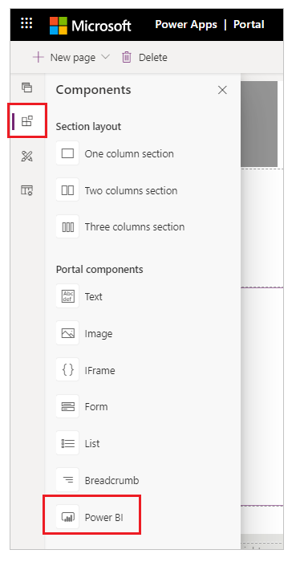

# Compose a page

After adding the required webpages and managing their hierarchy in the sitemap, you can add various components. The WYSIWYG editor allows you to add and edit the required components on the canvas easily. You can add and edit the following components on the canvas:

- Sections
    - One column section
    - Two columns section
    - Three columns section
- Portal components
    - Text
    - Image
    - IFrame
    - Form
    - List
    - Breadcrumb

> [!NOTE]
> If you customize your portal using Power Apps portals Studio, the website users would notice a performance impact. We recommended you to do the changes during non-peak hours on a live portal. 

## Use the WYSIWYG editor

1.  [Edit the portal](manage-existing-portals.md#edit) to open it in Power Apps portals Studio.  

2.  Select the page on which you want to add the component.

3.  Select an editable element on the canvas.

    > [!NOTE]
    > The editable elements are demarcated by a boundary.

4.  Select **Components**  from the left side of the screen.  

5.  Select the component to be added.

    > [!div class=mx-imgBorder]
    >   

    The selected component is added to the canvas inside the editable element.

6.  To delete a component, select the component on the canvas and then select **Delete** on the command bar at the top of the page.

    > [!div class=mx-imgBorder]
    >   

## Add sections

Sections allow you to define a structure for your page and arrange portal components.

Once you add sections to your page, you can add portal components inside the sections as per the requirement.

1.    [Edit the portal](manage-existing-portals.md#edit) to open it in Power Apps portals Studio.

2.    Select the page on which you want to add a section.

3.    Select an editable element on the canvas.

4.    Select **Components**  from left side of the screen.

5.    Under **Section layout**, select the section type to be inserted.

6.    In the properties pane on the right side of the screen, enter or select the following information:

    - **Min Height**: Enter the minimum height of the section. If you add a component that occupies more space than the specified height, the section expands to accommodate the component. By default, the minimum height is 100 px. You can also enter the height in points (pt) and percentage (%).

        > [!div class=mx-imgBorder]
        >   

    - **Alignment**: Select whether the component in the section must be left, center, or right aligned.

        > [!div class=mx-imgBorder]
        >   

    - **Background**: Select if you'd like to have color or an image as the section background.

        - **Fill**: Select a color for the background.

            > [!div class=mx-imgBorder]
            >   

        - **Image**: Select an image from the list. If you would like to upload a new image, select **Upload image**.

            > [!div class=mx-imgBorder]
            >   

7.    Add the required portal component in the section.


## Add portal components

You can add the following components on a webpage:

- [Text](#add-text-box)
- [Image](#add-image)
- [IFrame](#add-iframe)
- [Form](#add-form)
- [List](#add-list)
- [Breadcrumb](#add-breadcrumb)


### Add text box

1.  [Edit the portal](manage-existing-portals.md#edit) to open it in Power Apps portals Studio.  

2.  Select the page on which you want to add the component.

3.  Select an editable element on the canvas.

4.  Select **Components**  from the left side of the screen.  

5.    Under **Portal components**, select **Text**.

6.  Enter the required text in the text box.

7.  To format the text, select the text to display the format options. Modify the font size and style as required.

    > [!div class=mx-imgBorder]
    >   

8. In the properties pane on the right side of the screen, select the following information:

    - **Alignment**: Select whether the text must be left, center, or right aligned.

    - **Font color**: Select a color for the text.

        > [!div class=mx-imgBorder]
        >   
 

### Add image

1.  [Edit the portal](manage-existing-portals.md#edit) to open it in Power Apps portals Studio.  

2.  Select the page on which you want to add the component.

3.  Select an editable element on the canvas.

4.  Select **Components**  from the left side of the screen.  

5.  Under **Portal components**, select **Image**. The image placeholder is added to the canvas.

6.  In the properties pane on the right side of the screen, enter the following information:

    - **Image**: Select this option if you would like to select an existing image or upload a new one. If you want to select a previously uploaded image, choose an image from the **Select image** list. To upload a new image, select **Upload image**. All the uploaded images are included in the image library, which can be selected again through the **Select image** list.

        > [!div class=mx-imgBorder]
        >   

        > [!NOTE]
        > - You can upload only the images of type png, svg, jpg, and jpeg with the maximum size of 5 MB.
        > - You can't upload an image with the same name. You need to modify the name of the image to upload it again.

    - **External url**: Select this option if you would like to upload an image from an external URL. Enter the URL in the **External url** field. Only secured links are accepted—that is, https:// is mandatory. If you have images stored in your content delivery network, you can provide the link in this field.

        > [!div class=mx-imgBorder]
        >   

    -   **Formatting options**

        - **Width**: Enter width of the image.

        - **Height**: Enter height of the image.

    > [!NOTE]
    > You can also select the image on the canvas and drag the handles to resize it.

### Add IFrame

1.  [Edit the portal](manage-existing-portals.md#edit) to open it in Power Apps portals Studio.  

2.  Select the page on which you want to add the component.

3.  Select an editable element on the canvas.

4.  Select **Components**  from the left side of the screen.  

5.  Under **Portal components**, select **IFrame**. The IFrame placeholder is added to the canvas.

6.  In the properties pane on the right side of the screen, enter the following information:

    - **Width**: Enter the width of the IFrame.

    - **Height**: Enter the height of the IFrame.

        > [!NOTE]
        > You can also select the IFrame on the canvas and drag the handles to resize it.

    - **Link**: Enter the URL of the website to be displayed in the IFrame. Only secured links are accepted—that is, https:// is mandatory. By default, <https://www.bing.com> is available as the value.
    
        > [!div class=mx-imgBorder]
        >   

> [!NOTE]
> You can also add [Power Virtual Agent](https://docs.microsoft.com/power-virtual-agents/fundamentals-what-is-power-virtual-agents) bot to the  IFrame similarly using steps described in [add bot to your web site](https://docs.microsoft.com/power-virtual-agents/publication-connect-bot-to-web-channels#custom-website).

### Add form

Form is a data-driven configuration that collects data in the portal without the need for a developer to surface the form in the portal. 

Forms are [created in Common Data Service](https://docs.microsoft.com/powerapps/maker/model-driven-apps/form-designer-overview). You can use them in webpages in the portal or in conjunction with lists to build out complete web applications.  

1.  [Edit the portal](manage-existing-portals.md#edit) to open it in Power Apps portals Studio.  

2.  Select the page on which you want to add the component.

3.  Select an editable element on the canvas.

4.  Select **Components**  from the left side of the screen.  

5.  Under **Portal components**, select **Form**.

6.  In the properties pane on the right side of the screen, select one of the following options:

    - **Create new**: Create a new form.
    - **Use existing**: Use an existing form.

7. Enter information or make selection:

    - **Name**: Name of the form.

    - **Entity**: The name of the entity from which the form is loaded.

    - **Form layout**: The name of the form on the target entity in Common Data Service that is to be rendered.

    - **Mode**: Select one of the following options:

        - **Insert**: Indicates the form should insert a new record upon submission.

        - **Edit**: Indicates the form should edit an existing record.

        - **Read only**: Indicates the form should display an existing record's non-editable form.

        > [!NOTE]
        > The default option for **Edit** and **ReadOnly** modes is set as Query String Parameter Name passed as ID in URL. To change these values, you need to open Portal Management app and update the form properties.

    - **On success**: Select one of the following options:

        - **Show success message**: Requires a message to be displayed to the user on successful submission of the form. You can also select **Hide form on success** to hide the form upon successful submission.

        - **Redirect to webpage**: Redirects the user to the selected webpage in the portal. This field is required.

        - **Redirect to URL**: Redirects the user to the specified URL. This field is required.

    - **Show captcha for anonymous users**: Displays captcha to anonymous users.

    - **Show captcha for authenticated users**: Displays captcha to authenticated users.

    - **Enable entity permissions**: Entity permissions to be considered for the form. By default, it isn't selected. If selected, explicit permissions are required for any user to access the form. More information: [Entity permission](configure/assign-entity-permissions.md)

        > [!div class=mx-imgBorder]
        > 

### Add list

List is a data-driven configuration to render a list of records without the need for a developer to surface the grid in the portal.

Lists use [Common Data Service views](https://docs.microsoft.com/powerapps/maker/model-driven-apps/create-and-edit-views) to display records on the portal.  

1.  [Edit the portal](manage-existing-portals.md#edit) to open it in Power Apps portals Studio.  

2.  Select the page on which you want to add the component.

3.  Select an editable element on the canvas.

4.  Select **Components**  from the left side of the screen.  

5.  Under **Portal components**, select **List**.

6.  In the properties pane on the right side of the screen, select one of the following options:

    - **Create new**: Create a new list.
    - **Use existing**: Use an existing list.

7.  Enter information or make selection:

    - **Name**: Name of the list.

    - **Entity**: The name of the entity from which the views are loaded.

    - **Views**: The list of views of the target entity that is to be rendered. You can select multiple views to display records in the list. The view selected first is the default view.

    - **Create new record**: Allows a user to create a record. Select a webpage that contains a form to create a new record.

    - **View details**: Allows a user to view details. Select a webpage that contains a form to display details.

    - **Edit record**: Allows a user to edit a record. Select a webpage that contains a form to edit the record.

    - **Delete record**: Allows a user to delete a record.

    - **Empty list message**: Message to be displayed when there are no records to be displayed.

    - **Number of records per page**: Enter the number of the records to display on a page.

    - **Enable search in entity list**: Allows a user to search records in the list.

    - **Enable entity permissions**: Entity permissions to be considered for the list. Not selected by default. If selected, explicit permissions are required for any user to access the form. More information: [Entity permission](configure/assign-entity-permissions.md)  

    > [!div class=mx-imgBorder]
    > 

### Add breadcrumb

1.  [Edit the portal](manage-existing-portals.md#edit) to open it in Power Apps portals Studio.  

2.  Select the page on which you want to add the component.

3.  Select an editable element on the canvas.

4.  Select **Components**  from the left side of the screen.  

5.  Under **Portal components**, select **Breadcrumb**.

## Add a custom menu

By default, the menu on the website is created automatically based on the hierarchy of the webpages. It's called the **default** menu. To create a custom menu, you must create the web link set in the Portal Management app. More information: [Manage web links](configure/manage-web-links.md)

After you create the web link set:

1.    [Edit the portal](manage-existing-portals.md#edit) to open it in Power Apps portals Studio.

2.    Select the header component. 

3.    In the properties on the right side of the screen, select the web link set name from the **Navigation Menu** list.

    > [!div class=mx-imgBorder]
    > 

## Use code editor

To view the source of a component on the canvas, select the component, and then select the source code editor icon **&lt;/&gt;** in the footer.

> [!div class=mx-imgBorder]
>   

The source code is displayed in the **Code Editor** pane at the bottom of the screen. The changes you made earlier are updated in the source code. To make changes, update the source code and select **Save**. The changes are reflected on the canvas.

> [!div class=mx-imgBorder]
>  

> [!NOTE]
> You can also add Liquid tags in source code editor for advanced configuration. More information: [Work with Liquid templates](liquid/liquid-overview.md)

## Add Power BI

You can add Power BI component on a page. When adding a Power BI component, you have different options to select for access type, workspace, and advanced settings.

> [!NOTE]
> Before you begin, read [Power BI access types](#power-bi-access-types) and [Power BI considerations](#other-power-bi-considerations) to get familiar with important Power BI terms and considerations for Power Apps portal.

To add a Power BI component to a web page:

1. [Edit the
    portal](https://docs.microsoft.com/powerapps/maker/portals/manage-existing-portals#edit).

1. Select the page to add a component to.

1. Select an editable element on the canvas.

1. Select **Components** from the left side of the screen.

1. From Portal components, select **Power BI**. The Power BI placeholder is added to the canvas.

    

1. In the properties pane on the right side of the screen, enter the following information:

    1. **Access type**: Select appropriate option from the drop-down as per your requirement.

        

        1. **Embed for your customers**: Allows you to securely share the Power BI report or dashboard to external users without Power BI license or Azure Active Directory authentication setup. This option uses Power BI Embedded services to integrate Power BI chart into portal.
            > [!NOTE]
            > Make sure [Power BI Embedded service is enabled](https://docs.microsoft.com/powerapps/maker/portals/admin/set-up-power-bi-integration#enable-power-bi-embedded-service) and respective Power BI workspaces are selected, and shared with the maker or the logged-in user.

        1. **Embed for your organization**: Allows you to securely share the Power BI report or dashboard to Azure Active Directory authenticated users. 
            > [!NOTE]
            > Make sure you've shared Power BI workspaces with maker and target portal users.

        3. **Publish to web**
            Allows you to share Power BI report or dashboard to anyone on the internet.

        For more information about access types, go to [access types](#power-bi-access-types).

    1. **Workspace**: Select the Power BI workspace from the list.

    1. **Select type**: Select type as *Dashboard* or *Report* from the list.

        If you selected the type as **Dashboard**, then **Select dashboard** option appears and you can select any one of the available dashboards from the list. You can then select a **Tile** to display on the web page.

        If you selected the type as **Report**, then **Select report** option appears and you can select any one of the available reports from the list. You can then select a **Page** from the report to dosplay on the web page.

    1. **Apply roles** (only available for access type **Embed for your customer**): <br>If you have defined roles in Power BI and assigned them to reports, you must enter appropriate roles in this field. <br>
        You can enter multiple roles separated by a comma (for example, ```role_1,role_2```). For more information on defining roles in Power BI, see [Row-level security (RLS) with Power BI](https://docs.microsoft.com/power-bi/service-admin-rls) 

    1. **Apply filter** (only available for access types **Embed for your customer** and **Embed for your organization**) with **Report** type: <br>
        Allows user to load the report with pre-filtered values. User can provide filter condition in the field.
        This field requires filter parameter format without ```?filter=``` prefix. For example, ```Table/Field eq 'value'```.
        <br> For more information, read [filter parameter details](https://docs.microsoft.com/power-bi/service-url-filters).

        

    1. **Embed code URL** (only available for access type **Publish to web**): <br> To get embed code URL that you can copy and paste, read [Publish to web from Power BI](https://docs.microsoft.com/power-bi/service-publish-to-web)

        

### Power BI access types

The following highlights *Power BI access types* in brief. For more information, go to [Difference between Power BI service and Power BI embedded](https://docs.microsoft.com/power-bi/developer/embedded/embedded-faq#how-is-power-bi-embedded-different-from-power-bi-the-service).

- **Embed for your customers**:
    - Shows the list of workspaces shared to logged in user and enabled for [Power BI Embedded service](https://docs.microsoft.com/powerapps/maker/portals/admin/set-up-power-bi-integration#enable-power-bi-embedded-service).
    - Uses Power BI Embedded service.
    - If you add Power BI with *Embed for your customers* on a Power Apps portal page that is available **anonymously**, anyone can view the dashboard. To secure such a web page, read [web page access control in Power Apps portal](https://docs.microsoft.com/powerapps/maker/portals/configure/webpage-access-control).
- **Embed for your organization**:
    - Shows the list of workspaces shared with logged in user.
    - Uses Azure Active Directory authentication.
- **Publish to web**: Anyone on Internet can view your published report or visual. This requires no authentication and includes viewing detail level data your reports aggregate. Before publishing a report, make sure you can share the data and visualizations publicly. Do not publish confidential or sensitive information. When in doubt, check your organization's policies before publishing.

### Other Power BI considerations

- [Portal Studio](https://docs.microsoft.com/powerapps/maker/portals/portal-designer-anatomy) performance can degrade while working with Power BI workspaces due to the following Power BI workspace configurations:
    - Increased number of workspaces shared with user account used while editing the portal.
    - Increased number of users the Power BI workspace is shared with.
- [Capture liquid variable](https://docs.microsoft.com/powerapps/maker/portals/liquid/portals-entity-tags#powerbi) is not supported in portal Studio while working with Power BI component.
- If you [reset portal](https://docs.microsoft.com/powerapps/maker/portals/admin/reset-portal) and provision a new portal, you must add portal application ID of the new portal to the **Portal Power BI Embedded service** Azure AD security group. For more information, read [Set up Power BI integration](https://docs.microsoft.com/powerapps/maker/portals/admin/set-up-power-bi-integration#create-security-group-and-add-to-power-bi-account).  

### Power BI performance and optimization considerations

Embedding multiple Power BI workspaces may need additional considerations. Refer to the following resources for Power BI embed scenario troubleshooting, optimization and best practices:

- [Troubleshooting Power BI Embedded application content rendering](https://docs.microsoft.com/power-bi/developer/embedded/embedded-troubleshoot#content-rendering).
- [Power BI Embedded performance best practices](https://docs.microsoft.com/power-bi/developer/embedded/embedded-performance-best-practices).
- [Power BI optimization guide](https://docs.microsoft.com/power-bi/guidance/power-bi-optimization).

## Next steps

[Work with templates](work-with-templates.md)