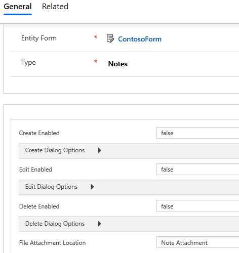
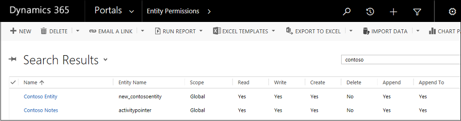
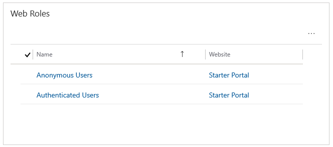

# Configure notes for entity forms and web forms on portals

Just like with subgrids, adding notes to your managed forms on the portal is easy&mdash;just add the notes control to the Dynamics 365 form through the out-of-the-box Dynamics 365 form designer and you're done. You can configure the behavior of the notes control by using metadata.

> [!Note]                                                           
> Explicit [Entity Permissions](https://docs.microsoft.com/en-us/dynamics365/customer-engagement/portals/assign-entity-permissions) are required for any notes to appear on the portal. For read and edit, the Read and Write privileges must be granted. For create, two permissions must exist: a permission with the Create and Append privileges must be granted for the note (annotation) entity, the second permission must be assigned to the entity type the note is being attached to with the Append To privilege granted. The **Enable Entity Permissions** check box must be selected on the corresponding entity form or web form step for the entity permissions to take effect.

## Notes configuration for entity forms

1. Sign in to Dynamics 365.
2. Go to **Portals** > **Content** > **Entity Forms**. A list of active entity forms is displayed.
3. Select the entity form to which you want to add note configuration.
4. Go to **Entity Form Metadata** either by using the top drop-down list or the subgrid on the main form of the entity form record that you are working with.
5. Select **Add New Entity Form Metadata** to add a new record.
6. From the **Type** drop-down list, select **Notes**. The notes configuration&ndash;specific settings are displayed. Most of the settings are collapsed by default. You can expand a section to see additional settings.
7. Fill in the fields by entering appropriate values. [!include] [Attributes](#attributes), [Create dialog options](#create-dialog-options), [Edit dialog options](#edit-dialog-options), and [Delete dialog options](#delete-dialog-options)
8. Save the form.

      

    After adding the configuration, the Note control will be rendered by using the appropriate options enabled on the portal.

## Attributes

| Name                  | Description                                                                                                                                                  |
|-----------------------|--------------------------------------------------------------------------------------------------------------------------------------------------------------|
| **Basic settings**    |                                                                                                                                                              |
| Create Enabled        | Enables the ability to add new notes to the entity.                                                                                                          |
| Create Dialog Options | Contains settings for configuring the dialog box when **Create Enabled** is true. See Create Dialog Options for more details.                                    |
| Edit Enabled          | Enables the ability to edit existing notes on the entity.                                                                                                    |
| Edit Dialog Options   | Contains settings for configuring the dialog box when **EditEnabled** is true. See Edit Dialog Options for more details.                                         |
| Delete Enabled        | Enables the ability to delete notes from the entity.                                                                                                         |
| Delete Dialog Options | Contains settings for configuring the dialog box when **DeleteEnabled** is true. See Delete Dialog Options for more details.                                     |
|File Attachment Location | Select the location of the file attachment:<ul><li>Note attachment</li><li>Azure Blob Storage</li></ul>|
|Accept MIME Types(s) | Allows you to specify a list of accepted MIME types. |
|Restrict MIME Types | Select whether to allow or restrict MIME types.|
|Maximum File Size (in KB) |Allows you to specify the maximum size of a file that can be attached. |
| **Advanced settings** |                                                                                                                                                              |
| List Title            | Overrides the title over the Notes area.                                                                                                                     |
| Add Note Button Label | Overrides the label on the Add Notes button.                                                                                                                 |
| Note Privacy Label    | Overrides the label denoting that a note is Private.                                                                                                         |
| Loading Message       | Overrides the message shown while the list of notes is loading.                                                                                              |
| Error Message         | Overrides the message shown when an error occurs while trying to load the list of notes.                                                                     |
| Access Denied Message | Overrides the message shown when the user does not have sufficient permissions to view the list of notes.                                                    |
| Empty Message         | Overrides the message shown when the current entity does not have any notes that can be viewed.                                                              |
| List Orders           | Allows you to set the order in which notes will be displayed. The List Orders setting allows you to set the following: <ul><li>Attribute: the logical name of the column by which you wish to sort</li><li>Alias: the alias for the attribute in the query</li><li>Direction: Ascending (smallest to largest, or first to last), or Descending (largest to smallest, or last to first).</li></ul>  To add a sorting rule, select "Column" (4) and fill in the details. List Orders will be processed in order from the top of the list having highest priority.|
||

## Create Dialog Options

| Name                               | Description                                                                                                                                 |
|------------------------------------|---------------------------------------------------------------------------------------------------------------------------------------------|
| **Basic settings**                 |                                                                                                                                             |
| Display Privacy Options Field      | Enables a check box in the Add Note dialog box that allows the user to mark a note as Private.                                                   |
| Privacy Option Field Default Value | Specifies the default value for the Display Privacy Options Field check box. The default value of this field is False.                     |
| Display Attach File                | Enables a file upload field in the Add Note dialog box, allowing a user to attach a file to a note.                                             |
| Attach File Accept                 | The MIME type accepted by the file upload input.                                                                                            |
| **Advanced settings**              |                                                                                                                                             |
| Note Field Label                   | Overrides the label for the Note field in the Add Note dialog box.                                                                              |
| Note Field Columns                 | Sets the cols value in the Note &lt;textarea&gt;                                                                                            |
| Note Field Rows                    | Sets the rows value in the Note &lt;textarea&gt;                                                                                            |
| Privacy Option Field Label         | Overrides the label for the Privacy Option field (if enabled).                                                                              |
| Attach File Label                  | Overrides the label for the Attach File field (if enabled)                                                                                  |
| Left Column CSS Class              | Adds the CSS class or classes to the leftmost column containing labels in the Add Note dialog box.                                                  |
| Right Column CSS Class             | Adds the CSS class or classes to the rightmost column containing field inputs in the Add Note dialog box.                                           |
| Title                              | Overrides the HTML text in the header of the Add Note dialog box.                                                                               |
| Primary Button Text                | Overrides the HTML that appears in the Primary (Add Note) button in the dialog box.                                                           |
| Dismiss Button SR Text             | Overrides the screen reader text associated with the dialog box's dismiss button.                                                               |
| Close Button Text                  | Overrides the HTML that appears in the Close (Cancel) button in the dialog box.                                                               |
| Size                               | Specifies the size of the Add Note dialog box. The options are Default, Large, and Small. For the Add Note dialog box, the default size is Default. |
| CSS Class                          | Specify a CSS class or classes that will be applied to the resulting dialog box.                                                                |
| Title CSS Class                    | Specify a CSS class or classes that will be applied to the resulting dialog box's title bar.                                                    |
| Primary Button CSS Class           | Specify a CSS class or classes that will be applied to the dialog box's Primary (Add Note) button.                                            |
| Close Button CSS Class             | Specify a CSS class or classes that will be applied to the dialog box's Close (Cancel) button.                                                |
|||

## Edit Dialog Options

| Name                               | Description                                                                                                                                   |
|------------------------------------|-----------------------------------------------------------------------------------------------------------------------------------------------|
| **Basic settings**                 |                                                                                                                                               |
| Display Privacy Options Field      | Enables a check box in the Edit Note dialog box that allows the user to mark a note as Private.  |
| Privacy Option Field Default Value | Specifies the default value for the Display Privacy Options Field check box. The default value of this field is False.   |
| Display Attach File                | Enables a file upload field in the Edit Note dialog box, allowing a user to attach a file to a note.                      |
| Attach File Accept                 | The MIME type accepted by the file upload input. |
| **Advanced settings**              |                                                                                              |
| Note Field Label                   | Overrides the label for the Note field in the Edit Note dialog box.|
| Note Field Columns                 | Sets the cols value in the Note &lt;textarea&gt;                                                                                             |
| Note Field Rows                    | Sets the rows value in the Note &lt;textarea&gt;                                                                                             |
| Privacy Option Field Label         | Overrides the label for the Privacy Option field (if enabled).                                                                                
| Attach File Label                  | Overrides the label for the Attach File field (if enabled)                                                                                   |
| Left Column CSS Class              | Adds the CSS class or classes to the leftmost column containing labels in the Edit Note dialog box.                                                  |
| Right Column CSS Class             | Adds the CSS class or classes to the rightmost column containing field inputs in the Edit Note dialog box.                                           |
| Title                              | Overrides the HTML text in the header of the Edit Note dialog box.                                                                               |
| Primary Button Text                | Overrides the HTML that appears in the Primary (Update Note) button in the dialog box.                                                         |
| Dismiss Button SR Text             | Overrides the screen reader text associated with the dialog box's dismiss button.                                                                |
| Close Button Text                  | Overrides the HTML that appears in the Close (Cancel) button on the dialog box.                                                                |
| Size                               | Specifies the size of the Edit Note dialog box. The options are Default, Large, and Small. For the Edit Note dialog box, the default size is Default.|
| CSS Class                          | Specify a CSS class or classes that will be applied to the resulting dialog box.                                                                 |
| Title CSS Class                    | Specify a CSS class or classes that will be applied to the resulting dialog's title bar.                                                     |
| Primary Button CSS Class           | Specify a CSS class or classes that will be applied to the dialog box's Primary (Update Note) button.                                          |
| Close Button CSS Class             | Specify a CSS class or classes that will be applied to the dialog box's Close (Cancel) button.                                                 |
|||

## Delete Dialog Options

| Name                     | Description                                                                                                                                       |
|--------------------------|------------------------------|
| **Basic settings**       |                                                                                                                                                   |
| Confirmation             | Override the confirmation message to delete the note.                                                                                             |
| **Advanced settings**    |                                                                                                                                                   |
| Title                    | Overrides the HTML text in the header of the Delete Note dialog box.                                                                                  |
| Primary Button Text      | Overrides the HTML that appears in the Primary (Delete) button in the dialog box.                                                                   |
| Dismiss Button SR Text   | Overrides the screen reader text associated with the dialog box's dismiss button.                                                                     |
| Close Button Text        | Overrides the HTML that appears in the Close (Cancel) button in the dialog box.                                                                     |
| Size                     | Specifies the size of the Delete Note dialog box. The options are Default, Large, and Small. For the Delete Note dialog box, the default size is Default. |
| CSS Class                | Specify a CSS class or classes that will be applied to the resulting dialog box.                                                                      |
| Title CSS Class          | Specify a CSS class or classes that will be applied to the resulting dialog box's title bar.                                                          |
| Primary Button CSS Class | Specify a CSS class or classes that will be applied to the dialog box's Primary (Delete) button.                                                    |
| Close Button CSS Class   | Specify a CSS class or classes that will be applied to the dialog box's Close (Cancel) button.                                                      |
|||

### Assign entity permissions

You must create and assign the appropriate entity permission to the records as follows, otherwise the **Add**, **Edit**, and **Delete** buttons for the note will be hidden:

- Read, Write, Create, Append, and Append To privileges for the **Activity (activitypointer)** entity with the scope as **Global**. This entity permission must be associated with a web role for the user.
- Read, Write, Create, Append, and Append To privileges for the entity that has the Notes control enabled in it. The scope should be set to **Global**. This entity permission must be associated with a web role for the user.

    

    

If you created a custom form in Dynamics 365 and added the notes section to it, be sure to select **Notes** as the default tab you want to be visible.

## Notes configuration for web forms

Web form notes are configured in the same way as [entity form notes](#notes-configuration-for-entity-forms). You must first create a metadata record for the Web Form Step that has notes, and then add the notes configuration metadata.