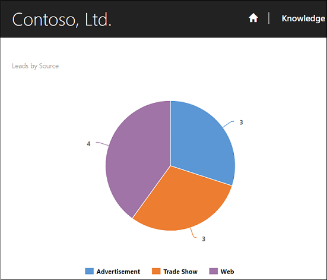
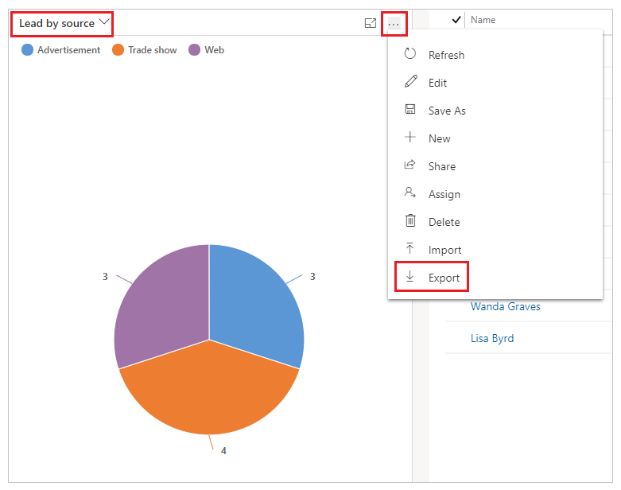
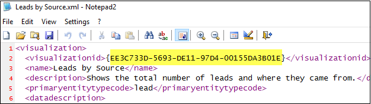
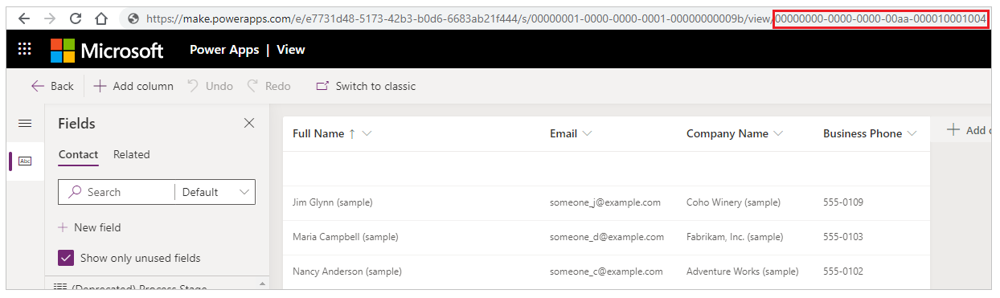

# Add a chart created in a model-driven app to a webpage in portal

You add a chart to a webpage by using a Liquid tag named [Chart](../liquid/portals-entity-tags.md#chart). You can add the chart Liquid tag in:

- The **Copy** field on a webpage.
- In the **Source** field on a [Web template](../liquid/store-content-web-templates.md).



For example, to show leads by source and filtered for only open leads view:

```
<!—Leads by Source – Open Leads -->

```

> [!IMPORTANT]
> You must specify the values for both the [`chart id`](#get-the-id-of-a-chart) and the [`viewid`](#get-the-id-of-a-view) parameters to render a chart on a portals webpage.

## Get the ID of a chart

1.	Go to the target entity, for example, **Sales** > **Leads**.
2.	Expand the **Charts** area.
3.	Choose the chart you want.
4.	Select **More Commands**, and then select **Export Chart**.

    

5. Open the XML file of the exported chart in a text editor.
6. Copy the value of the `<visualizationid>` tag.

    

7. Paste the `visualizationid` value into your Liquid chart tag declaration for the chart ID parameter, for example:

    ```
    <!—Leads by Source – Open Leads -->
    
    ```

Now that the Liquid chart tag declaration has the chart ID, follow the next steps to get the view ID.

## Get the ID of a view

You must open the view editor to get the view ID to be used with the Liquid chart tag.
 
1. Go to make.powerapps.com and select the appropriate environment.
1. In the left navigation bar, select Data > Entities.
1. Select the appropriate table and go to 'Views' tab.
1. You can see the list of views. Go to options (...) and select 'Edit View'.
1. Copy the id value from the View window's address bar.

    

1. Paste this ID into your Liquid chart tag declaration for the viewid parameter, for example:

    ```
    <!—Leads by Source – Open Leads -->
    
    ```

## Table permission requirement

Read privilege is asserted for the target table being queried in the chart. For anonymous or authenticated users to be able to view the chart, you must ensure that the appropriate [Table Permission](assign-entity-permissions.md) records are created and assigned to applicable [web roles](create-web-roles.md). 
 
If permission isn't granted, the user will see an access denied message.

## Supported charts and chart types

The following chart types are supported in portals:

- Column
- Bar
- Area
- Pie
- Line
- Funnel

Supported configuration for Legend Entries (Series):

- Single Series
- Multiple Series
- Aggregates Types - Sum, Counts, Min, Max, Avg in Single or Multiple Series
- Top X / Bottom X Rules

Supported configuration for Horizontal (Category) Axis Labels:

- Categories on attributes of a table or linked table (on attribute data types supported by portals).
- Multiple categories (X-Axis).
- *Group by* and *Order by* on attributes.
- Date Grouping Types – Day, Month, Year on Primary Table and First Level Linked Table.
    - Date Grouping by Week, Fiscal Year, Fiscal Period, and Quarter are **not supported**.
    - Date Grouping on Linked Table attributes is supported only until the first level of Link.

## Unsupported charts and chart types

The following chart types are currently not supported in portals:

- Doughnut
- Tag

The following table lists the charts that are currently not supported in portals.

| Chart Name                              | Chart ID                             | Table Type      |
|-----------------------------------------|--------------------------------------|------------------|
| Accounts by Owner - Tag Chart           | be178262-6142-4b41-85b7-4ccedc62cfd9 | account          |
| Activities by Owner - Tag Chart         | c83b331e-87c7-488c-b8e7-89a6098ea102 | activitypointer  |
| Activities by Priority - Doughnut Chart | d3f6c1eb-2e4b-428b-8949-682a311ae057 | activitypointer  |
| Contacts by Account                     | 2ff3ebea-6310-4dde-b3a1-e1144ea42b7b | contact          |
| Contacts by Country                     | ea89e2ad-2602-4333-8724-aa5775d66b77 | contact          |
| Contacts by Preferred Contact Method    | 751b7456-308e-4568-a3a9-47135aae833a | contact          |
| Goal Progress (Count)                   | a93b8f7b-9c68-df11-ae90-00155d2e3002 | goal             |
| Goal Progress (Money)                   | aec6d51c-ea67-df11-ae90-00155d2e3002 | goal             |
| Today's Target Vs. Actuals (Count)      | 1b697c8e-9a6f-df11-986c-00155d2e3002 | goal             |
| Today's Target Vs. Actuals (Money)      | 1e697c8e-9a6f-df11-986c-00155d2e3002 | goal             |
| Cases By Account                        | 38872e4f-ac99-e511-80da-00155dc1b253 | incident         |
| Cases By Priority                       | 0f0fb995-9d6f-453c-b26d-8f443e42e676 | incident         |
| Cases By Product                        | 17c3f166-5b22-4476-819b-b05da2e8d24f | incident         |
| Articles expiring this month by owner   | 47d696ad-7c3b-e511-80d1-00155db10d2b | knowledgearticle |
| By Owner                                | 330068fd-833b-e511-80d1-00155db10d2b | knowledgearticle |
| By Subject                              | bcd3f9a5-913b-e511-80d1-00155db10d2b | knowledgearticle | 
| | |

## Other considerations

- Long labels on Horizontal (Category) Axis Label can get overlapped when using a high number of data points on the chart.
- Hovering over currency data types formatting shows values with spaces instead of separators.
- Numeric fields are currently shown in decimal format.
- Horizontal Axis values can show only up-to 15 Labels.

### See also

[Microsoft Learn: Model-driven charts in portals](/learn/modules/portals-integration/4-model-driven-charts)


[!INCLUDE[footer-include](../../../includes/footer-banner.md)]