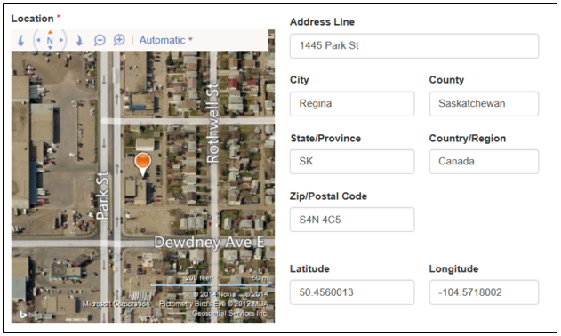
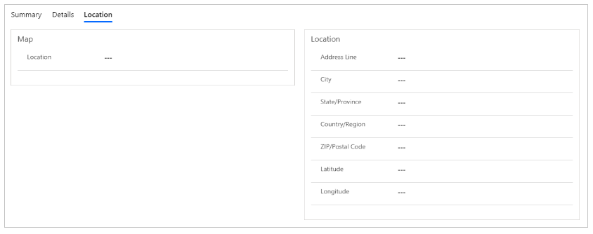

# Add geolocation

*Geolocation* is the identification of the real-world geographic location of an object. Geolocation is closely related to the use of positioning systems, but places a greater emphasis on determining a meaningful location (for example, a street address) rather than just a set of geographic coordinates. The word geolocation can also mean the latitude and longitude coordinates of a particular location.

A managed form can be configured to display a map control either to display an existing location as a pin on a map or to provide the ability for the user to specify a location.

If the form or Address Line field is editable and this field is blank, when the page loads it will prompt the user asking if they would like to share their location. If they choose to share their location, the map will be updated with their currently detected location. The user can refine the location of the pin by dragging it. If the user chooses not to share their location, they can manually specify the location in the fields provided and the mapping service will be queried to find the location, update latitude and longitude, and reposition the pin on the map accordingly.

## Add geolocation
To add geolocation functionality to a managed form, the following tasks must be completed.

### Form customization
Edit the basic form by using the form designer and make the following modifications:

1. Create a new section and provide an appropriate label, for example **Map**. This section will contain the map.
2. Set the name of the section to **section\_map** or a name that ends with _section\_map_, for example **contoso\_section\_map**. This name is important because the form engine looks for a section with this name to determine when to render a map. 
3. Add a new or existing field that will store the formatted address, and add it to the **Map** section created in the previous step.
4. Create a new section and provide an appropriate label, for example **Location**. This section will contain the address fields for the selected location.
5. Add the required address fields to the **Location** section created in the previous step: 
    - Address Line
    - City
    - County
    - State/Province
    - Country/Region
    - Zip/Postal Code
    - Latitude
    - Longitude

The resulting form should look similar to the following. You can choose different display names for these fields. You can also choose to lay out these sections any way you prefer.

### Site settings
Geolocation with map functionality on managed forms requires configuration settings to complete requests with the mapping service REST endpoint. The following site settings are used to configure the location service.

|Name|Value|
|---|---|
|Bingmaps/credentials|Unique key to authenticate requests to the Bing Maps API. Visit [www.bingmapsportal.com](https://www.bingmapsportal.com) to create a Bing Maps account and get a key. Required.|
|Bingmaps/restURL|URL to the Bing Maps REST API. Optional. If a value is not specified, the default https://dev.virtualearth.net/REST/v1/Locations is used.|
| |

### Field configurations
The map control requires additional configuration to tell it what the IDs of the various location fields are, so it can assign values to them or retrieve values from them. The configuration depends on the type of managed form.

- For basic forms, see [Geolocation configuration for basic forms](entity-forms.md#geolocation-configuration-for-basic-forms).

- For advanced forms, see [Geolocation configuration for advanced forms](web-form-properties.md#geolocation-configuration-for-advanced-form).

[!INCLUDE[footer-include](../../../includes/footer-banner.md)]