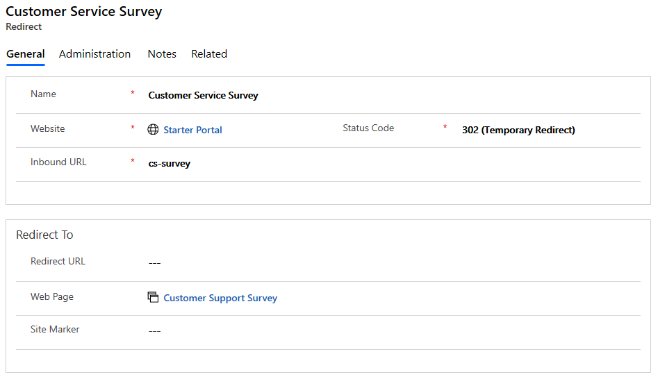

# Add a redirect URL to a new URL on a portal

Customers frequently want to have a simple URL that redirects to a page deeper in the site, or they want to allow for a legacy URL to be used with the site and automatically redirect to a new URL in the site. Page redirects allow a content author to specify a URL that, when requested, will be redirected on a permanent or temporary basis to a specific webpage or web file. These redirect URLs are managed separately from the page content so that they do not have to fit directly in the web hierarchy.

## Create a redirect

1. Open the [Portal Management app](configure-portal.md).

2. Go to the **Portals** > **Website** > **Redirects**.

3. select **New**.

4. Enter the redirect information as described below.

| Name        | Description                                                                                                                                  |
|-------------|----------------------------------------------------------------------------------------------------------------------------------------------|
| Name        | The friendly name of the redirect. (Can be anything. Make it easy to identify.)                                                              |
| Website     | The website the redirect is associated with. (The site the user is redirected from.)                                                         |
| Inbound URL | The partial URL that is to be redirected. (The page the user is redirected from.)                                                            |
| Status Code | One of the following:  **302 (Temporary Redirect)**: returns a temporary redirect status. This is the default.                                               -   **301 (Permanent Redirect)**: returns a permanent redirect status, indicating the resource has moved permanently.                          |
| URL         | A target external URL to be redirected to. (Use this if the user is being redirected to a link external to the website specified above.)                            |
| Web Page    | A target internal webpage to be redirected to. (Use this if the user is being redirected to a page internal to the website specified above.) |
| Site Marker | A target internal site marker to be redirected to.                                                                                           |

4. After entering the required fields and specifying a value for at least one of the URL, Web Page, or Site Marker fields, select **Save**.

      

## Use the redirect

When the inbound URL is requested, the browser is redirected to the URL of the target webpage for the matching redirects entry.

For example, for an Inbound URL value of cs-survey with a target webpage set to the Customer Support Survey page, the following request:

https://customerportal.contoso.com/cs-survey

results in the browser requesting the following URL:

https://customerportal.contoso.com/surveys/customer-service-survey/

[!INCLUDE[footer-include](../../../includes/footer-banner.md)]