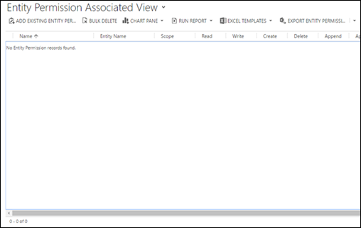
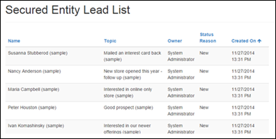
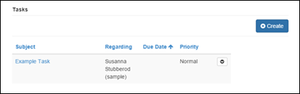

# Configure security using table permissions

To apply security in portals to individual records, use table permissions. You add table permissions to web roles so you can define roles in your organization that correspond logically to the privileges and concepts of record ownership and access. Remember that a given contact can belong to any number of roles, and a given role can contain any number of table permissions. [!INCLUDE[proc-more-information](../../../includes/proc-more-information.md)] [Create web roles for portals](create-web-roles.md).

Although permissions to change and access URLs in a portal site map is granted via Content Authorization, site managers will also want to secure their custom web applications built with basic forms and lists. [!INCLUDE[proc-more-information](../../../includes/proc-more-information.md)] [Define basic forms](entity-forms.md) and [Define lists](entity-lists.md).  

To secure these features, table permissions allow granular rights to be granted and record-level security to be enabled via relationship definitions.

## Add table permissions to a web role

1. Open the [Portal Management app](configure-portal.md).

2. Go to **Portals** &gt; **Web Roles** and open the web role you want to add permissions to. 

3. Under **Related**, select **Table Permissions**.

4. Select **Add Existing Table Permission** to add an existing table permission to a web role. 

4. Browse for a table permission or select **New Table Permission** to create a new table permission record.

      

When creating a new Table Permission record, the first step is to determine which table will be secured. The next step is to define access type, as discussed in the following section, and&mdash;for any access type other than Global&mdash;the relationships that define that access type. Finally, determine the rights that are being granted to the role via this permission. Rights are cumulative, so if a user is in one role that grants Read rights and another that grants Read and Update, the user will have Read and Update rights for any records that overlap between the two roles.

> [!Note]
> Selecting tables like webpage, web files, and other configuration tables is invalid and might have other unintended consequences. The portal will assert the security of configuration tables based on content access controls, not table permissions.

### Global access type

If a Table Permission record with Read rights is granted to a role that has the Global access type, any contact in that role will have access to all records of the defined table. For example, they can see all leads, all accounts, and so on. This permission will be automatically respected by any lists, essentially showing all records according to the Microsoft Dataverse views that have been defined for that list. Further, if a user attempts to access a record via a basic form that they don't have access to, they'll receive a permission error. For example, see this sample scenario for [showing all car listings to all authenticated users in a car dealership](entity-permissions-studio-walkthrough.md#view-all-car-listings).

### Contact access type

With Contact access type, a signed-in user in the role for which the permission record is defined will have the rights granted by that permission only for records that are related to that user's Contact record via a defined relationship.

On a list, this access type means that a filter will be added to whatever Microsoft Dataverse views are surfaced by that list, which only retrieves records directly linked to the current user. (Depending on the scenario, this relationship can be thought of as ownership or management rights.) For example, see this sample scenario for [showing, updating, and deleting owned car listings in a car dealership](entity-permissions-studio-walkthrough.md#view-update-and-delete-owned-car-listings).

Basic forms will only allow the appropriate permission for Read, Create, Write, and so on, if this relationship exists when the record is loaded. More information: [Define basic forms](entity-forms.md).  

### Account access type

With Account access type, a signed-in user in the role for which the permission record is defined will have the rights granted by that permission only for records that are related to that user's Parent Account record via a defined relationship.

This access type means that the list will only show the records of the selected table that are associated to the user's Parent Account. For example, if a table permission allows Read access to a Lead table with the Account access type, the user having this permission can view all the leads of only the Parent Account of the user. For example, see this sample scenario for allowing staff to [view all car dealerships](entity-permissions-studio-walkthrough.md#view-all-car-dealerships) owned by their company. 

### Self access type

Self access type allows you to define the rights a user has to their own Contact (Identity) record. Users can use basic forms or advanced forms to make changes to their own Contact record linked with their profile. The default profile page has a special built-in form that allows any user to change their basic contact info, and opt in or out of marketing lists. If this form is included in your portal (which it is by default), users won't require this permission to use it. However, they'll require this permission to use any custom basic forms or advanced forms that target their User Contact record. For example, see this sample scenario that allows staff of a car dealership to update their [contact details on their profile page](entity-permissions-studio-walkthrough.md#change-profile-details).

### Parental access type

In the most complex case, permissions are granted for a table that's a relationship away from a table for which a Table Permission record has already been defined. This permission is actually a Child record of the Parent Table Permission.

The Parent Permission record defines a permission and access type for a table (probably Global or Contact access type, although Parent is also possible). That table might be related to a Contact (if there's Contact access type) or globally defined. With that permission in place, a Child permission is created that defines a relationship from another table to the table defined in the parent relationship.

Users in a web role who have access to records defined by the Parent Table Permission will also have rights as defined by the Child permission to records related to the parent record.

### Attributes and relationships

The following table explains the table permission attributes.

| Name                     | Description                                                                                                                                                                                                                                                                                                               |
|--------------------------|---------------------------------------------------------------------------------------------------------------------------------------------------------------------------------------------------------------------------------------------------------------------------------------------------------------------------|
| Name                     | The descriptive name of the record. This field is required.                                                                                                                                                                                                                                                               |
| Table Name              | The logical name of the table that is to be secured or that will define the contact relationship or parent relationship to secure a related table on a child permission. This field is required.                                                                                                                        |
| Access Type (mandatory)                   | <ul><li>**Global**: Grant privileges to the table record without any requirement for an owner (contact).</li><li>**Contact**: Grant privileges to the table record that has a direct relationship to an owner (contact).</li><li>**Account**: Grant privileges to the table record that has a relationship to an account, which serves as the owner assuming the account is the parent customer of the contact.</li><li>**Parent**: Grant privileges to the table record through the chain of its parent permissions' relationships.</li></ul>|
| Relationship for Access Type | Depends on the selected Access Type. <ul> <li> **Contact Relationship**: Required only if Access Type = Contact.   The schema name of the relationship between the contact and the table specified by the Table Name field. </li> <li> **Account Relationship**: Required only if Access Type = Account.   The schema name of the relationship between the account and the table specified by the Table Name field. </li> <li> **Parent Relationship**: Required only if a parent table permission is assigned.   The schema name of the relationship between the table specified by the Table Name field and the table specified by the Table Name field on its Parent Table Permission record. <ul> <li> **Parent Table Permission**:  Required only if Access Type = Parent. </li> </li> </ul>  </ul>   **Note**: Available relationships will be empty if the Contact or the Account has no existing relationships with the selected table. To create table relationships, see [Table relationships overview](../../data-platform/create-edit-entity-relationships.md).
| Read                     | Privilege that controls whether the user can read a record.                                                                                                                                                                                                                                                               |
| Write                    | Privilege that controls whether the user can update a record.                                                                                                                                                                                                                                                             |
| Create                   | Privilege that controls whether the user can create a new record. The right to create a record for a table type doesn't apply to an individual record, but instead to a class of tables.                                                                                                                             |
| Delete                   | Privilege that controls whether the user can delete a record.                                                                                                                                                                                                                                                             |
| Append                   | Privilege that controls whether the user can attach another record to the specified record. The Append and Append To access rights work in combination. Every time that a user attaches one record to another, the user must have both rights. For example, when you attach a note to a case, you must have the Append access right on the note and the Append To access right on the case for the operation to work.  |
| Append To                | Privilege that controls whether the user can append the record in question to another record. The Append and Append To access rights work in combination, as described above.|
| | |

## Global permissions for tasks related to leads

In one scenario, we might want to use a list and basic forms to surface all leads on the portal to anyone in a custom Lead Manager web role. On the Lead Edit Form, which is launched whenever a lead row is selected on the list, a subgrid will display related Task records. These records should be accessible to anyone in the Lead Manager role. As the first step, we'll give Global permissions to leads to anyone in our Lead Manager role.

This role has a related Table Permission for the Lead table, with a Global access type.

Users in this role can access all leads via lists or forms on the portal.

  

We'll now add a Child permission to the Global Lead permission. With the Parent Permission record open, go to the **Child Table Permissions** subgrid and select **New Table Permission** to add a new record.

  

Select the table as Tasks and the access type as Parental. You can then select the parent relationship (**Lead\_Tasks**). This permission implies that a contact in a web role with the Parent permission will then have Global permission to all tasks that are related to leads.

In order for your list to respect these permissions:

- Table Permissions must be enabled on the list.
    
     

- There must be actions that will actually allow users to do the actions for which their permissions have been granted. 

     

- Permissions must also be enabled on the [basic form](entity-forms.md) record.

    
 
- The form must be surfacing a page that has a subgrid on it for the table that you want to enable with Child permissions. In this case, the table will be Tasks.

    

If you want to enable Read or Create permissions for tasks, you'll need to configure those basic forms too, and edit the forms to remove the Regarding lookup field.  

This action then grants permissions for all tasks that are related to leads. If tasks are being surfaced on a list, a filter is added to the list so that only tasks that are related to a lead will appear on the list. In our example, they're being surfaced with a subgrid on a basic form.

  

## Contact access type permissions for tasks

Another example would be if you wanted to allow access to tasks for which a contact is related to the parent lead for that task. This scenario is nearly identical to the example in the previous section, except in this case the Parent permission has an access type of Contact, instead of Global. A relationship must be specified on the parent relationship between the Lead table and the Contact table.

After these permissions are in place, users in the Lead Manager role can access leads that are related to them directly as specified by the Contact access type permission, and access tasks related to those same leads as specified by the Child permission.

### See also

[Create web roles for portals](create-web-roles.md)  
[Control webpage access for portals](webpage-access-control.md)

[!INCLUDE[footer-include](../../../includes/footer-banner.md)]

