# Configure the Azure Active Directory B2C provider manually

This article describes how to configure Azure Active Directory B2C (Azure AD B2C) as the identity provider manually. Use these steps to manually create a new Azure AD B2C tenant, register the application, and configure user flows.

> [!NOTE]
> - If you want to configure the Azure AD B2C provider automatically by using Power Apps portals, go to [Configure Azure AD B2C provider](configure-azure-ad-b2c-provider.md).
> - Changes to the authentication settings [might take a few minutes](../admin/clear-server-side-cache.md#caching-changes-for-portals-with-version-926x-or-later) to be reflected on the portal. If you want the changes to be reflected immediately, restart the portal by using [portal actions](../admin/admin-overview.md).
<!--markdownlint-disable MD036-->
**To configure Azure AD B2C as the OpenID Connect provider manually**

1. Select **Configure** for **Azure Active Directory B2C**. More information: [Configure a provider](use-simplified-authentication-configuration.md#add-or-configure-a-provider)

    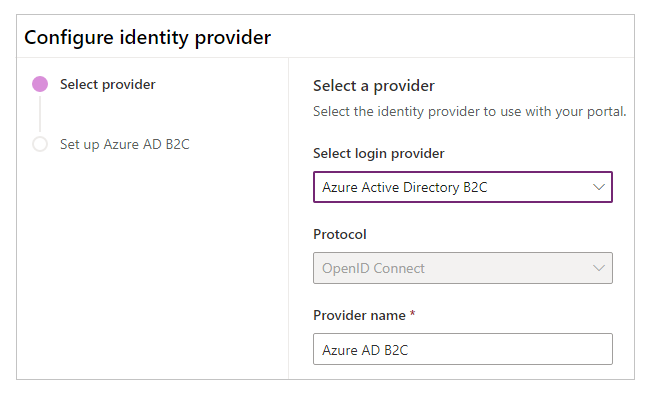

1. If necessary, update the name.

1. Select **Skip to manual configuration**.

    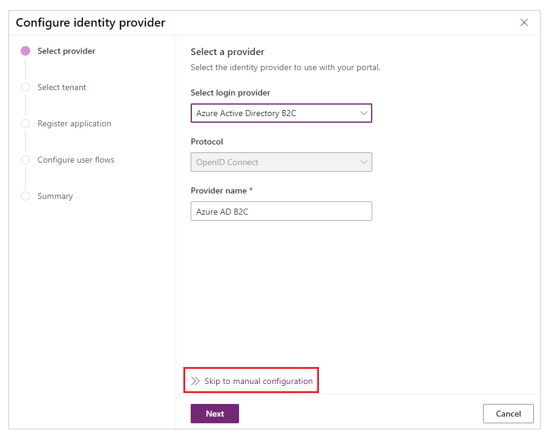

    > [!NOTE]
    > Selecting **Next** instead of **Skip to manual configuration** takes you to configure the [Azure AD B2C authentication by using the Power Apps portals interface](configure-azure-ad-b2c-provider.md).

1. In this step, you create the application and configure the settings with your identity provider.

    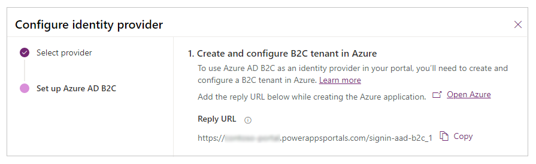

    1. Sign in to your [Azure portal](https://portal.azure.com/).

    1. [Create an Azure AD B2C tenant](/azure/active-directory-b2c/tutorial-create-tenant).

    1. [Register an application](/azure/active-directory-b2c/tutorial-register-applications?tabs=applications#register-a-web-application) in your tenant.

        1. Search for and select **Azure AD B2C**.

        1. Under **Manage**, select **App registrations**.

        1. Select **New registration**.

            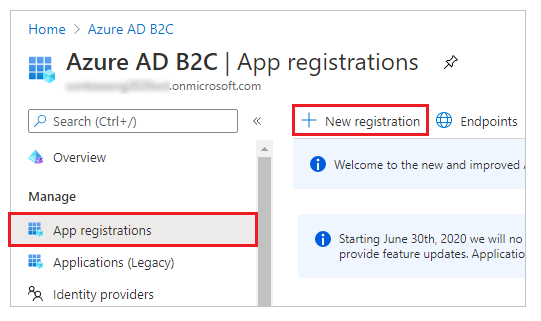

        1. Enter a name.

        1. Under **Redirect URI**, select **Web** (if it isn't selected already).

        1. In the **Redirect URI** text box, enter the **Reply URL** for your portal. <br> Example: `https://contoso-portal.powerappsportals.com/signin-aad-b2c_1`

            > [!NOTE]
            > If you're using the default portal URL, copy and paste the **Reply URL** as shown in the **Create and configure B2C tenant in Azure** section on the **Configure identity provider** screen (step 4 above). If you're using a custom domain name for the portal, enter the custom URL. Be sure to use this value when you configure the **Redirect URL** in your portal settings while configuring the Azure AD B2C provider. <br> For example, if you enter the **Reply URL** in Azure portal as `https://contoso-portal.powerappsportals.com/signin-aad-b2c_1`, you must use it as-is for the Azure AD B2C configuration in portals.

            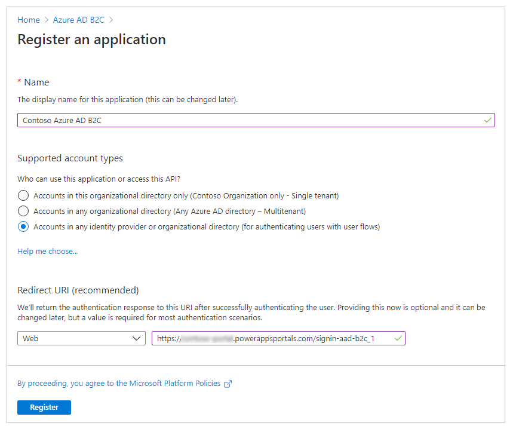

        1. Select **Register**.

        1. On the left pane, under **Manage**, select **Authentication**.

            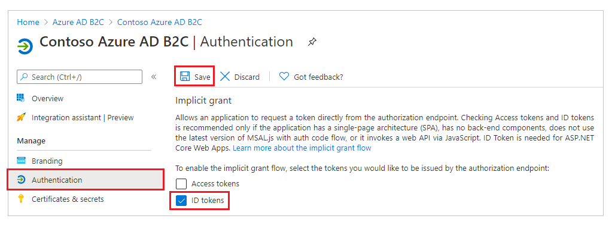

        1. Under **Implicit grant**, select the **ID tokens** check box.

        1. Select **Save**.

    1. [Create a sign-up and sign-in user flow](/azure/active-directory-b2c/tutorial-create-user-flows#create-a-sign-up-and-sign-in-user-flow). Optionally, you can [create a password reset user flow](/azure/active-directory-b2c/tutorial-create-user-flows#create-a-password-reset-user-flow).

    1. [Configure token compatibility](/azure/active-directory-b2c/configure-tokens#configure-token-compatibility) by using an **Issuer (iss) claim** URL that includes **tfp**. More information: [Token compatibility](/azure/active-directory-b2c/tokens-overview#compatibility)

        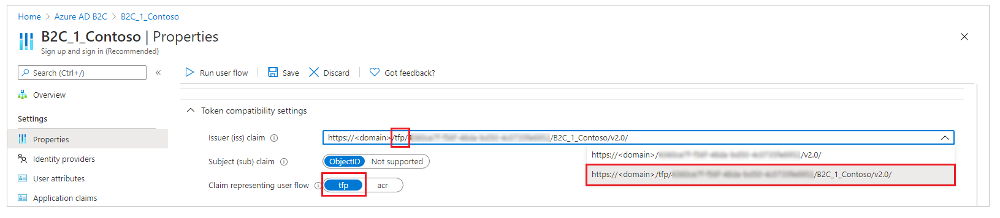 

1. In this step, you enter site settings and password reset settings for the portal configuration.

    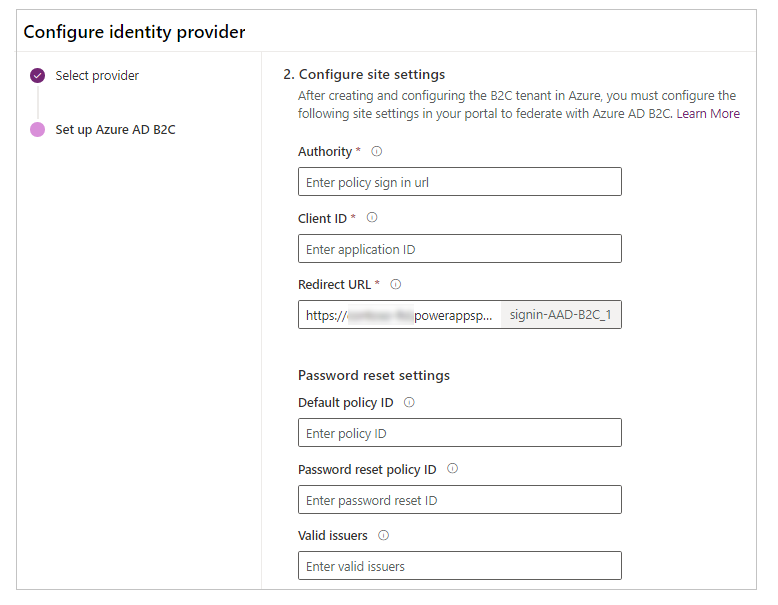

    1. In the **Configure site settings** section, enter the following values:

        - **Authority**: Enter the issuer URL defined in the metadata of the sign-up and sign-in policy user flow.​
        <br>**To get the issuer URL**

           1. Open the sign-up and sign-in user flow you created earlier. For this step, you need to go to the Azure AD B2C tenant on the [Azure portal](https://portal.azure.com).

              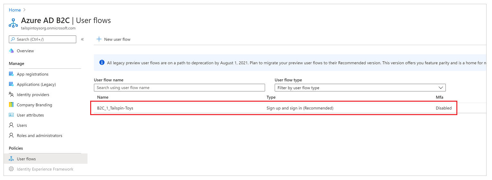

           1. Select **Run user flow**.

              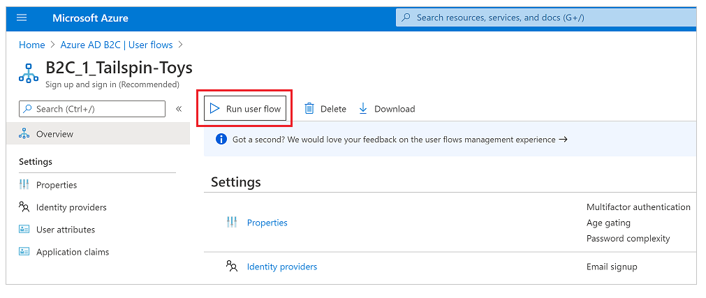

           1. Select the OpenID configuration URL to open in a new browser window or tab.

               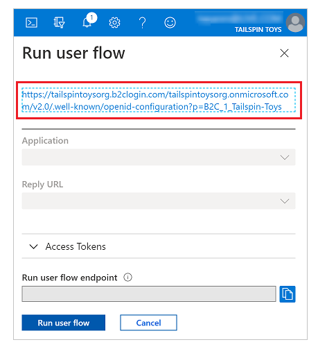

               The URL refers to the OpenID Connect identity provider configuration document, also known as the *OpenID well-known configuration endpoint*.

           1. Copy the URL of the **Issuer** from the new browser window or tab.

                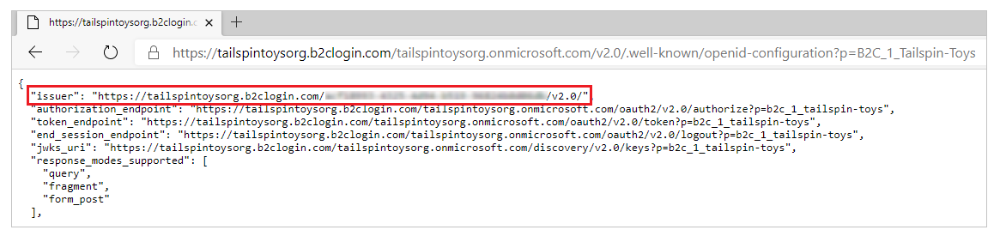

                Ensure that you copy only the URL, without the quotation marks (*""*). <br> For example, `https://contosoorg.b2clogin.com/tfp/799f7b50-f7b9-49ec-ba78-67eb67210998/b2c_1_contoso/v2.0/`

                > [!TIP]
                > Ensure that the **Issuer (iss) claim** URL includes **tfp**.

        - **Client ID​**: Enter the **Application ID** of the Azure AD B2C application you created earlier.

        - **Redirect URI**: Enter the portal URL. <br> You only need to change the redirect URI if you're using a custom domain name.

    1. In the **Password reset settings**section, enter the following values:

        - **Default policy ID**: Enter the name of the sign-up and sign-in user flow you created earlier. The name is prefixed with *B2C_1*.

        - **Password reset policy ID**: Enter the name of the password reset user flow you created earlier. The name is prefixed with *B2C_1*.

        - **Valid issuers**: Enter a comma-delimited list of issuer URLs for the sign-up and sign-in user flow, and password reset user flow, you created earlier. 
        <br> To get the issuer URLs for the sign-up and sign-in user flow, and the password reset user flow, open each flow and then follow the steps under **Authority**, in step 5a earlier in this article.

1. In this step, you have the option of configuring additional settings for the Azure AD B2C identity provider.

    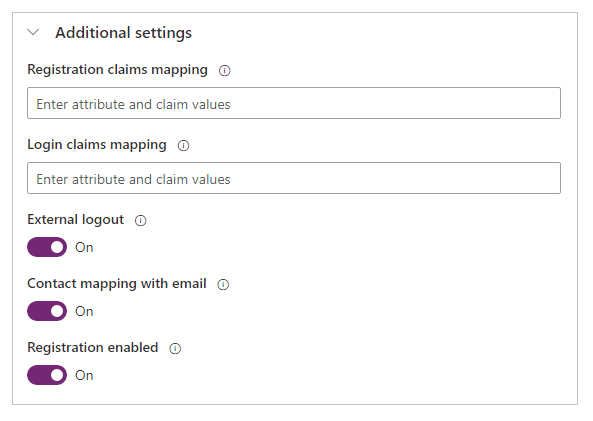

    - **Registration claims mapping​**: Enter a list of logical name/claim pairs to be used to map claim values returned from Azure AD B2C (created during sign-up) to attributes in the contact record. <br> Format: `field_logical_name=jwt_attribute_name`, where `field_logical_name` is the logical name of the field in portals and `jwt_attribute_name` is the attribute with the value returned from the identity provider. <br> 
     For example, if you've enabled **Job Title (jobTitle)** and **Postal Code (postalCode)** as **User Attributes** in your user flow, and you want to update the corresponding Contact table fields **Job Title (jobtitle)** and **Address 1: ZIP / Postal Code (address1_postalcode)**, enter the claims mapping as ```jobtitle=jobTitle,address1_postalcode=postalCode```.

    - **Login claims mapping**: Enter a list of logical name/claim pairs to be used to map claim values returned from Azure AD B2C after sign-in to the attributes in the contact record. <br> Format: `field_logical_name=jwt_attribute_name` where `field_logical_name` is the logical name of the field in portals, and `jwt_attribute_name` is the attribute with the value returned from the identity provider. <br> 
     For example, if you've enabled **Job Title (jobTitle)** and **Postal Code (postalCode)** as **Application Claims** in your user flow, and you want to update the corresponding Contact table fields **Job Title (jobtitle)** and **Address 1: ZIP / Postal Code (address1_postalcode)**, enter the claims mapping as ```jobtitle=jobTitle,address1_postalcode=postalCode```.

    - **External logout**: Choose whether to enable or disable federated sign-out:
      - Select **On** to redirect users to the federated sign-out user experience when they sign out from the portal.
      - Select **Off** to simply sign users out from the portal.

    - **Contact mapping with email**: Specify whether contacts are mapped to a corresponding email. Turn on this toggle to associate a unique contact record with a matching email address and then automatically assign the external identity provider to the contact after the user successfully signs in.

    - **Registration enabled**:- Turn [open registration](configure-portal-authentication.md#open-registration) for your portal on or off. Turning off this toggle disables and hides external account registration.

1. Select **Confirm** to view a summary of your settings and complete the identity provider configuration.

### See also

[Migrate identity providers to Azure AD B2C](migrate-identity-providers.md)


[!INCLUDE[footer-include](../../../includes/footer-banner.md)]