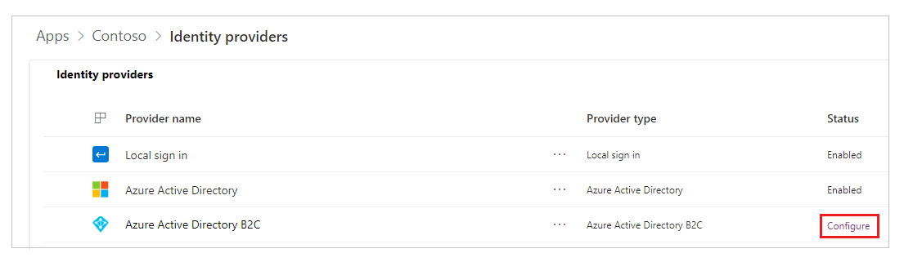
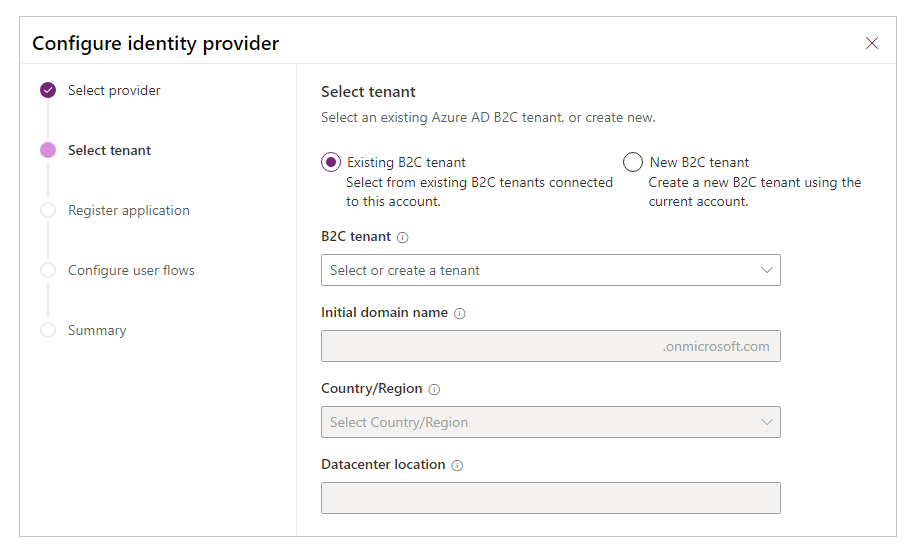
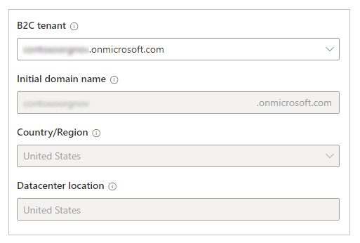
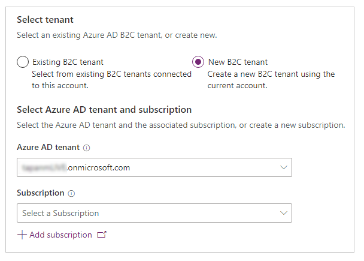
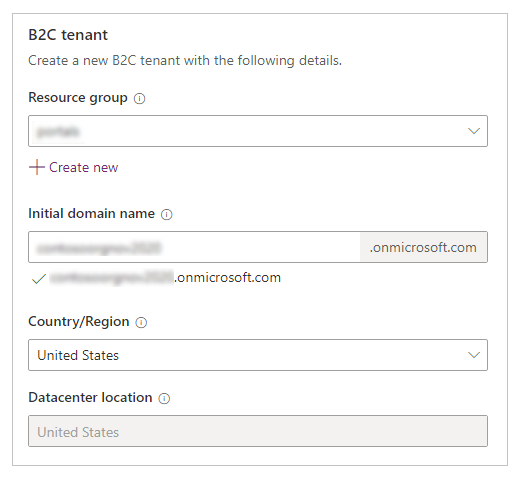
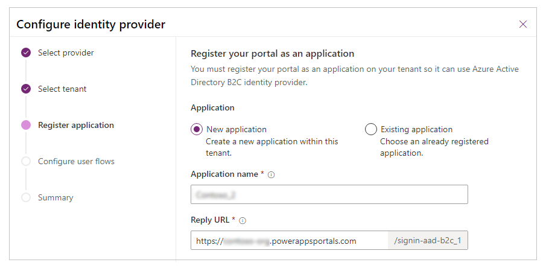
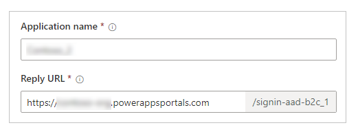
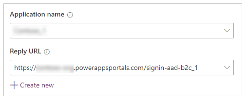
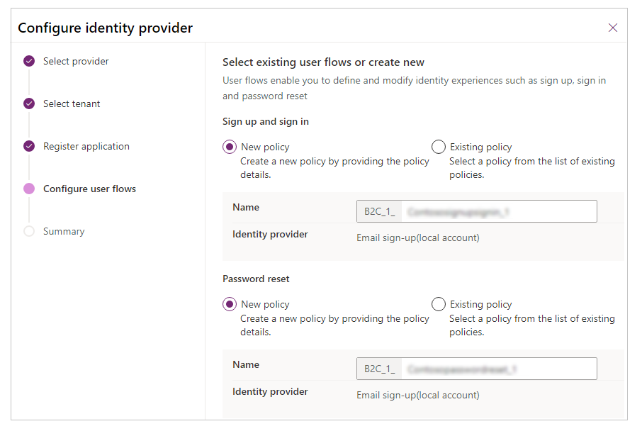
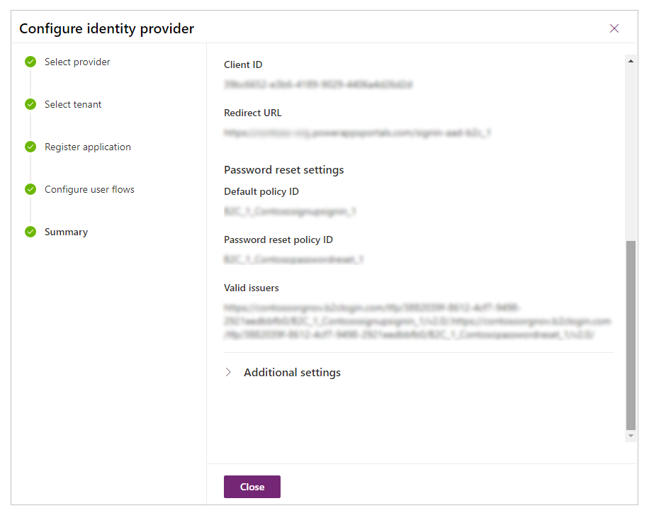

# Configure the Azure Active Directory B2C provider (Preview)

[This article is pre-release documentation and is subject to change.]

[!include[Azure](../../../includes/pn-azure-shortest.md)] Active Directory (Azure AD) powers Microsoft 365 and Dynamics 365 services for employee or internal authentication. [!include[Azure](../../../includes/pn-azure-shortest.md)] Active Directory B2C is an extension to that authentication model that enables external customer sign in through local credentials and federation with various common social identity providers.

A portal owner can configure the portal [!include[Azure](../../../includes/pn-azure-shortest.md)] AD B2C as an identity provider. [!include[Azure](../../../includes/pn-azure-shortest.md)] AD B2C supports Open ID Connect for federation.

In this article, learn about how to configure Azure Active Directory B2C as the identity provider automatically using a feature in preview. Using these steps, you can create new Azure AD B2C tenant, register application, and configure user flows from within Power Apps portals. If you want to configure the Azure AD B2C provider manually, go to [Configure Azure AD B2C provider manually](configure-azure-ad-b2c-provider-manual.md).

> [!NOTE]
> Changes to the authentication settings [might take a few minutes](../admin/clear-server-side-cache.md#caching-changes-for-portals-with-version-926x-or-later) to be reflected on the portal. Restart the portal by using [portal actions](../admin/admin-overview.md) if you want the changes to be reflected immediately.

Follow these steps to configure Azure AD B2C as the OpenID Connect provider.

> [!IMPORTANT]
> - This is a preview feature.
> - [!INCLUDE[cc_preview_features_definition](../../../includes/cc-preview-features-definition.md)]

## Step 1. Select provider

1. Go to [Power Apps preview](https://make.preview.powerapps.com).

1. Select **Apps** from the left navigation pane.

    

1. Select your portal from the list of available apps.

1. Select **Settings** from the top menu. You can also select **More Commands** (**...**), and then select **Settings**.

    

1. From the settings on the right side of your workspace, select **Authentication Settings**.

    

1. Select **Configure** for **Azure Active Directory B2C**.

    

1. If necessary, update the **Provider name**.

    

1. Select **Next**.

## Step 2. Select tenant

In this step, select an existing Azure AD B2C tenant, or create a new B2C tenant.

### Option 1. Existing Azure AD B2C tenant

Select this option if you already have an existing Azure AD B2C tenant. Other details such as the initial domain name, country/region, and location are automatically updated.

> [!NOTE]
> Ensure the account you use to sign-in to Power Apps has access to the Azure AD tenant that you want to use for configuring the B2C authentication. For information about adding different types of user accounts to Azure AD B2C tenant, go to [Overview of user accounts in Azure Active Directory B2C](https://docs.microsoft.com/azure/active-directory-b2c/user-overview).

Select **Next** to continue.

### Option 2. New Azure AD B2C tenant

Select this option to create a new Azure AD B2C tenant for the selected Azure Active Directory.

> [!NOTE]
> Ensure the account you use to sign-in to Power Apps has been assigned at least the [Contributor role](https://docs.microsoft.com/azure/role-based-access-control/built-in-roles) for the subscription, or a resource group within the subscription.

To create a new Azure AD B2C tenant:

1. Select the Azure Active Directory tenant or directory.

1. Select a subscription for the tenant. Or select **Add subscription** if you want to create a new subscription from the Azure portal.

1. Select the resource group for the Azure AD B2C tenant.

1. Enter the initial domain name.

1. Select **Country/Region** for the tenant.

    > [!NOTE]
    > - You can't change the Country/Region after you create your directory.
    > - Ensure you select the correct Country/Region since your choice determines the **Datacenter location** for your directory.
    > - Microsoft doesn't control the location from which you or your end users may access or move directory data through apps or services. To see Microsoft's data location commitments for its services, see the [Online Service Terms](https://go.microsoft.com/fwlink?linkid=2009014).

    

1. Select **Next**.

## Step 3. Register application

In this step, register your portal as an application with the Azure Active Directory. You can create a new application, or select an already created application from Azure Active Directory.

> [!NOTE]
> If you're using custom domain name for the portal, enter the custom URL as the **Reply URL**.

### Option 1. New application

Select this option to create new application.

To create a new application:

1. Enter application name.

1. Enter **Reply URL**.

    

1. Select **Next**.

### Option 2. Existing application

Select this option to use an existing application.

To use an existing application:

1. Select an existing application from the list.

1. Select the **Reply URL**. Or create a new *Reply URL* using **Create new**.

    

1. Select **Next**.

## Step 4. Configure user flows

In this step, configure the **Sign up and sign in**, and **Password reset** user flows. Sign up and sign in user flow enables a user to create an account or sign in to their account. Password reset flow enables a user to choose a new password after email verification. More information: [User flow and policy in Azure AD B2C](https://docs.microsoft.com/azure/active-directory-b2c/user-flow-overview#user-flow-versions)

- **New policy** - Select if you want to create a new policy. Also allows you to change the name of the policy. This option creates the flow with *local account* identity provider using email address.
- **Existing policy** - Select an already created policy from the Azure AD B2C tenant.

> [!NOTE]
> - Only email claim is configured in these user flows. You can enable more claims like *first name*, and *last name* in the flow's **User attributes** and **Application claims** configuration using the Azure Portal. 
> - If you enable more claims, ensure you [edit the authentication provider](#edit-configuration) and add them to the *Registration claims mapping* and *Login claims mapping* in the **Additional settings** (not required for *first name* and *last name*). More information: [Step 6 - additional settings for Azure AD B2C provider configuration](configure-azure-ad-b2c-provider-manual.md)

Select **Create** to create the identity provider configuration.

## Step 5. Summary

The Azure AD B2C provider configuration is complete. You can view the summary of the configuration, and select **Close** to exit.

## Edit configuration

To edit the configuration, select **Edit configuration** for the **Azure Active Directory B2C** identity provider from the providers list. More information: [Edit a provider](use-simplified-authentication-configuration.md#edit-a-provider).

## Delete configuration

To delete the configuration, select **Delete** for the **Azure Active Directory B2C** identity provider from the providers list. More information: [Delete a provider](use-simplified-authentication-configuration.md#delete-a-provider).

### See also

[Migrate identity providers to Azure AD B2C](migrate-identity-providers.md)
