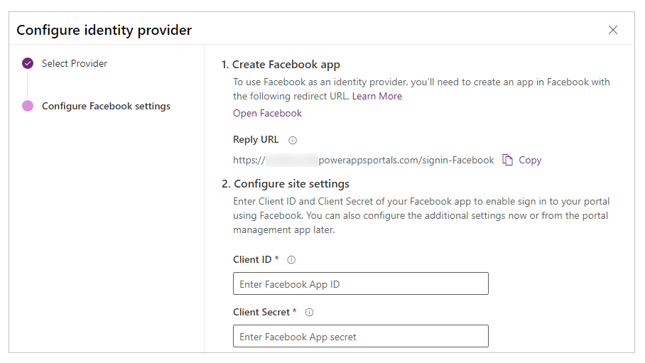

# Configure the Facebook provider for portals

As explained in [Configure an OAuth 2.0 provider for portals](configure-oauth2-provider.md), Facebook is one of several identity providers that use the OAuth 2.0 protocol. To get started with configuring Facebook as the identity provider, select **Configure** from the [provider settings](use-simplified-authentication-configuration.md#add-configure-or-delete-an-identity-provider) page.

## Step 1. Create a Facebook app

To use **Facebook** as an identity provider, you need to [create an app in Facebook](https://developers.facebook.com) with a redirect URL. For detailed steps about creating an app in Facebook, refer to [Facebook for Developers: Create an app](https://developers.facebook.com/docs/development/create-an-app).

> [!NOTE]
> The Reply URL is used by the Facebook app to redirect users to the portal after the authentication succeeds. If your portal uses a custom domain name, you might have a different URL than the one provided here.​

**To create an app in Facebook**

1. Open [Facebook Developers App Dashboard](https://developers.facebook.com/apps).
1. Select **Create App**.
1. For the **Select an app type**, select **Consumer**, then select **Continue**.
1. Enter an **App Display Name**, and a valid **App Contact Email**.
1. Select **Create App**. This step may require you to accept Facebook platform policies and complete an online security check.
1. While on the dashboard for the new app, go to **Settings** &gt; **Basic** tab and add the following details:
    - **App Domains** (optional). For example, `contoso.powerappsportals.com`.
    - **Privacy Policy URL**: URL for your privacy policy, must be accessible anonymously; following the Facebook policy.
    - **User Data Deletion**: Use callback URL, or the instructions URL for user data deletion following the Facebook policy.
    - Appropriate **App Purpose**.
    - Select **Add Platform**, and then select **Website** with **Site URL**: `https://contoso.powerappsportals.com/` or `https://contoso.powerappsportals.com/signin-facebook`
1. Select **Save Changes**.
1. Select **Add Products** from the left-pane.
1. Select **Set Up** for **Facebook Login**.
1. Select **Web**, and the URL for the platform entered earlier is shown.
1. Select **Save**.
1. Select **Settings** under **Facebook Login**.
1. In **Valid OAuth redirect URIs**, enter portal URL in this format: `https://contoso.powerappsportals.com/signin-facebook`
1. Select **Save Changes** at the bottom of the page.
1. Select **Settings** on the left-pane.
1. Select **Get Advanced Access** in the notification that states "Your app has Standard Access to public_profile. To use Facebook Login, switch public_profile to Advanced Access.". You can also select **App Review** from the left-pane, and then select **Permissions and Features** instead.
1. Select **Get Advanced Access** for **public_profile**.
1. Confirm the change. This step may require you to accept Facebook platform policies and complete an online security check.
1. At the top-center of the screen, for the **App Mode**, select **Live**. You'll be asked to do a checkup, so select **Start checkup**.
1. Review and confirm the data use certification, certify the compliance policies, and then select **Submit**.
1. After verifying the data use checkup, at the top-center of the screen, for the **App Mode**, select **Live**.
1. Select **Settings** > **Basic**, and note the **App ID** and **App Secret** that will be used in the next step to configure Power Apps portals.

## Step 2. Configure site settings

After you've created the app in Facebook, configure the site settings for the provider:

- **Client ID**: A unique app ID generated by Facebook for your app (App ID in Facebook for Developers).
- **Client Secret**:  The app secret for your Facebook app (App Secret in Facebook for Developers).​

## (Optional) Step 3. Additional settings

To configure **Additional settings** for the Facebook provider, see [Configure additional settings for OAuth 2.0 providers](configure-oauth2-settings.md).

[!INCLUDE[footer-include](../../../includes/footer-banner.md)]