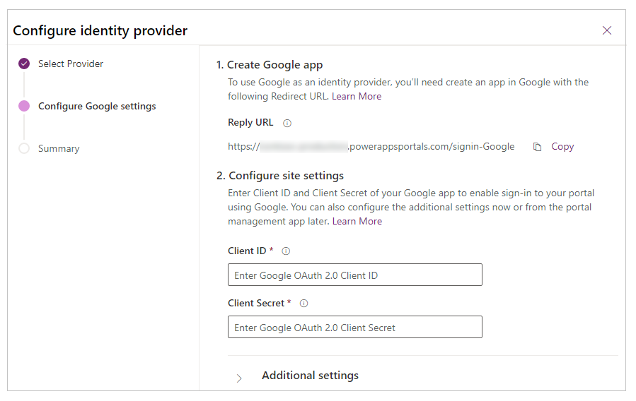

# Configure the Google provider for portals

As explained in [Configure an OAuth 2.0 provider for portals](configure-oauth2-provider.md), Google is one of several identity providers that use the OAuth 2.0 protocol. To get started with configuring Google as the identity provider, select **Configure** from the [provider settings](use-simplified-authentication-configuration.md#add-configure-or-delete-an-identity-provider) page.

## Step 1. Create a Google app

To use **Google** as an identity provider, you need to [create an app in Google](https://console.developers.google.com/) with a redirect URL.

> [!NOTE]
> The Reply URL is used by the Google app to redirect users to the portal after the authentication succeeds. If your portal uses a custom domain name, you might have a different URL than the one provided here.​

> [!IMPORTANT]
> [Google+ API](https://developers.google.com/people/legacy) is deprecated. We strongly recommend that you migrate to [Google People API](https://developers.google.com/people).

**To create an app in Google**

1. Open [Google Developers Console](https://console.developers.google.com/).  
1. Create an API project, or open an existing project.
1. Select **Enable APIs and Services** from the dashboard of APIs and Services.
1. Search for and enable API **Google People API**.
1. In **Google APIs**, select **Credentials** on the left pane.

    > [!NOTE]
    > If you've already configured a consent screen with the portal's top-level domain, you can skip steps 6 through 14 and go directly to step 15. However, if your consent screen is configured but the portals' top-level domain hasn't been added, go through step 11 before you skip to step 15.

1. Select **Configure consent screen**.
1. Select the **External** user type.
1. Select **Create**.
1. Enter **Application name**, and upload an image for a logo if necessary.
1. Select an appropriate **Support email**.
1. Enter `powerappsportals.com` as the top-level domain in **Authorized domains**. 
    > [!TIP]
    > Use `microsoftcrmportals.com` if you haven't [updated your Power Apps portal domain name](../admin/update-portal-domain.md). You can also enter a [custom domain name](../admin/add-custom-domain.md) if you have one configured.
1. Provide links for home page, privacy policy, and terms of service as required. 
1. Select **Save**.
1. Select **Credentials** from the left pane.
1. Select **OAuth client ID** from the **Create credentials** drop-down menu.
1. Select the application type as **Web application**.
1. Enter a **Name** for the OAuth Client ID.
1. Enter your Power Apps portal URL in the **Authorized JavaScript Origins** list.
1. Enter **Authorized redirect URIs** as the Power Apps portal URL followed by `/signin-google`. For example, if the portal URL is `https://contoso.powerappsportals.com`, the **Authorized redirect URIs** field should be `https://contoso.powerappsportals.com/signin-google`.
1. Select **Create**.
1. Copy **Client ID** and **Client secret** from the **OAuth client** dialog box.

## Step 2. Configure site settings

After you've created the app in Google, configure the site settings for the provider:

- **Client ID**: A unique app ID generated by Google for your app.​
- **Client Secret**: The client secret generated by Google for your app.

## (Optional) Step 3. Additional settings

To configure **Additional settings** for the Google provider, see [Configure additional settings for OAuth 2.0 providers](configure-oauth2-settings.md).

[!INCLUDE[footer-include](../../../includes/footer-banner.md)]