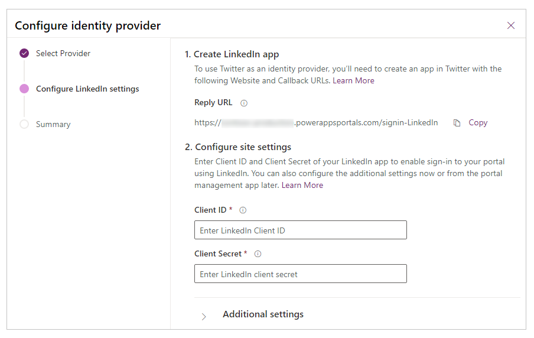

# Configure the LinkedIn provider for portals

As explained in [Configure ah OAuth 2.0 provider for portals](configure-oauth2-provider.md), LinkedIn is one of several identity providers that use the OAuth 2.0 protocol. To get started with configuring LinkedIn as the identity provider, select **Configure** from the [provider settings](use-simplified-authentication-configuration.md#add-configure-or-delete-an-identity-provider) page.

## Step 1. Create the LinkedIn app

On the identity provider configuration steps, you'll see a **Reply URL** for your portal in step 1. You need to [create an app in LinkedIn](https://www.linkedin.com/developers/apps) with this reply URL.

> [!NOTE]
> The Reply URL is used by the LinkedIn app to redirect users to the portal after the authentication succeeds. If your portal uses a custom domain name, you might have a different URL than the one provided here.​

**To create an app in LinkedIn**

1. Open [LinkedIn Developer Network](https://www.linkedin.com/secure/developer).  
2. Select **Add New Application**.

    - Enter the app details, such as **Application Name** and **Description**.
    - Enter the portal URL, such as `https://contoso.powerappsportals.com`.
    - Set OAuth User Agreement/Default Scope: `r\_basicprofie` and `r\_emailaddress`.
    - Enter the OAuth 2.0 Reply URL from the identity provider configuration step 1. For example, `https://portal.contoso.com/signin-linkedin`.

3. Select **Add Application**.

## Step 2. Configure site settings

After you've created the app in LinkedIn, configure the site settings for the provider:

- **Client ID**: A unique app ID generated by LinkedIn for your app.​
- **Client Secret**:  The app secret for your LinkedIn app.​

## (Optional) Step 3. Additional settings

To configure **Additional settings** for the LinkedIn provider, see [Configure additional settings for OAuth 2.0 providers](configure-oauth2-settings.md).

[!INCLUDE[footer-include](../../../includes/footer-banner.md)]