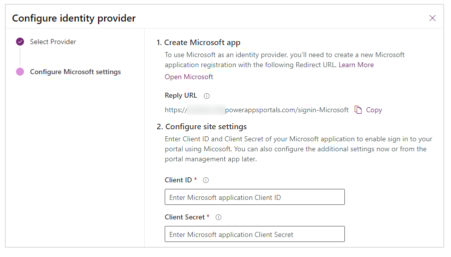

# Configure the Microsoft provider for portals

As explained in [Configure an OAuth 2.0 provider for portals](configure-oauth2-provider.md), Microsoft is one of several identity providers that use the OAuth 2.0 protocol. To get started with configuring Microsoft as the identity provider, select **Configure** from the [provider settings](use-simplified-authentication-configuration.md#add-configure-or-delete-an-identity-provider) page.

## Step 1. Create the Microsoft app

On the identity provider configuration steps, you'll see a **Reply URL** for your portal in step 1. You need to [create an app in Azure portal](https://aka.ms/AppRegistrations) with this reply URL. For step-by-step instructions, go to [Quickstart: Register an application with the Microsoft identity platform](/azure/active-directory/develop/quickstart-register-app).

> [!NOTE]
> The Reply URL is used by the Microsoft app to redirect users to the portal after the authentication succeeds. If your portal uses a custom domain name, you might have a different URL than the one provided here.​

## Step 2. Configure site settings

After you've created the app on the Azure portal, configure the site settings for the provider:

- **Client ID**: A unique app ID generated by Microsoft for your app.​
- **Client Secret**: The client secret generated by Microsoft for your app.

## (Optional) Step 3. Additional settings

To configure **Additional settings** for the Microsoft provider, see [Configure additional settings for OAuth 2.0 providers](configure-oauth2-settings.md).

[!INCLUDE[footer-include](../../../includes/footer-banner.md)]