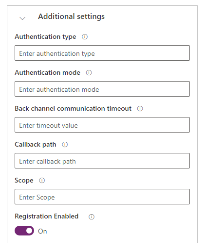

# Configure additional settings for OAuth 2.0 providers

As explained in [Configure an OAuth 2.0 provider for portals](configure-oauth2-provider.md), you can configure several identity providers that use the OAuth 2.0 protocol. The additional authentication settings in this section apply to the [Microsoft](configure-oauth2-microsoft.md), [LinkedIn](configure-oauth2-linkedin.md), [Facebook](configure-oauth2-facebook.md), [Google](configure-oauth2-google.md), and [Twitter](configure-oauth2-twitter.md) providers.

To configure the additional settings for any OAuth 2.0 identity provider, select **Configure** from the [provider settings](use-simplified-authentication-configuration.md#add-configure-or-delete-an-identity-provider) page, and expand **Additional settings**.

- **Authentication type**: The OWIN authentication middleware type.   Example: `https://sts.windows.net/contoso.onmicrosoft.com/`
- **Authentication mode**: The OWIN authentication middleware mode.
- **Backchannel timeout**: Timeout value in milliseconds for back-channel communications: MicrosoftAccountAuthenticationOptions.BackchannelTimeout.
- **Callback path**: The request path within the application's base path where the user-agent will be returned: MicrosoftAccountAuthenticationOptions.CallbackPath.​
- **Sign in As authentication type**: The name of another authentication middleware that will be responsible for actually issuing a user claims identity: MicrosoftAccountAuthenticationOptions.SignInAsAuthenticationType.​
- **Scope**: A comma-separated list of permissions to request: MicrosoftAccountAuthenticationOptions.Scope.​
- ​**Registration Enabled**​: Enables or disables the registration requirement for the existing identity provider. When this is disabled, the user is denied registration with an error if no contact record exists for the user. When this is enabled, user registration is allowed for a new user only if the site setting **Authentication/Registration/Enabled** is set to true.​
- **Contact mapping with email**: Specifies whether contacts are mapped to a corresponding email. When set to **On**, this setting associates a unique contact record with a matching email address, and then automatically assigns the external identity provider to the contact after the user successfully signs in.

### See also

[Configure an OAuth 2.0 provider for portals](configure-oauth2-provider.md)

[!INCLUDE[footer-include](../../../includes/footer-banner.md)]