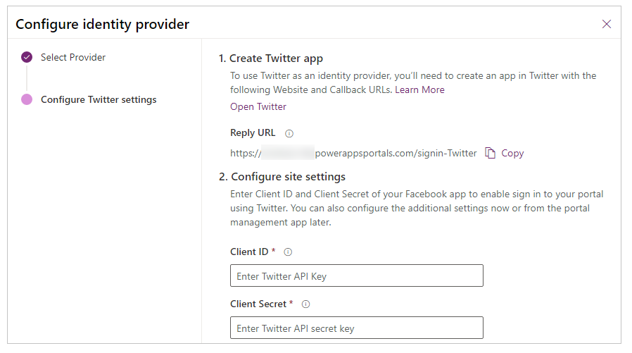

# Configure the Twitter provider for portals

As explained in [Configure an OAuth 2.0 provider for portals](configure-oauth2-provider.md), Twitter is one of several identity providers that use the OAuth 2.0 protocol. To get started with configuring Twitter as the identity provider, select **Configure** from the [provider settings](use-simplified-authentication-configuration.md#add-configure-or-delete-an-identity-provider) page.

> [!IMPORTANT]
> Twitter authentication for portals is temporarily unavailable because of the compatibility issues.

## Step 1. Create a Twitter app

To use **Twitter** as an identity provider, you need to [create an app in Twitter](https://developer.twitter.com/apps) with a redirect URL.

> [!NOTE]
> The Reply URL is used by the Twitter app to redirect users to the portal after the authentication succeeds. If your portal uses a custom domain name, you might have a different URL than the one provided here.​

**To create an app in Twitter**

1. Open [Twitter Application Management](https://apps.twitter.com/). 
2. Select **Create New App**.

    - Enter the app details, such as **Name** and **Description**.
    - Enter the Website URL, such as  `https://contoso.powerappsportals.com`.
    - Enter the Callback URL, such as `https://portal.contoso.com/signin-twitter`.

3. Select **Create your Twitter application**.

## Step 2. Configure site settings

After you've created the app in Twitter, configure the site settings for the provider:

- **Client ID**: A unique app ID generated by Twitter for your app.​
- **Client Secret**: The client secret generated by Twitter for your app.

## (Optional) Step 3. Additional settings

To configure **Additional settings** for the Twitter provider, see [Configure additional settings for OAuth 2.0 providers](configure-oauth2-settings.md).

[!INCLUDE[footer-include](../../../includes/footer-banner.md)]