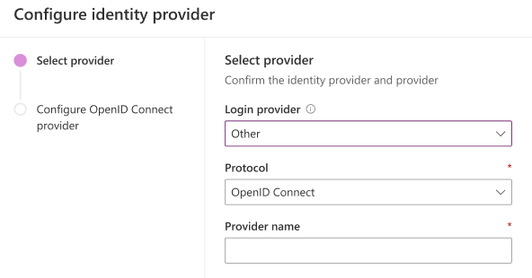
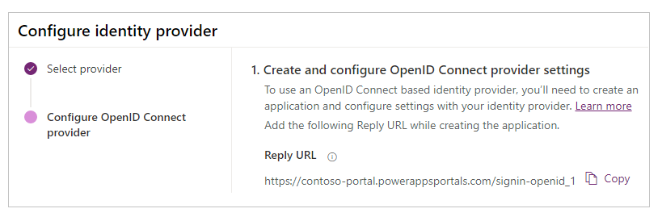
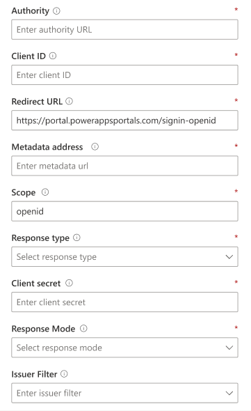
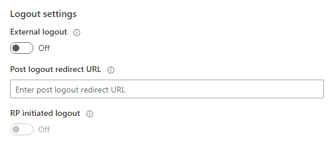
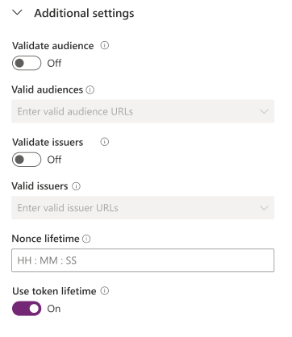

# Configure an OpenID Connect provider for portals

[OpenID Connect](https://openid.net/connect/) external identity providers are services that conform to the [Open ID Connect specification](https://openid.net/specs/openid-connect-core-1_0.html). OpenID Connect introduces the concept of an *ID token*, which is a security token that allows the client to verify the identity of the user. The ID token also gets basic profile information about users&mdash;also known as *claims*.

This article explains how an identity provider that supports OpenID Connect can be integrated with Power Apps portals. Some of the examples of OpenID Connect providers for portals: [Azure Active Directory (Azure AD) B2C](configure-azure-ad-b2c-provider.md), [Azure AD](configure-openid-settings.md), [Azure AD with multiple tenants](configure-openid-settings.md#enable-authentication-using-a-multi-tenant-azure-active-directory-application).

## Supported and unsupported authentication flows in portals

- Implicit Grant
    - This flow is the default authentication method used by portals.
- Authorization Code
    - Portals uses the *client_secret_post* method to communicate with the token endpoint of the identity server.
    - Using the *private_key_jwt* method to authenticate with the token endpoint isn't supported.
- Hybrid (restricted support)
    - Portals requires *id_token* to be present in the response, so having the *response_type* value as *code token* isn't supported.
    - The Hybrid flow in portals follows the same flow as Implicit Grant, and uses *id_token* to directly sign in the users.
- Portals doesn't support Proof Key for Code Exchange (PKCE)&ndash;based techniques to authenticate users.

> [!NOTE]
> Changes to authentication settings [might take a few minutes](../admin/clear-server-side-cache.md#caching-changes-for-portals-with-version-926x-or-later) to be reflected on the portal. Restart the portal by using [portal actions](../admin/admin-overview.md) if you want the changes to be reflected immediately.

## Configure the OpenID Connect provider

Similar to all other providers, you have to sign in to [Power Apps](https://make.powerapps.com) to configure the OpenID Connect provider.

1. Select [Add provider](use-simplified-authentication-configuration.md#add-configure-or-delete-an-identity-provider) for your portal.

1. For **Login provider**, select **Other**.

1. For **Protocol**, select **OpenID Connect**.

1. Enter a provider name.

    

1. Select **Next**.

1. Create the application, and configure the settings with your identity provider.

    

    > [!NOTE]
    > The Reply URL is used by the app to redirect users to the portal after the authentication succeeds. If your portal uses a custom domain name, you might have a different URL than the one provided here.

1. Enter the following site settings for portal configuration.

    

    > [!NOTE]
    > Be sure to review&mdash;and if required, change&mdash;the default values.

    | Name | Description |
    | - | - |
    | Authority | The authority (or issuer) URL associated with the identity provider.   Example (Azure AD) : `https://login.microsoftonline.com/7e6ea6c7-a751-4b0d-bbb0-8cf17fe85dbb/` |
    | Client ID | The ID of the application created with the identity provider that's to be used with the portal. |
    | Redirect URL | The location where the identity provider will send the authentication response.   Example: `https://contoso-portal.powerappsportals.com/signin-openid_1`   **Note**: If you're using the default portal URL, you can copy and paste the **Reply URL** as shown in the **Create and configure OpenID Connect provider settings** step. If you're using a custom domain name, enter the URL manually. Be sure that the value you enter here is exactly the same as the **Redirect URI** value for the application in the identity provider configuration (such as Azure portal). |
    | Metadata address | The discovery endpoint for obtaining metadata. Common format: [Authority URL]/.well-known/openid-configuration.   Example (Azure AD) : `https://login.microsoftonline.com/7e6ea6c7-a751-4b0d-bbb0-8cf17fe85dbb/v2.0/.well-known/openid-configuration` |
    | Scope | A space-separated list of scopes to request via the OpenID Connect scope parameter.   Default value: `openid`   Example (Azure AD) : `openid profile email`   More information: [Configure additional claims when using OpenID Connect for portals with Azure AD](configure-openid-settings.md#configure-additional-claims) |
    | Response type | The value for the OpenID Connect *response_type* parameter.   Possible values include: <ul> <li> `code` </li> <li> `code id_token` </li><li> `id_token` </li><li> `id_token token` </li><li> `code id_token token` </li> </ul>   Default value: `code id_token` |
    | Client secret | The client secret value from the provider application. This might also be referred to as an *app secret* or *consumer secret*. This setting is required if the selected response type is `code`. |
    | Response mode | The value for the OpenID Connect *response_mode* parameter. The value should be `query` if the selected response type is `code`. Default value: `form_post`. |

1. Configure settings for signing users out.

    

    | Name | Description |
    | - | - |
    | External logout | Enables or disables external account sign-out. When enabled, users are redirected to the external sign-out user experience when they sign out from the portal. When disabled, users are only signed out from the portal. |
    | Post logout redirect URL | The location where the identity provider will redirect a user after external sign-out. This location should be set appropriately in the identity provider configuration. |
    | RP initiated logout | Enables or disables a sign-out initiated by the relying party. To use this setting, enable **External logout** first. |

1. (Optional) Configure additional settings.

    

    | Name | Description
    | - | - |
    | Issuer filter | A wildcard-based filter that matches on all issuers across all tenants.   Example: `https://sts.windows.net/*/` |
    | Validate audience | If enabled, the audience is validated during token validation.  |
    | Valid audiences | Comma-separated list of audience URLs.  |
    | Validate issuers | If enabled, the issuer is validated during token validation. |
    | Valid issuers | Comma-separated list of issuer URLs. |
    | Registration claims mapping | List of logical name-claim pairs to map claim values returned from the provider during sign-up to the attributes of the contact record.   Format: `field_logical_name=jwt_attribute_name` where `field_logical_name` is the logical name of the field in portals, and `jwt_attribute_name` is the attribute with the value returned from the identity provider.   Example: `firstname=given_name,lastname=family_name` when using *Scope* as `profile` for Azure AD. In this example, `firstname` and `lastname` are the logical names for the profile fields in portals, whereas `given_name` and `family_name` are the attributes with the values returned by the identity provider for the respective fields. |
    | Login claims mapping | List of logical name-claim pairs to map claim values returned from the provider during sign-up to the attributes of the contact record.   Format: `field_logical_name=jwt_attribute_name` where `field_logical_name` is the logical name of the field in portals, and `jwt_attribute_name` is the attribute with the value returned from the identity provider.   Example: `firstname=given_name,lastname=family_name` when using *Scope* as `profile` for Azure AD. In this example, `firstname` and `lastname` are the logical names for the profile fields in portals, whereas `given_name` and `family_name` are the attributes with the values returned by the identity provider for the respective fields. |
    | Nonce lifetime | Lifetime of the nonce value, in minutes. Default: 10 minutes. |
    | Use token lifetime | Indicates that the authentication session lifetime (such as cookies) should match that of the authentication token. If specified, this value will override the **Application Cookie Expire Timespan** value in the **Authentication/ApplicationCookie/ExpireTimeSpan** site setting. |
    | Contact mapping with email | Specify whether the contacts are mapped to a corresponding email.   When set to **On**, a unique contact record is associated with a matching email address, assigning the external identity provider to the contact after a successful user sign-in. |

## Edit an OpenID Connect provider

To edit a configured OpenID Connect provider, see [Edit a provider](use-simplified-authentication-configuration.md#edit-a-provider).

### See also

[Configure an OpenID Connect provider for portals with Azure AD](configure-openid-settings.md)  
[FAQ for using OpenID Connect in portals](configure-openid-faqs.md)

[!INCLUDE[footer-include](../../../includes/footer-banner.md)]