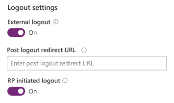

# Configure OpenID Connect provider

Similar to all other providers, you have to sign in to [Power Apps](https://make.powerapps.com) to configure the OpenID Connect provider.

To configure OpenID Connect provider:

1. Select [Add provider](use-simplified-authentication-configuration.md#add-configure-or-delete-an-identity-provider) for your portal.

1. Select **Login provider** as **Other**.

1. Select **Protocol** as **OpenID Connect**.

1. Enter a provider name.

    

1. Select **Next**.

1. Create the application and configure the settings with your identity provider.

1. Enter the following site settings for portal configuration.

    

    | Name | Description |
    | - | - |
    | Authority | The Authority to use when making OpenIdConnect calls.   Example: `https://login.microsoftonline.com/contoso.onmicrosoft.com/`   More information:[OpenIdConnectAuthenticationOptions.Authority](https://msdn.microsoft.com/library/microsoft.owin.security.openidconnect.openidconnectauthenticationoptions.authority.aspx) |
    | Client ID | The client ID value from the provider application. It may also be referred to as an "App ID" or "Consumer Key".   More information: [OpenIdConnectAuthenticationOptions.ClientId](https://msdn.microsoft.com/library/microsoft.owin.security.openidconnect.openidconnectauthenticationoptions.clientid.aspx) |
    | Redirect URL | The AD FS WS-Federation passive endpoint.   Example: `https://portal.contoso.com/signin-saml2`   More information: [OpenIdConnectAuthenticationOptions.RedirectUri](https://msdn.microsoft.com/library/microsoft.owin.security.openidconnect.openidconnectauthenticationoptions.redirecturi.aspx) |
    | Metadata address | The discovery endpoint for obtaining metadata. Commonly ending with the path:/.well-known/openid-configuration.   Example: `https://login.microsoftonline.com/contoso.onmicrosoft.com/.well-known/openid-configuration`   More information:[OpenIdConnectAuthenticationOptions.MetadataAddress](https://msdn.microsoft.com/library/microsoft.owin.security.openidconnect.openidconnectauthenticationoptions.metadataaddress.aspx) |
    | Scope | A space separated list of permissions to request.   Example: `openid`   More information: [OpenIdConnectAuthenticationOptions.Scope](https://msdn.microsoft.com/library/microsoft.owin.security.openidconnect.openidconnectauthenticationoptions.scope.aspx) |
    | Response type | The 'response\_type'.   More information: [OpenIdConnectAuthenticationOptions.ResponseType](https://msdn.microsoft.com/library/microsoft.owin.security.openidconnect.openidconnectauthenticationoptions.responsetype.aspx) |
    | Client secret | The client secret value from the provider application. It may also be referred to as an "App Secret" or "Consumer Secret".   More information: [OpenIdConnectAuthenticationOptions.ClientSecret](https://msdn.microsoft.com/library/microsoft.owin.security.openidconnect.openidconnectauthenticationoptions.clientsecret.aspx) |
    | Response mode | |
    | Issue filter | A wildcard-based filter that matches on all issuers across all tenants.   Example: `https://sts.windows.net/*/` |

1. Select **Next**.

1. Configure logout settings.

    

    | Name | Description |
    | - | - |
    | External logout | Enables or disables external account sign-out and registration. |
    | Post logout redirection URL |  |
    | RP initiated logout | |

1. (Optional) Configure additional settings.

    

    | Name | Description
    | - | - |
    | Validate audience | A Boolean to control if the audience will be validated during token validation.  |
    | Valid audiences | Comma-separated list of audience URLs.   More information: [TokenValidationParameters.AllowedAudiences](https://msdn.microsoft.com/library/system.identitymodel.tokens.tokenvalidationparameters.allowedaudiences.aspx)  |
    | Validate issuers | A Boolean to control if the issuer will be validated during token validation. |
    | Valid issuers | Comma-separated list of issuer URLs.   More information: [TokenValidationParameters.ValidIssuers](https://msdn.microsoft.com/library/system.identitymodel.tokens.tokenvalidationparameters.validissuers.aspx) |
    | Nonce lifetime | |
    | Use token lifetime | Indicates that the authentication session lifetime (for example, cookies) should match that of the authentication token.   More information: [OpenIdConnectAuthenticationOptions.UseTokenLifetime](https://msdn.microsoft.com/library/microsoft.owin.security.openidconnect.openidconnectauthenticationoptions.usetokenlifetime.aspx) |

1. Select **Confirm**.

### See also
[Configure portal authentication](configure-portal-authentication.md)  
[Set authentication identity for a portal](set-authentication-identity.md)  
[OAuth2 provider settings for portals](configure-oauth2-settings.md)  
[WS-Federation provider settings for portals](configure-ws-federation-settings.md)  
[SAML 2.0 provider settings for portals](configure-saml2-settings.md)  

