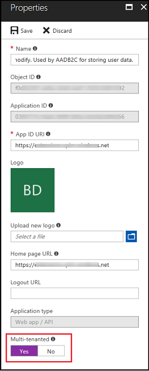

# Configure Open ID Connect provider settings for portals

[OpenID Connect](http://openid.net/connect/) external identity providers are services that conform to the Open ID Connect [specifications](http://openid.net/developers/specs/). Integrating a provider involves locating the authority (or issuer) URL associated with the provider. A configuration URL can be determined from the authority which supplies metadata required during the authentication workflow. The provider settings are based on the properties of the [OpenIdConnectAuthenticationOptions](https://msdn.microsoft.com/library/microsoft.owin.security.openidconnect.openidconnectauthenticationoptions.aspx) class.

Examples of authority URLs are:

- [Google](https://developers.google.com/identity/protocols/OpenIDConnect): <https://accounts.google.com/><https://accounts.google.com/.well-known/openid-configuration>
- [[!INCLUDE[pn-azure-active-directory](../../../includes/pn-azure-active-directory.md)]](https://msdn.microsoft.com/library/azure/mt168838.aspx): [https://login.microsoftonline.com/&lt;[!INCLUDE[pn-azure-shortest](../../../includes/pn-azure-shortest.md)] AD Application&gt;/](https://login.microsoftonline.com/contoso.onmicrosoft.com/.well-known/openid-configuration)

Each OpenID Connect provider also involves registering an application (similar to that of an OAuth 2.0 provider) and obtaining a Client Id. The authority URL and the generated application Client Id are the settings required to enable external authentication between the portal and the identity provider.

> [!Note]
> The Google OpenID Connect endpoint is currently not supported because the underlying libraries are still in the early stages of release with compatibility issues to address. The [OAuth2 provider settings for portals](configure-oauth2-settings.md) endpoint can be used instead.

## OpenID settings for [!INCLUDE[pn-azure-active-directory](../../../includes/pn-azure-active-directory.md)]

To get started, sign into the [[!INCLUDE[pn-azure-shortest](../../../includes/pn-azure-shortest.md)] Management Portal](https://msdn.microsoft.com/library/azure/hh967611.aspx#bkmk_azureportal) and create or select an existing directory. When a directory is available follow the instructions to [add an application](https://docs.microsoft.com/azure/active-directory/develop/active-directory-integrating-applications) to the directory.  

1. Under the **Applications** menu of the directory, select **Add**.
2. Choose **Add an application my organization is developing**.
3. Specify a custom **name** for the application and choose the type **web application and/or web API**.
4. For the **Sign-On URL** and the **App ID URI**, specify the URL of the portal for both fields https://portal.contoso.com/
5. At this point, a new application is created. Navigate to the **Configure** section in the menu.

    Under the **single sign-on** section, update the first **Reply URL** entry to include a path in the URL: http://portal.contoso.com/signin-azure-ad. This corresponds to the **RedirectUri** site setting value

6. Under the **properties** section, locate the **client ID** field. This corresponds to the **ClientId** site setting value.
7. In the footer menu, select **View Endpoints** and note the **Federation Metadata Document** field

The left portion of the URL is the **Authority** value and is in one of the following formats:

- https://login.microsoftonline.com/01234567-89ab-cdef-0123-456789abcdef/
- https://login.microsoftonline.com/contoso.onmicrosoft.com/

To get the service configuration URL, replace the FederationMetadata/2007-06/FederationMetadata.xml path tail with the path .well-known/openid-configuration. For instance,   <https://login.microsoftonline.com/contoso.onmicrosoft.com/.well-known/openid-configuration>

This corresponds to the **MetadataAddress** site setting value.

### Related site settings

Apply portal site settings referencing the above application.

> [!Note]
> A standard [!INCLUDE[pn-azure-shortest](../../../includes/pn-azure-shortest.md)] AD configuration only uses the following settings (with example values):                                 
> - Authentication/OpenIdConnect/[!INCLUDE[pn-azure-shortest](../../../includes/pn-azure-shortest.md)]AD/Authority - <https://login.microsoftonline.com/01234567-89ab-cdef-0123-456789abcdef/>                                                    
> - Authentication/OpenIdConnect/[!INCLUDE[pn-azure-shortest](../../../includes/pn-azure-shortest.md)]AD/ClientId - fedcba98-7654-3210-fedc-ba9876543210                                      
>   The Client ID and the authority URL do not contain the same value and should be retrieved separately.           
> - Authentication/OpenIdConnect/[!INCLUDE[pn-azure-shortest](../../../includes/pn-azure-shortest.md)]AD/RedirectUri - https://portal.contoso.com/signin-azure-ad
 
Multiple identity providers can be configured by substituting a label for the \[provider\] tag. Each unique label forms a group of settings related to an identity provider. Examples: [!INCLUDE[pn-azure-shortest](../../../includes/pn-azure-shortest.md)]AD, MyIdP

|                          Site Setting Name                           |                                                                                                                                                                                                         Description                                                                                                                                                                                                          |
|----------------------------------------------------------------------|------------------------------------------------------------------------------------------------------------------------------------------------------------------------------------------------------------------------------------------------------------------------------------------------------------------------------------------------------------------------------------------------------------------------------|
|           Authentication/Registration/ExternalLoginEnabled           |                                                                                                                                                                         Enables or disables external account sign-in and registration. Default: true                                                                                                                                                                         |
|         Authentication/OpenIdConnect/\[provider\]/Authority          |                                               Required. The Authority to use when making OpenIdConnect calls. Example: `https://login.microsoftonline.com/contoso.onmicrosoft.com/`. For more information:[OpenIdConnectAuthenticationOptions.Authority](https://msdn.microsoft.com/library/microsoft.owin.security.openidconnect.openidconnectauthenticationoptions.authority.aspx).                                                |
|      Authentication/OpenIdConnect/\[provider\]/MetadataAddress       | The discovery endpoint for obtaining metadata. Commonly ending with the path:/.well-known/openid-configuration . Example: `https://login.microsoftonline.com/contoso.onmicrosoft.com/.well-known/openid-configuration`. For more information:[OpenIdConnectAuthenticationOptions.MetadataAddress](https://msdn.microsoft.com/library/microsoft.owin.security.openidconnect.openidconnectauthenticationoptions.metadataaddress.aspx). |
|     Authentication/OpenIdConnect/\[provider\]/AuthenticationType     |                                   The OWIN authentication middleware type. Specify the value of the issuer in the service configuration metadata. Example: `https://sts.windows.net/contoso.onmicrosoft.com/`. For more information: [AuthenticationOptions.AuthenticationType](https://msdn.microsoft.com/library/microsoft.owin.security.authenticationoptions.authenticationtype.aspx).                                   |
|          Authentication/OpenIdConnect/\[provider\]/ClientId          |                                                  Required. The client ID value from the provider application. It may also be referred to as an "App ID" or "Consumer Key". For more information: [OpenIdConnectAuthenticationOptions.ClientId](https://msdn.microsoft.com/library/microsoft.owin.security.openidconnect.openidconnectauthenticationoptions.clientid.aspx).                                                   |
|        Authentication/OpenIdConnect/\[provider\]/ClientSecret        |                                              The client secret value from the provider application. It may also be referred to as an "App Secret" or "Consumer Secret". For more information: [OpenIdConnectAuthenticationOptions.ClientSecret](https://msdn.microsoft.com/library/microsoft.owin.security.openidconnect.openidconnectauthenticationoptions.clientsecret.aspx).                                              |
|        Authentication/OpenIdConnect/\[provider\]/RedirectUri         |                                                        Recommended. The AD FS WS-Federation passive endpoint. Example: https://portal.contoso.com/signin-saml2. For more information: [OpenIdConnectAuthenticationOptions.RedirectUri](https://msdn.microsoft.com/library/microsoft.owin.security.openidconnect.openidconnectauthenticationoptions.redirecturi.aspx).                                                        |
|          Authentication/OpenIdConnect/\[provider\]/Caption           |                                                              Recommended. The text that the user can display on a sign in user interface. Default: \[provider\]. For more information: [OpenIdConnectAuthenticationOptions.Caption](https://msdn.microsoft.com/library/microsoft.owin.security.openidconnect.openidconnectauthenticationoptions.caption.aspx).                                                               |
|          Authentication/OpenIdConnect/\[provider\]/Resource          |                                                                                                       The 'resource'. For more information: [OpenIdConnectAuthenticationOptions.Resource](https://msdn.microsoft.com/library/microsoft.owin.security.openidconnect.openidconnectauthenticationoptions.resource.aspx).                                                                                                        |
|        Authentication/OpenIdConnect/\[provider\]/ResponseType        |                                                                                                The 'response\_type'. For more information: [OpenIdConnectAuthenticationOptions.ResponseType](https://msdn.microsoft.com/library/microsoft.owin.security.openidconnect.openidconnectauthenticationoptions.responsetype.aspx).                                                                                                 |
|           Authentication/OpenIdConnect/\[provider\]/Scope            |                                                                                A space separated list of permissions to request. Default: openid. For more information: [OpenIdConnectAuthenticationOptions.Scope ](https://msdn.microsoft.com/library/microsoft.owin.security.openidconnect.openidconnectauthenticationoptions.scope.aspx).                                                                                 |
|        Authentication/OpenIdConnect/\[provider\]/CallbackPath        |                      An optional constrained path on which to process the authentication callback. If not provided and RedirectUri is available, this value will be generated from RedirectUri. For more information: [OpenIdConnectAuthenticationOptions.CallbackPath](https://msdn.microsoft.com/library/microsoft.owin.security.openidconnect.openidconnectauthenticationoptions.callbackpath.aspx).                      |
|     Authentication/OpenIdConnect/\[provider\]/BackchannelTimeout     |                                                                Timeout value for back channel communications. Example: 00:05:00 (5 mins). For more information: [OpenIdConnectAuthenticationOptions.BackchannelTimeout](https://msdn.microsoft.com/library/microsoft.owin.security.openidconnect.openidconnectauthenticationoptions.backchanneltimeout.aspx).                                                                |
| Authentication/OpenIdConnect/\[provider\]/RefreshOnIssuerKeyNotFound |                                      Determines whether a metadata refresh should be attempted after a SecurityTokenSignatureKeyNotFoundException. For more information: [OpenIdConnectAuthenticationOptions.RefreshOnIssuerKeyNotFound](https://msdn.microsoft.com/library/microsoft.owin.security.openidconnect.openidconnectauthenticationoptions.refreshonissuerkeynotfound.aspx).                                       |
|      Authentication/OpenIdConnect/\[provider\]/UseTokenLifetime      |                                               Indicates that the authentication session lifetime (e.g. cookies) should match that of the authentication token. For more information: [OpenIdConnectAuthenticationOptions.UseTokenLifetime](https://msdn.microsoft.com/library/microsoft.owin.security.openidconnect.openidconnectauthenticationoptions.usetokenlifetime.aspx).                                               |
|     Authentication/OpenIdConnect/\[provider\]/AuthenticationMode     |                                                                                                     The OWIN authentication middleware mode. For more information: [AuthenticationOptions.AuthenticationMode](https://msdn.microsoft.com/library/microsoft.owin.security.authenticationoptions.authenticationmode.aspx).                                                                                                     |
| Authentication/OpenIdConnect/\[provider\]/SignInAsAuthenticationType |                                                   The AuthenticationType used when creating the System.Security.Claims.ClaimsIdentity. For more information: [OpenIdConnectAuthenticationOptions.SignInAsAuthenticationType](https://msdn.microsoft.com/library/microsoft.owin.security.openidconnect.openidconnectauthenticationoptions.signinasauthenticationtype.aspx).                                                   |
|   Authentication/OpenIdConnect/\[provider\]/PostLogoutRedirectUri    |                                                                                 The 'post\_logout\_redirect\_uri'. For more information: [OpenIdConnectAuthenticationOptions.PostLogoutRedirectUri](https://msdn.microsoft.com/library/microsoft.owin.security.openidconnect.openidconnectauthenticationoptions.postlogoutredirecturi.aspx).                                                                                 |
|       Authentication/OpenIdConnect/\[provider\]/ValidAudiences       |                                                                                                  Comma-separated list of audience URLs. For more information: [TokenValidationParameters.AllowedAudiences](https://msdn.microsoft.com/library/system.identitymodel.tokens.tokenvalidationparameters.allowedaudiences.aspx).                                                                                                  |
|        Authentication/OpenIdConnect/\[provider\]/ValidIssuers        |                                                                                                       Comma-separated list of issuer URLs. For more information: [TokenValidationParameters.ValidIssuers](https://msdn.microsoft.com/library/system.identitymodel.tokens.tokenvalidationparameters.validissuers.aspx).                                                                                                       |
|         Authentication/OpenIdConnect/\[provider\]/ClockSkew          |                                                                                                                                                                                        The clock skew to apply when validating times.                                                                                                                                                                                        |
|       Authentication/OpenIdConnect/\[provider\]/NameClaimType        |                                                                                                                                                                              The claim type used by the ClaimsIdentity to store the name claim.                                                                                                                                                                              |
|       Authentication/OpenIdConnect/\[provider\]/RoleClaimType        |                                                                                                                                                                              The claim type used by the ClaimsIdentity to store the role claim.                                                                                                                                                                              |
|   Authentication/OpenIdConnect/\[provider\]/RequireExpirationTime    |                                                                                                                                                                              A value indicating whether tokens must have an 'expiration' value.                                                                                                                                                                              |
|    Authentication/OpenIdConnect/\[provider\]/RequireSignedTokens     |                                                                                                                               A value indicating whether a System.IdentityModel.Tokens.SecurityToken xmlns=<http://ddue.schemas.microsoft.com/authoring/2003/5> can be valid if not signed.                                                                                                                                |
|      Authentication/OpenIdConnect/\[provider\]/SaveSigninToken       |                                                                                                                                                                        A Boolean to control if the original token is saved when a session is created.                                                                                                                                                                        |
|       Authentication/OpenIdConnect/\[provider\]/ValidateActor        |                                                                                                                                                            A value indicating whether the System.IdentityModel.Tokens.JwtSecurityToken.Actor should be validated.                                                                                                                                                            |
|      Authentication/OpenIdConnect/\[provider\]/ValidateAudience      |                                                                                                                                                                       A Boolean to control if the audience will be validated during token validation.                                                                                                                                                                        |
|       Authentication/OpenIdConnect/\[provider\]/ValidateIssuer       |                                                                                                                                                                        A Boolean to control if the issuer will be validated during token validation.                                                                                                                                                                         |
|      Authentication/OpenIdConnect/\[provider\]/ValidateLifetime      |                                                                                                                                                                       A Boolean to control if the lifetime will be validated during token validation.                                                                                                                                                                        |
|  Authentication/OpenIdConnect/\[provider\]/ValidateIssuerSigningKey  |                                                                                                                  A Boolean that controls if validation of the System.IdentityModel.Tokens.SecurityKey that signed the securityToken xmlns=<http://ddue.schemas.microsoft.com/authoring/2003/5> is called.                                                                                                                  |
|                                                                      |                                                                                                                                                                                                                                                                                                                                                                                                                              |

## Enable authentication using a multi-tenant Azure Active Directory application

You can configure your portal to accept [!include] users from any tenant in [!include] and not just a specific tenant by using the multi-tenant application registered in [!include]. To enable multi-tenancy, set the **Multi-tenanted** switch to **Yes** in the [!include] application.

### Related site settings

Multiple identity providers can be configured by substituting a label for the [provider] tag. Each unique label forms a group of settings related to an identity provider. You can create or configure the following site settings in portals to support authentication against [!include] using a multi-tenanted application:

|Site Setting Name    |Description   |
|---|---|
|Authentication/OpenIdConnect/[provider]/Authority   |The Authority to use when making OpenIdConnect calls. For example: `https://login.microsoftonline.com/common`   |
|Authentication/OpenIdConnect/[provider]/ClientId   |The client ID value from the provider application. It may also be referred to as an App ID or Consumer Key.   |
|Authentication/OpenIdConnect/[provider]/ExternalLogoutEnabled   |Enables or disables external account sign-out and registration. Set this value as True.   |
|Authentication/OpenIdConnect/[provider]/IssuerFilter   |A wildcard-based filter that matches on all issuers across all tenants. In most cases, use the value: `https://sts.windows.net/*/`   |
|Authentication/OpenIdConnect/[provider]/RedirectUri  |The reply URL location where the provider sends the authentication response.For example: `https://portal.contoso.com/signin-oidc` |
|Authentication/OpenIdConnect/[provider]/ValidateIssuer   |A Boolean to control if the issuer will be validated during token validation. Set this value as False.   |
|||

### See also
[Configure portal authentication](configure-portal-authentication.md)  
[Set authentication identity for a portal](set-authentication-identity.md)  
[OAuth2 provider settings for portals](configure-oauth2-settings.md)  
[WS-Federation provider settings for portals](configure-ws-federation-settings.md)  
[SAML 2.0 provider settings for portals](configure-saml2-settings.md)  

